# 00 · Foundations: reading the board, singles, and links

> **Level:** start here · **Next:** [Naked Candidates](../01-naked-candidates/README.md)
> Diagrams: [sudokuwiki.org](https://www.sudokuwiki.org/Getting_Started) by Andrew Stuart. Text: original to this guide.

Every technique in this guide boils down to the same two moves. Either you prove that a digit **must** go somewhere (a *placement*), or you prove that a digit **can't** go somewhere (an *elimination*). The fancy names only describe *how* you found the proof.

This chapter sets up three things you'll use on every page:

1. **How cells are named**, so the diagrams make sense.
2. **Singles**, which are the only moves that actually fill in a cell.
3. **Links**, the "if this, then that" relationships that every advanced technique is built from.

---

## 1. Naming cells

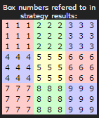

| Thing | Convention | Example |
|---|---|---|
| Rows | Letters **A–J**, top to bottom. **There is no I**, because it looks too much like 1. | Row **J** is the bottom row |
| Columns | Numbers **1–9**, left to right | Column **9** is the right edge |
| Cells | Row letter + column number | **E5** is the very centre |
| Boxes | 1–9, reading order (left→right, top→bottom) | Box **5** is the centre box |

A few words you'll see constantly:

- **Unit** (or *house*): any row, column or box. Each one holds the digits 1–9 exactly once.
- **Peers**: two cells are peers if they share a unit. Peers "**see**" each other, so they can't hold the same digit.
- **Candidates** (or *pencil marks*): the small digits in a cell that are still possible.

> 💡 **Memory hook:** *"If two cells can see each other, they can't be twins."* Almost every elimination in this guide ends with that sentence.

---

## 2. Singles: the only moves that place digits

Everything else in this guide is about *removing candidates* until a single appears. There are two kinds.

### Hidden single: "this is the only place left for digit X in this unit"

The cell may still have several candidates, but one digit has nowhere else to go in some row, column or box.

#### In a box

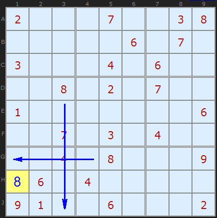

Look for the **8** in box 7.
- The 8 in **D3** fills column 3, so **H3** and **J3** are out.
- The 8 in **G5** fills row G, so **G1** and **G2** are out.
- The only cell left in box 7 is **H1**, so it's the 8.

▶ [Try this position](https://www.sudokuwiki.org/sudoku.htm?bd=200070038000006070300040600008020700100000006007030400004080009060400000910060002)

#### In a row (or column)

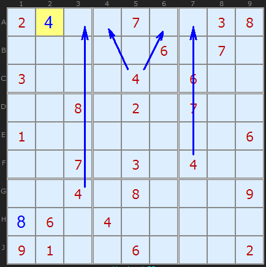

Find the **4** in row A. The 4s in G3, F7 and box 2 cross out every cell in row A except **A2**.

#### "Pinned" from three directions

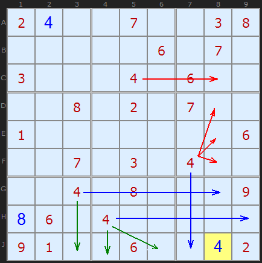

Sometimes a cell is the last home for a digit in its row, its column *and* its box at the same time. The **4 in J8** is forced three ways over. When that happens, the cell usually stands out to the eye.

### Naked single: "this cell has only one candidate left"

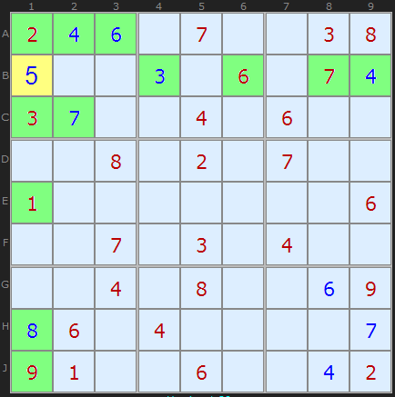

**B1** sees every digit except 5 somewhere in its row, column or box (highlighted in green), so it must be **5**.

| | Hidden single | Naked single |
|---|---|---|
| You look at... | a **digit** across a unit | a **cell** across its peers |
| Question asked | "Where can 7 go in this box?" | "What can go in this cell?" |
| Best found by | scanning ("cross-hatching") | checking pencil marks |

> 🎯 **Scanning routine** that finds most singles quickly:
> 1. Pick a digit. Cross-hatch every box for it, then every row and column.
> 2. Move on to the next digit. Start with the digits that are already placed most often, because they have the fewest homes left.
> 3. Only start pencil-marking once a full pass finds nothing.

---

## 3. Links: the atoms of every advanced technique

When singles dry up, you need ways to reason about *pairs* of possibilities. A **link** connects two candidates whose fates are tied together.

### Bi-location link: one digit, exactly two places in a unit

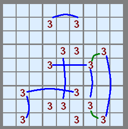

If row, column or box contains a digit in **exactly two cells**, then one of those cells is that digit. You don't know which one yet, but you know *exactly one* of them is. The diagram draws every such link for the digit **3**.

### Bi-value link: one cell, exactly two digits

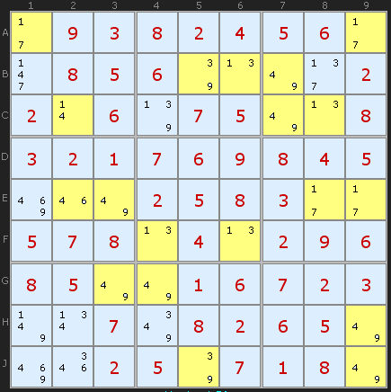

A cell with **exactly two candidates** (a *bivalue* cell, highlighted yellow) is the same either/or relationship, just inside one cell instead of across a unit. These cells are gold: almost every "wing" and "chain" technique is built from them.

### Chains flip like a row of light switches

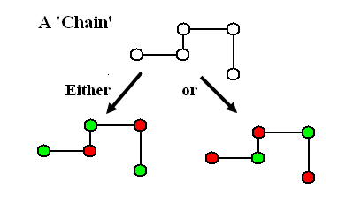

String links together and you get a **chain**. A chain only has two possible states, and its candidates alternate **ON / OFF / ON / OFF** along its length. Decide any one candidate, and the whole chain resolves.

That's the core trick of advanced Sudoku. **You don't need to know which state is true.** You only need to find a cell that loses in *both* states.

### Chains, loops and nets

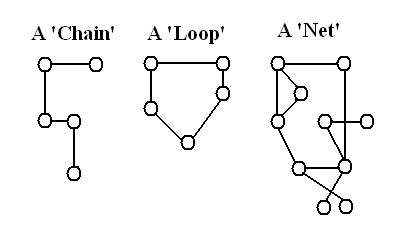

| Shape | What it is | Techniques that use it |
|---|---|---|
| **Chain** | Has two ends | XY-Chain, AIC, Forcing chains |
| **Loop** | Closes back on itself | X-Cycles, Nice Loops, Remote Pairs |
| **Net** | Branches in every direction | Simple Colouring, 3D Medusa, Forcing Nets |

---

## 4. Strong and weak links: the one idea that unlocks everything

Here's the distinction that confuses everyone at first. It's worth five minutes now.

| Link type | Meaning | Logic | When you have one |
|---|---|---|---|
| **Strong** | *At least one* of A, B is true | **NOT A ⇒ B** | Exactly 2 candidates in a unit (bi-location), or exactly 2 in a cell (bi-value) |
| **Weak** | *At most one* of A, B is true | **A ⇒ NOT B** | Any two candidates that see each other (same digit in a unit, or two digits in one cell) |

Think of a **strong** link as a *guarantee* ("someone will show up") and a **weak** link as an *exclusion* ("they can't both show up").

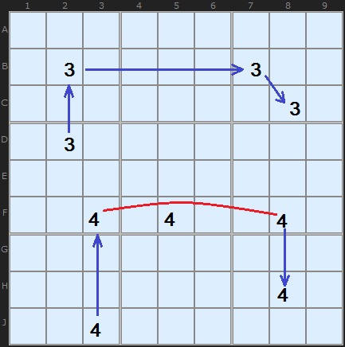

The top chain on 3s is made entirely of two-candidate units. The bottom one has *three* 4s in row F (the red line), so that step isn't a strong link.

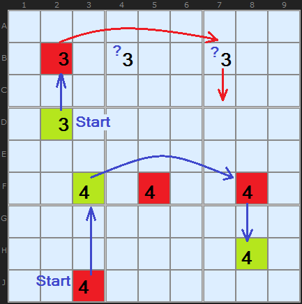

A weak link isn't useless, though. It just only works **in one direction**:

- Turning a candidate **ON** switches off *every* peer with that digit, however many there are. ✅ Weak links carry "ON ⇒ OFF".
- Turning a candidate **OFF** only forces something ON if exactly one alternative remains. ✅ Strong links carry "OFF ⇒ ON".

So the chain from J3 works when you *start* with J3 **OFF**. Then F3 turns ON, which switches off the other 4s in row F, including F8, and that pushes on to H8.

### The rule of alternation

A useful chain **alternates**: strong, weak, strong, weak...

```
 A ══strong══ B ──weak── C ══strong══ D
 OFF   ⇒      ON    ⇒   OFF     ⇒     ON
```

Every strong link turns an OFF into an ON, and every weak link turns an ON into an OFF. If you break the alternation, the inference stops.

### A strong link can stand in for a weak one

If a unit has *exactly two* 6s, then "at least one is a 6" is true. "At most one is a 6" is **also** true, since no unit can hold two 6s. So a strong link can always be used as a weak link. The reverse is **not** true.


Here the red link in box 2 is strong (only two 6s in the box), but the chain uses it in its weak role. That's perfectly legal.

### An X-Wing, seen as a loop

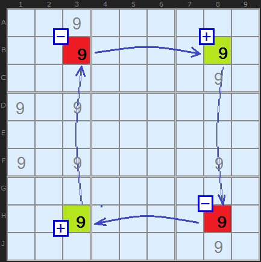

The two rows (B and H) each have exactly two 9s. Those are strong links. The columns have extra 9s, so the column connections are weak. Going round the rectangle, the links alternate strong, weak, strong, weak, so the loop is consistent. The extra 9s on those weak sides can be removed. You'll meet this again as [X-Wing](../04-x-wing/README.md) and generalised in [X-Cycles](../14-x-cycles/README.md).

---

## 5. Map of the territory

| Uses... | Stays on one digit | Moves between digits |
|---|---|---|
| **Just patterns** | [X-Wing](../04-x-wing/README.md), [Swordfish](../09-swordfish/README.md), [Jellyfish](../16-jellyfish/README.md) | [Naked](../01-naked-candidates/README.md)/[Hidden](../02-hidden-candidates/README.md) subsets |
| **Short chains** | [Simple Colouring](../06-simple-colouring/README.md), [Empty Rectangles](../52-empty-rectangles/README.md) | [Y-Wing](../07-y-wing/README.md), [XYZ-Wing](../10-xyz-wing/README.md), [W-Wing](../13-w-wing/README.md) |
| **Long chains / loops** | [X-Cycles](../14-x-cycles/README.md), [Grouped X-Cycles](../27-grouped-x-cycles/README.md) | [XY-Chains](../25-xy-chains/README.md), [AIC](../32-alternating-inference-chains/README.md) |
| **Nets** | [Multi-Colouring](../51-multi-colouring/README.md) | [3D Medusa](../15-3d-medusa/README.md), [Forcing Nets](../28-forcing-nets/README.md) |

**Further reading on sudokuwiki:** [Getting Started](https://www.sudokuwiki.org/Getting_Started) · [Introducing Chains and Links](https://www.sudokuwiki.org/Introducing_Chains_and_Links) · [Weak and Strong Links](https://www.sudokuwiki.org/Weak_and_Strong_Links)
