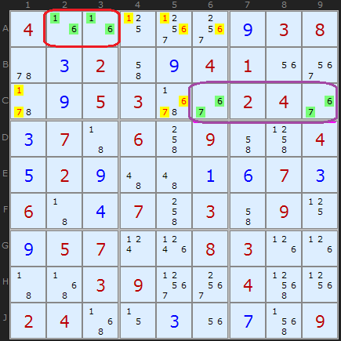
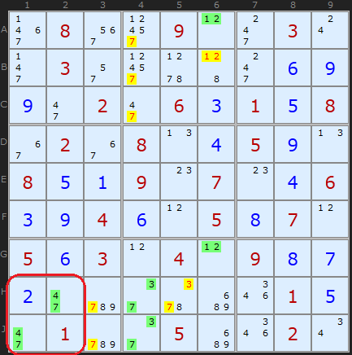
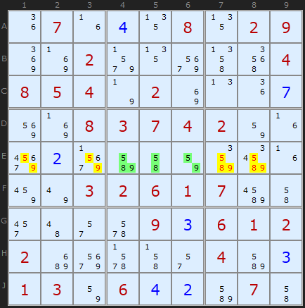
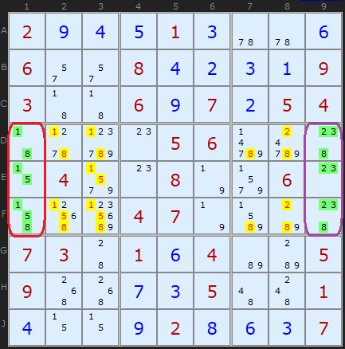
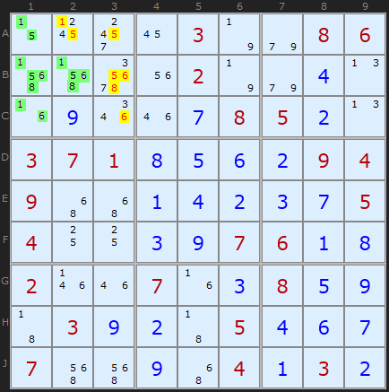
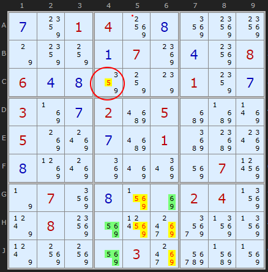
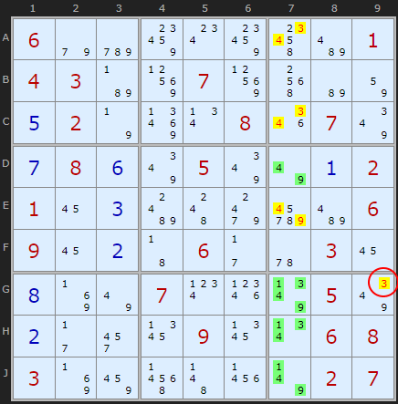
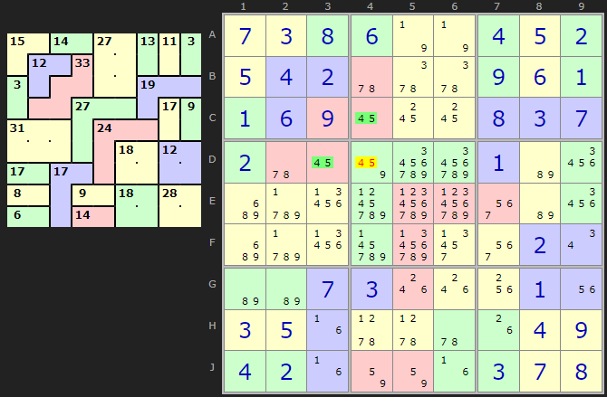
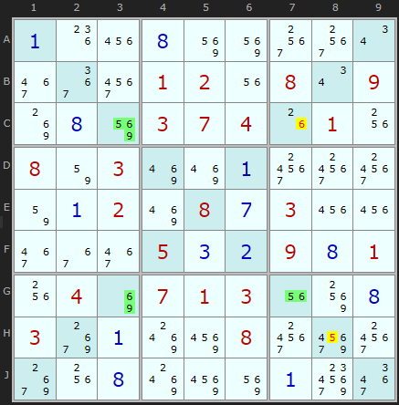

# 01 · Naked Pairs, Triples & Quads

> **Level:** Basic · **Family:** Subsets · **Prerequisites:** [Foundations](../00-foundations/README.md) · **Next:** [Hidden Candidates](../02-hidden-candidates/README.md)
> Diagrams: [sudokuwiki.org/Naked_Candidates](https://www.sudokuwiki.org/Naked_Candidates) by Andrew Stuart. Text: original to this guide.

## In one sentence

If **N cells** in one unit hold **only N different digits between them**, those digits are "used up" by those cells. Remove them from every other cell in the unit.

## The intuition: musical chairs

Imagine two cells in a row whose pencil marks are both `{1,6}`. Two chairs, two people, so the 1 and the 6 *will* sit in those two chairs. You don't know who sits where yet, but nobody else in the row can have a 1 or a 6.

Scale that up:

| Name | Cells | Distinct digits across those cells |
|---|---|---|
| Naked **Single** | 1 | 1 |
| Naked **Pair** | 2 | 2 |
| Naked **Triple** | 3 | 3 |
| Naked **Quad** | 4 | 4 |

```
Row:  [1 6] [1 6] [1 3 6 8] [3 6 9] [1 9]
       └─pair─┘      ↓        ↓       ↓
                  remove 1,6 everywhere else in the row
Row:  [1 6] [1 6] [3 8]     [3 9]   [9]   ← a single appears!
```

## The trap with triples: not every cell needs every digit

This is the #1 thing beginners miss. A naked triple on `{5,8,9}` can look like any of these:

| Pattern | Example cells | Candidates per cell |
|---|---|---|
| full | `{589} {589} {589}` | 3/3/3 |
| mixed | `{589} {58} {59}` | 3/2/2 |
| **"ring"** | `{58} {89} {59}` | 2/2/2 ← easy to miss! |

The test is **the union of the cells' candidates has exactly 3 digits**. Each cell can be missing one or two of them.

> 🧠 The 2/2/2 "ring" triple shows up again later. Bend it across two units and it becomes a [Y-Wing](../07-y-wing/README.md).

## How to spot them

1. Hunt for **bivalue cells** first (cells with exactly 2 candidates). Two identical ones in the same unit are a pair.
2. For triples, list every cell in a unit with **≤ 3 candidates** and look for three whose union is 3 digits.
3. Check **all the units** the cells share. Two cells in the same row *and* box clear both.
4. Big win: once a naked set clears a unit, re-scan that unit for hidden singles.

---

## Worked examples

### Example 1: two pairs at once



- **A2 and A3** are both `{1,6}`. They share **row A** *and* **box 1**, so 1s and 6s go from the rest of row A and from the rest of box 1 (which hits the 1 in C1).
- **Row C** has its own `{6,7}` pair. It wipes 6s and 7s from the rest of row C.
- Put the two together and **C1** is left with just an **8**.

▶ [Load position](https://www.sudokuwiki.org/sudoku.htm?bd=400000938032094100095300240370609004529001673604703090957008300003900400240030709) · [From the start](https://www.sudokuwiki.org/sudoku.htm?bd=400000038002004100005300240070609004020000070600703090057008300003900400240000009)

### Example 2: pairs don't need to be in a line



- **H2 and J1** are `{4,7}`. They're in different rows *and* different columns, but they share **box 7**. That's enough, and the 7s in H3 and J3 go.
- **A6 and G6** are `{1,2}` in column 6, which knocks 1 and 2 out of B6.
- **H4 and J4** are `{3,7}` in column 4 *and* box 8. 7s leave the top of column 4, and 3 and 7 leave H5.

▶ [Load position](https://www.sudokuwiki.org/sudoku.htm?bd=080090030030000069902063158020804590851907046394605870563040987200000015010050020)

### Example 3: a textbook triple



**E4, E5, E6** hold `{5,8,9}`, `{5,8}`, `{5,9}`. That's three cells and three digits, a 3/2/2 triple. Clear 5, 8 and 9 from the rest of row E.

▶ [Load position](https://www.sudokuwiki.org/sudoku.htm?bd=070408029002000004854020007008374200020000000003261700000093612200000403130642070)

### Example 4: two triples, and the "last three cells" shortcut



In columns 1 and 9, only three cells are unsolved. That means they *trivially* form a naked triple, because they must hold the three missing digits. The interesting part is that both triples also sit inside a single box, so they clear their boxes. That cascade solves **F8 = 9**.

> 💡 **Shortcut:** whenever a unit has only N empty cells and they're all in one box (or line), you have a free naked N-set for the *other* unit.

▶ [Load position](https://www.sudokuwiki.org/sudoku.htm?bd=294513006600842319300697254000056000040080060000470000730164005900735001400928637)

### Example 5: a naked quad



**A1, B1, B2, C1** together contain only `{1,5,6,8}`. That's four cells and four digits, so those digits leave the rest of box 1. Quads are rare. Usually a smaller subset is spotted first.

▶ [Load position](https://www.sudokuwiki.org/sudoku.htm?bd=000030086000020040090078520371856294900142375400397618200703859039205467700904132)

---

## Bonus: squeezing extra eliminations out of a subset ("bent" sets)

A naked set tells you *which digits* those cells hold. Sometimes it also tells you *where* one particular digit must be.

### Bent naked triple



The triple `{5,6,9}` sits in **G6, H4, J4** inside box 8. That clears box 8 as usual. Now look at only the **5s inside the triple**: they're in H4 and J4, and both are in **column 4**. One of the three cells must be the 5, and only those two can hold it, so the 5 is in column 4 within box 8. That's a pointing pair hiding *inside* the triple, and it removes the 5 from **C4** (circled).

**Rule:** after finding a naked set, check each digit. If all of that digit's appearances *within the set* share another unit, eliminate it from that unit too.

▶ [Load position](https://www.sudokuwiki.org/sudoku.htm?bd=S9B0g880104900h9294947o88840a078o0d9408060d0h86847s01880g038j0g02ca05c2c38r058k8s0gca01c6c88w0h8l8s8m8q8u8y07997n07920h8z8i0204937x08948y99akau93937x90908y03akeacj8z)

### Same idea with a quad



This quad `{1,3,4,9}` runs down a column. Within it, every **1** and **3** happens to be in box 9, so the 3 in **G9** can go as well.

▶ [Load position](https://www.sudokuwiki.org/sudoku.htm?bd=S9B069ecy8g0w8g4wbe010403b79107915gb6820e027n8v0v081q077y0g080f7y057y7u0a0201160cbg4c9odmbe0609160b43062b5u03160h8j7u070x1t7z057y0b2b2y1b091b0v0608038j8a5n4b237v0207)

### Variant puzzles (for the curious)

| Variant | What changes | Diagram |
|---|---|---|
| **Killer Sudoku** | A *cage* acts like a unit, so a pair can lock a cage |  |
| **Sudoku X** | The diagonals are units, so bent sets point along them |  |

---

## Common mistakes

- ❌ **Cells in different units.** The cells must *all* see each other via one shared unit. Clear only the unit(s) they *all* share.
- ❌ **Counting candidates per cell instead of the union.** `{1,2} {2,3} {1,3}` *is* a triple.
- ❌ **Looking for Quints.** In a 9-cell unit, a naked 5-set always comes with a hidden 4-set in the other cells (5 + 4 = 9). Hunt for the smaller one instead.

## How it connects

- **Mirror image:** [Hidden Candidates](../02-hidden-candidates/README.md). A naked set in some cells always means a hidden set in the remaining cells of that unit.
- **Generalisation:** an [Almost Locked Set](../37-almost-locked-sets/README.md) is a naked set with *one extra* digit, and it's the engine of many extreme techniques.
