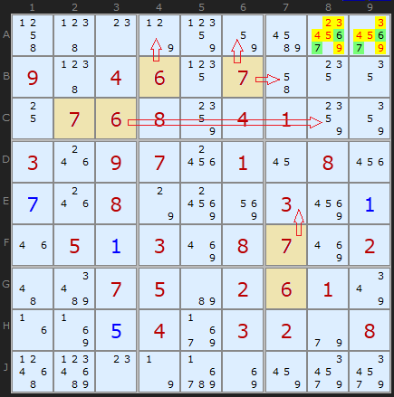
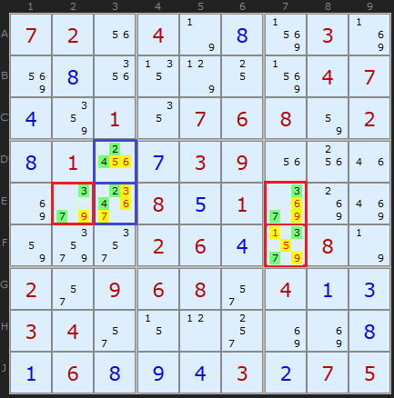
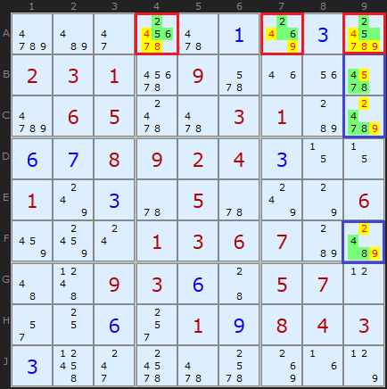
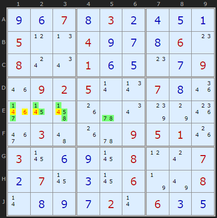
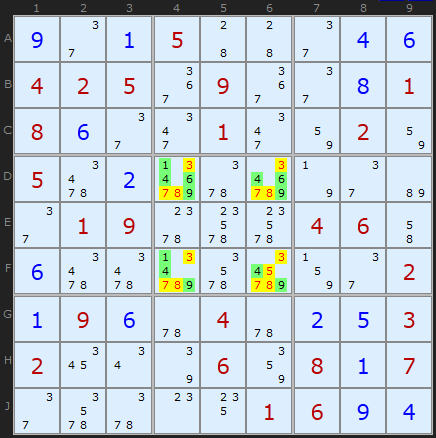

# 02 · Hidden Pairs, Triples & Quads

> **Level:** Basic · **Family:** Subsets · **Prerequisites:** [Naked Candidates](../01-naked-candidates/README.md) · **Next:** [Intersection Removal](../03-intersection-removal/README.md)
> Diagrams: [sudokuwiki.org/Hidden_Candidates](https://www.sudokuwiki.org/Hidden_Candidates) by Andrew Stuart. Text: original to this guide.

## In one sentence

If **N digits** can only go in the **same N cells** of a unit, those cells belong to those digits. Wipe every *other* candidate out of those cells.

## Naked vs hidden: the flip side of the same coin

| | Naked set | Hidden set |
|---|---|---|
| You look at | **cells** and their candidates | **digits** and where they can go |
| Condition | N cells contain only N digits | N digits appear in only N cells |
| You remove | those digits from **other cells** | **other digits** from those cells |
| Feels like | "these cells are full" | "these digits have nowhere else to go" |

> 💡 **They always come together.** In any unit, a naked set in some cells means there's a hidden set in the rest, and the other way round. Pick whichever is *smaller* to look for. For example, if a row has 7 empty cells and a hidden pair, the other 5 cells form a naked quint, which nobody wants to look for.

## Why they're called "hidden"

The cells have extra candidates that *disguise* the pattern:

```
Box 3 cells:  A8 {1 3 4 6 7 9}   A9 {2 4 6 7 8}   ... no other cell has 6 or 7
                    ↑   ↑               ↑ ↑
            6 and 7 appear ONLY here → A8, A9 must be {6,7}
After:        A8 {6 7}           A9 {6 7}         ← now a visible (naked) pair
```

## How to spot them

1. Go digit by digit through a unit and note **how many places** each digit has.
2. Any two digits with exactly the **same two cells** make a hidden pair.
3. For triples, find 3 digits whose possible cells add up to just 3 cells. As with naked triples, a digit doesn't need to appear in all three.
4. Promising places to look are **crowded units** with only a few empty cells, and digits that are already **placed many times** on the board.

---

## Worked examples

### Example 1: the classic hidden pair



The 6s and 7s already placed in boxes 1 and 2 (and in column 7) leave box 3 with only **A8** and **A9** for both digits. Strip everything else from those two cells and you get a clean `{6,7}` naked pair.

▶ [From the start](https://www.sudokuwiki.org/sudoku.htm?bd=000000000904607000076804100309701080008000300050308702007502610000403208000000000)

### Example 2: three hidden pairs at once



- Blue: `{2,4}` only fit **D3 and E3** in column 3. Every other candidate in those two cells goes.
- Red: `{3,7}` forms an L-shape. In **row E** it's restricted to two cells, and in **column 7** it's restricted to two cells as well, with one cell shared by both. That's two separate hidden pairs that overlap.

▶ [Load position](https://www.sudokuwiki.org/sudoku.htm?bd=720408030080000047401076802810739000000851000000264080209680413340000008168943275)

### Example 3: hidden triples, one unlocking the next



- **Row A (red):** 2, 5 and 6 can only go in **A4** `{2,5,6}`, **A7** `{2,6}` and **A9** `{2,5}`. Three digits, three cells, so clear the other candidates.
- That clean-up uncovers a second one. In **column 9**, digits 4, 7 and 8 are now limited to **B9, C9, F9**.

▶ [Load position](https://www.sudokuwiki.org/sudoku.htm?bd=000001030231090000065003100678924300103050006000136700009360570006019843300000000)

### Example 4: a hidden quad (rare!)



In row E, the digits **1, 5, 7, 8** can only go in **E1, E2, E3, E5**. Those four cells also contain 4s and 6s, which act as camouflage. Remove them and the quad is exposed.

▶ [Load position](https://www.sudokuwiki.org/sudoku.htm?bd=S9B0i0f070h030b0d0e0a050l0n040i0g0h060o080s0u010f0e0o0g091m0902050r0v070h1q3f174r1g5u0u7s7o1s3e034a1g5u0905011o03170f0i17080l0s070b07170c17067n7u080r0h0i0g020r060c0e)



A second example: `{1,4,6,9}` in box 5 is confined to the four corner cells **D4, D6, F4, F6**.

▶ [Load position](https://www.sudokuwiki.org/sudoku.htm?bd=S9B0i2e0a0544442e0d0f0402053a093a2e0h01080f2e2m012m82028205660be75ye67n2eb62e0109606g6g04064i0f6666db6edq832e020a090f5u045u0b0e03021a0u7q0686080a072e6e5y0o1401060i0d)

---

## Common mistakes

- ❌ **Mixing units.** All N digits must be confined to N cells *in the same unit*.
- ❌ **Removing the set's digits from other cells.** That's the *naked* rule. For a hidden set you remove *other digits* from the set's cells. (Once the hidden set has been cleaned up, it *becomes* a naked set and you can then apply the naked rule too.)
- ❌ **Forgetting a digit that's already placed.** A digit that's already solved in the unit has zero empty cells, so it can't be part of a hidden set.

## How it connects

- **Hidden singles** are hidden sets of size 1. See [Foundations](../00-foundations/README.md).
- Hidden pairs often create the **bivalue cells** that [Y-Wings](../07-y-wing/README.md) and [XY-Chains](../25-xy-chains/README.md) need. Run hidden-pair hunts before you go looking for wings.
