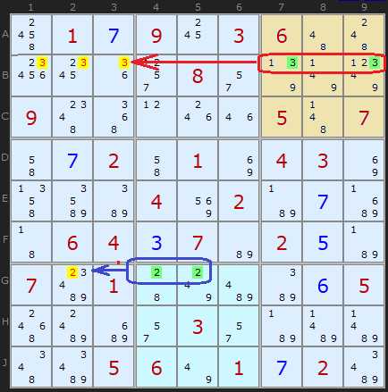
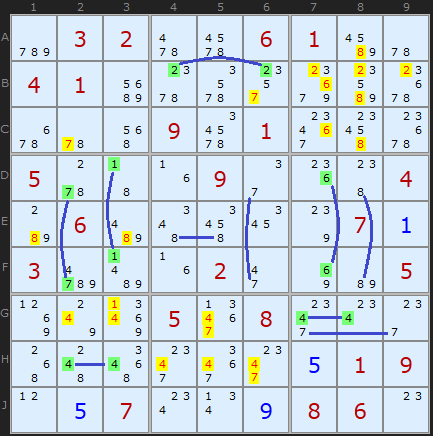
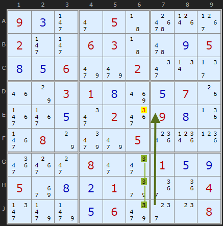
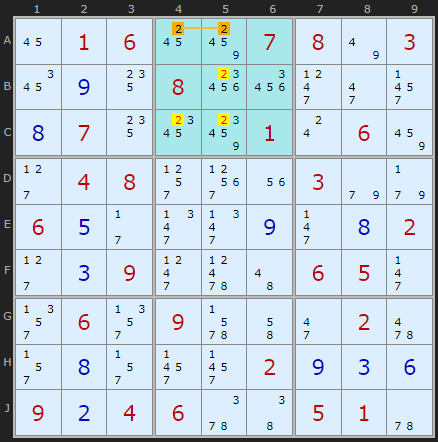
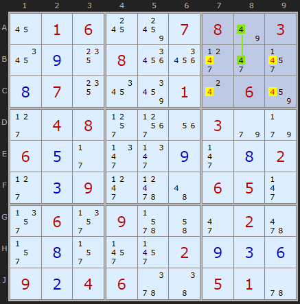
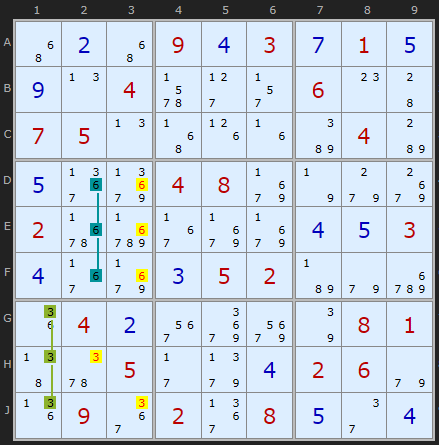
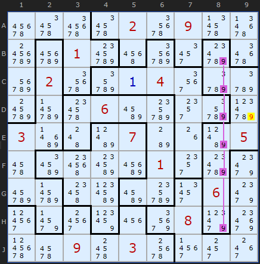

# 03 · Intersection Removal (Pointing Pairs & Box/Line Reduction)

> **Level:** Basic · **Family:** Single-digit · **Prerequisites:** [Foundations](../00-foundations/README.md) · **Next:** [X-Wing](../04-x-wing/README.md)
> Diagrams: [sudokuwiki.org/Intersection_Removal](https://www.sudokuwiki.org/Intersection_Removal) by Andrew Stuart. Text: original to this guide.

## In one sentence

When a box and a line (row or column) overlap, and one of them has a digit **only inside the overlap**, the *other* one can't have that digit outside the overlap.

## The intuition

A box and a row overlap in exactly **3 cells**. Call that overlap the *intersection*.

```
          Box 3
        ┌───────┐
Row B → │ X . X │ ← intersection (B7, B8, B9)
        │ . . . │
        │ . . . │
        └───────┘
```

Both units need one copy of digit X. If **either** unit can only place X in the intersection, then X *will* land in the intersection. That satisfies the other unit too, so the other unit can't have X anywhere else.

There are two directions, and they're the same idea seen from opposite sides:

| Name | Restricted unit | Eliminate from | Mnemonic |
|---|---|---|---|
| **Pointing pair/triple** | the **box**: X only on one line inside it | the rest of that **line** | the box *points* along the line |
| **Box/Line Reduction** (a.k.a. *claiming*) | the **line**: X only inside one box | the rest of that **box** | the line *claims* the box |

## How to spot them

- **Pointing:** for each box and each digit, are the candidates all in one row or one column? If so, look along that line *outside* the box.
- **Claiming:** for each row and column and each digit, are the candidates all inside one box? If so, look at the rest of that box.
- Do this right after placing a digit. New placements often squeeze a digit into a single line.

---

## Worked examples

### Example 1: two pointing pairs



- In **box 3** the only 3s are **B7 and B9**, and both are in row B. So row B's 3 lives in box 3, and the 3s in row B over in **box 1** go.
- In **box 8** the only 2s are **G4 and G5**, in row G. They point left and remove the 2 in **G2**.

▶ [Load position](https://www.sudokuwiki.org/sudoku.htm?bd=S9B4s010g091803064a4c281c1i2t082q7r7v81094g520l1o1m054b074i0g024i018i04038i4nbqba048y02b70gc34306040c07b6020eb707bk01447wbeba0f0558bgc22q032qb7bfbf4ebi05067u010g02bi) · [From the start](https://www.sudokuwiki.org/sudoku.htm?bd=010903600000080000900000507002010430000402000064070200701000005000030000005601020)

### Example 2: a board full of pointers



This puzzle is unusually rich. For practice, cover the yellow eliminations with your hand and try to find which pointing pair causes each one.

▶ [Load position](https://www.sudokuwiki.org/sudoku.htm?bd=032006100410000000000901000500090004060000070300020005000508000000000019007000860)

### Example 3: a pointing *triple*



All of box 8's 3s are in **G6, H6, J6**. That's three cells, all in column 6. They point up the column and knock out a 3 higher up.

▶ [Load position](https://www.sudokuwiki.org/sudoku.htm?bd=S9B090c2j2i0543701p39022j2j060343620i050h0e069m9m022m0v2f1m7o03010h8q0e071g3f3f0e2m023i090h1j3f087o9q9m051s1t1l3i3g2k082i2m010e0i05aa0h0b019i3a1i042n9n9n0e069q2g0o08)

### Example 4: Box/Line Reduction



Row A's only 2s are **A4 and A5**, both in box 2. Row A's 2 *must* be in box 2's top row, so box 2 can't have a 2 anywhere else. That removes **B5, C4, C5**.

▶ [Load position](https://www.sudokuwiki.org/sudoku.htm?bd=S9B160106188c07087u031a0i140828262l2i2z0h07141c8g010s068a2d04082t3p1u039e9f060e2b2n2n0i2j0h022d0c092l654a06052j2v062v096b4i2i02622r0h2r2z2z020i0c0f090b04065y4605015u)



On the very next step, **column 8** has its only 4s at **A8 and B8**, inside box 3. The other 4s in box 3 go, and that leaves **C7 = 2**.

▶ [Load position](https://www.sudokuwiki.org/sudoku.htm?bd=S9B160106188c07087u031a0i140826262l2i2z0h07141a8e010s068a2d04082t3p1u039e9f060e2b2n2n0i2j0h022d0c092l654a06052j2v062v096b4i2i02622r0h2r2z2z020i0c0f090b04065y4605015u)

### Example 5: claiming with triples



- **3s, column 1:** only G1, H1, J1, all in box 7, so every other 3 in box 7 goes.
- **6s, column 2:** the same thing happens one column over, clearing 6s from **D3, E3, F3**. (Column 3 still has 6s elsewhere, so nothing breaks.)

▶ [Load position](https://www.sudokuwiki.org/sudoku.htm?bd=S9B4y0b4y090d030g010e0i0n046b2d2r060o4407050n4z1h1fba04b80e3baf0408ab7n9gac026rdv37abab0d0e030d37ab0c0502b79edu1i040b3maeaq7q0801475z052b9j0d02069e1j093b023b080e2e0d)

---

## Variant note: Jigsaw



In Jigsaw Sudoku the "boxes" are irregular, so one region can overlap a line in *more than three* cells. The logic is the same. Here, if **D9** were 9 it would wipe out every 9 in column 8, so D9 can't be 9.

---

## Common mistakes

- ❌ **Eliminating inside the intersection.** The candidates *in* the overlap are the ones doing the work. Never remove those.
- ❌ **Getting the direction backwards.** Ask yourself which unit is restricted. You eliminate from the **other** one.

## How it connects

- An [X-Wing](../04-x-wing/README.md) built from a box and a line turns out to be exactly this technique.
- [Grouped X-Cycles](../27-grouped-x-cycles/README.md) and [Empty Rectangles](../52-empty-rectangles/README.md) treat "X somewhere in this intersection" as a single chain node.
