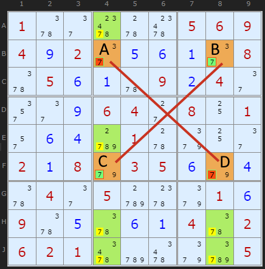
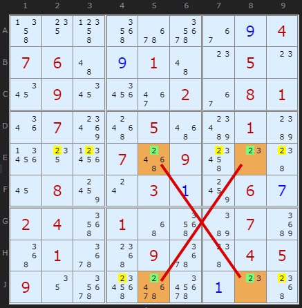
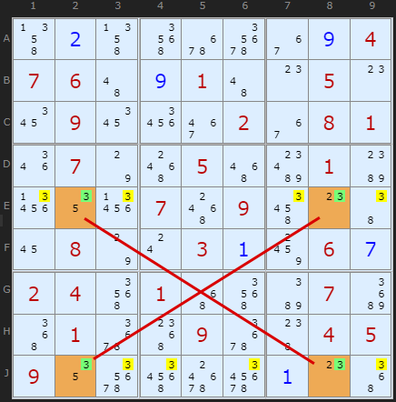
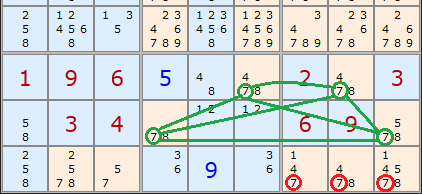
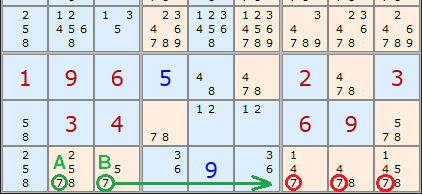

# 04 · X-Wing

> **Level:** Tough · **Family:** Fish (single-digit) · **Prerequisites:** [Intersection Removal](../03-intersection-removal/README.md) · **Next:** [Swordfish](../09-swordfish/README.md)
> Diagrams: [sudokuwiki.org/X_Wing_Strategy](https://www.sudokuwiki.org/X_Wing_Strategy) by Andrew Stuart. Text: original to this guide.

## In one sentence

If a digit has **exactly two spots in each of two rows**, and those spots line up in the **same two columns**, the digit will occupy two opposite corners of that rectangle. Remove it from the rest of both columns.

## The intuition: two lanes, two cars

Picture rows B and F as two lanes, each needing exactly one 7. Each lane has only two parking spots, and they sit in the *same* columns (4 and 8):

```
           col 4     col 8
row B  ──  [7]  ────  [7]  ──     ← only two 7s in row B
            │          │
row F  ──  [7]  ────  [7]  ──     ← only two 7s in row F
            │          │
         other 7s   other 7s     ← ✗ eliminate these
```

There are only two ways to fill it:

| Option | Row B's 7 | Row F's 7 |
|---|---|---|
| ╲ diagonal | col 4 | col 8 |
| ╱ diagonal | col 8 | col 4 |

**Either way, column 4 gets one 7 from these rows, and so does column 8.** Each column is full, so any other 7 in columns 4 and 8 is impossible.

> 💡 **Base vs cover.** The units where the digit is restricted are the **base sets** (here, the rows). The units you clear are the **cover sets** (the columns). This vocabulary scales to [Swordfish](../09-swordfish/README.md), [Jellyfish](../16-jellyfish/README.md) and [Finned Fish](../29-finned-x-wing/README.md).

It works rotated as well: two **columns** with the digit in the same two **rows** clear those rows.

## How to spot it

1. Pick one digit. With digit highlighting turned on, an X-Wing jumps out much faster.
2. Find rows (or columns) where that digit appears **exactly twice**.
3. Look for two such rows whose pairs sit in the **same two columns**.
4. Scan those two columns for extra copies. Those are your eliminations.

---

## Worked examples

### Example 1: the classic X-Wing on 7



Cells **A, B, C, D** form the rectangle. Rows B and F each have only those two 7s. The 7s elsewhere in the two columns (boxed in green) must go, whichever diagonal turns out to be true.

▶ [Load position](https://www.sudokuwiki.org/sudoku.htm?bd=S9B015y2e685w68050609040i022e0e0f0a2e085y050f0a5u090b042e2u2e0i06042c0810012q0f0dd0015w9i102e020a089e03050f9e0d5y042e05d0609i010f095y0e5y0f0a045y0206020166cy669id205) · [From the start](https://www.sudokuwiki.org/sudoku.htm?bd=100000569402000008050009040000640801000010000208035000040500010900000402621000005)

### Example 2: column-based, with a big payoff



This time the **columns** are the base. In columns 5 and 8 the 2 only appears in rows E and J (the orange cells). The red X shows the two diagonals: **E5+J8** or **E8+J5**. Either way rows E and J get their 2 from these cells, so six other 2s in those rows are removed (yellow).

▶ [Load position](https://www.sudokuwiki.org/sudoku.htm?bd=S9B4n144p5i6q7a360i0407064a0i014a0o050o1a091a263e023608011q078w580556bk01bc2714290758094w0o4816088c0s030a8c060g02045i014y5iba07c652016u54096u48040509127a5s707i0a0o54) · [From the start](https://www.sudokuwiki.org/sudoku.htm?bd=000000004760010050090002081070050010000709000080030060240100070010090045900000000)

### Example 3: same rows, different digit



A few moves later the same two rows host a second X-Wing, this time on **3** in columns 2 and 8. Once you've found one X-Wing, check the **same pair of lines** for other digits.

▶ [Load position](https://www.sudokuwiki.org/sudoku.htm?bd=S9B4n0b4n5i6q7a360i0407064a0i014a0o050o1a091a263e023608011q077o580556bk01bc2712270758094u0o4616087o0s030a8c060g02045i014y5iba07c652016u54096u48040509127a5q707i0a0o52)

---

## What about boxes?

You *can* run the same logic with a box as a base or cover set. But it never finds anything new:



Here rows 7 and 8 (G and H) each have two 7s, and the cover sets are the bottom-right boxes. The shape is a trapezoid rather than a rectangle. It removes the circled 7s, but...



...a plain **pointing pair** (A, B) removes exactly the same 7s.

| Base → Cover | Equivalent to |
|---|---|
| Rows → Columns, or Columns → Rows | **True X-Wing** |
| Boxes → Lines | Box/Line Reduction |
| Lines → Boxes | Pointing Pair |

> 🧠 **Takeaway:** an X-Wing that involves a box is really [Intersection Removal](../03-intersection-removal/README.md) in disguise. Only look for row/column X-Wings.

---

## Common mistakes

- ❌ **Base lines with 3 candidates.** Each base line must have the digit in *exactly* the two corner cells. (If there's a third one, look at [Finned X-Wing](../29-finned-x-wing/README.md).)
- ❌ **Removing from the base lines.** The base rows are already restricted to the corners. You clear the *cover* lines.
- ❌ **Mixing up which direction you clear.** If the digit is restricted in the rows, clear the columns, and the other way round.

## How it connects

- **Bigger fish:** 3 lines → [Swordfish](../09-swordfish/README.md). 4 lines → [Jellyfish](../16-jellyfish/README.md).
- **Imperfect fish:** [Finned X-Wing](../29-finned-x-wing/README.md), [Franken Swordfish](../31-franken-swordfish/README.md).
- **As a chain:** an X-Wing is a 4-link loop. See [X-Cycles](../14-x-cycles/README.md).

## Practice puzzles

Puzzles that need an X-Wing but are otherwise simple:
[1](https://www.sudokuwiki.org/sudoku.htm?bd=000001008700030009020000061080009003001040900900300020240000080600090005100600000) ·
[2](https://www.sudokuwiki.org/sudoku.htm?bd=000001408000206030720000009030700000400605003000002040900000062060903000502400000) ·
[3](https://www.sudokuwiki.org/sudoku.htm?bd=000080000000901084209040006790000800040000050006000042900060501160704000000030000) ·
[4](https://www.sudokuwiki.org/sudoku.htm?bd=900020000506000109007501000000008060601000507090400000000602700409000806000080004) ·
[5](https://www.sudokuwiki.org/sudoku.htm?bd=029010400000506090080000000002060300060701080005080100000000010070402000004070250)
