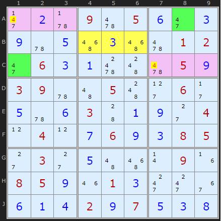
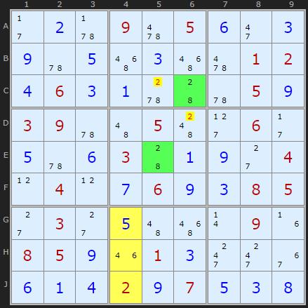
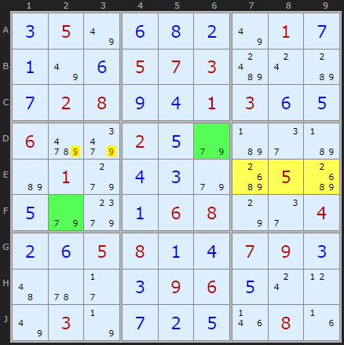
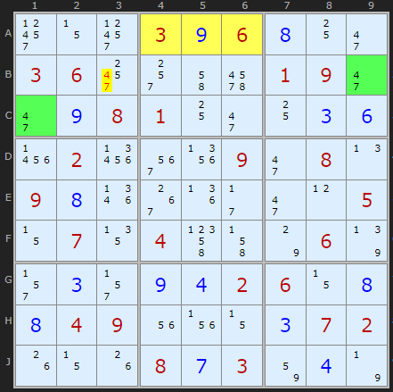
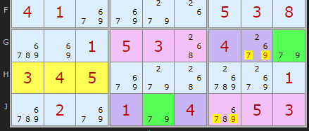

# 05 · Chute Remote Pairs

> **Level:** Tough · **Family:** Bivalue patterns · **Prerequisites:** [Naked Candidates](../01-naked-candidates/README.md), [Intersection Removal](../03-intersection-removal/README.md) · **See also:** [W-Wing](../13-w-wing/README.md)
> Diagrams: [sudokuwiki.org/Chute_Remote_Pairs](https://www.sudokuwiki.org/Chute_Remote_Pairs) by Andrew Stuart. Text: original to this guide.

## In one sentence

Two identical bivalue cells `{x,y}` that sit in the same **chute** but **can't see each other** can't *both* be y if the chute's third box has no room for a y in the right place. So at least one of them is x, and any cell that sees both loses x.

## Vocabulary: the chute

A **chute** is three boxes in a line. There are six: the three horizontal **bands** (boxes 1-2-3, 4-5-6, 7-8-9) and the three vertical **stacks** (boxes 1-4-7, 2-5-8, 3-6-9).

Within a band, every digit appears **once in each of the 3 rows** and **once in each of the 3 boxes**. So the three copies of a digit form a little "permutation": each copy has its own row *and* its own box.

## The intuition

```
 Box 1          Box 2          Box 3
┌─────────┐   ┌─────────┐   ┌─────────┐
│ . . .   │   │ . . .   │   │ . [P]   │ ← row A   P = {4,7}
│ . . .   │   │ ▒ ▒ ▒   │   │ . . .   │ ← row B   ▒ = "yellow" cells
│[Q] . .  │   │ . . .   │   │ . . .   │ ← row C   Q = {4,7}
└─────────┘   └─────────┘   └─────────┘
```

Ask: **could P and Q both be 7?**

- P = 7 uses up row A's 7 and box 3's 7.
- Q = 7 uses up row C's 7 and box 1's 7.
- The band's third 7 then has to be in **row B** *and* **box 2**, which means in one of the ▒ cells.

So **if the ▒ cells have no 7** (no candidate, and no placed 7), P and Q can't both be 7. Each of them is either 4 or 7, so **at least one is 4**. A cell that sees both P and Q can't be 4.

> 🔑 **The rule in one breath:** look at the yellow cells. **The digit that's missing protects the digit that's present.** Eliminate the *present* digit from cells that see both pair cells.

## Checklist

1. Find two cells with the **same two candidates** `{x,y}`.
2. They must be in the **same chute**, but in **different boxes and different lines**, so they can't see each other.
3. Locate the **third box** of the chute, and within it the **line neither cell is on**. Those 3 cells are the "yellow" cells.
4. Check the yellow cells for x and y, **including solved cells**:
   - only x present (no y anywhere there) → eliminate **x** from the common peers of the pair
   - only y present → eliminate **y**
   - **neither** present → the pair is *exactly* {x,y} in some order, so eliminate **both**
   - both present → no conclusion

---

## Worked examples

### Example 1: the classic shape



- Green: **A8** and **C1**, both `{4,7}`, in the top band and in different rows and boxes.
- Yellow: the third box (box 2), on the leftover row B, is **B4, B5, B6**. It has 4s but **no 7**.
- So A8 and C1 can't both be 7, and at least one is **4**. The pink cells that see both (**A1** and **C7**) lose their **4**.

▶ [Load position](https://www.sudokuwiki.org/sudoku.htm?bd=S9B2j0b5v0962050f2i0c0i5u0e560c566201022i060c0a644c62050i03095u4a054c2d062b0e5u0f03440a0i2c040l040l0g060i0c08052c032c0e4a560r091f08050i1m010c2k2k360f0a0d020i070e0c0h) · [From the start](https://www.sudokuwiki.org/sudoku.htm?bd=000905000000000012060000050390050060000300004040060085030000090850010000000207000)

### Example 2: a vertical chute, proved by contradiction



**C6** and **E5** are `{2,8}` in the middle stack. The yellow cells (the leftover column in box 8) contain a 2, at **J4**. It's a solved cell, but that still counts. There's **no 8**.

Suppose a pink cell such as **C5** were 2. Then both green cells would have to be **8**. That uses up column 6's 8 and column 5's 8 in this stack, so box 8 would need its 8 in column 4, and column 4 has no 8 available. That's a contradiction, so the pink cells can't be 2.

▶ [Load position](https://www.sudokuwiki.org/sudoku.htm?bd=S9B2b0b5v0962050f2i0c0i5u0e560c566201020d060c0a5w445u050i03095u4a054c2d062b0e5u0f03440a0i2c040l040l0g060i0c08052c032c0e4a560r091f08050i1m010c2k2k360f0a0d020i070e0c0h)

### Example 3



**D6** and **F2** are `{7,9}` in the middle band. The yellow cells **E7, E8, E9** have a 9 but **no 7**, so the pair can't be 7+7, and 9 comes off **D2** and **D3**.

▶ [Load position](https://www.sudokuwiki.org/sudoku.htm?bd=S9B0c057u0f0h0b7u010g0a7u0f050703bg0sb80g02080i0d01030f0e06d69q020e9eb72eb7b6019g0d0c9ec405c40e9e9k0a06087o2e040b0f05080a0d07090c4a5u2b0c09060e0s0l7u037n0g0b0e1n081f)

### Example 4: double elimination (rare)



The yellow cells **A4, A5, A6** contain **neither 4 nor 7**. The pair B9/C1 can't be 4+4 and can't be 7+7, so it's one of each. **B3**, which sees both, loses its 4 *and* its 7.

▶ [Load position](https://www.sudokuwiki.org/sudoku.htm?bd=S9B310z31030i060h102i0306302s4i6i01092i2i0i0801102i100c0f2302273m1z092i080n090h1r381j2b2i0l050z0713044p4j7o067r2r0c2r0i0d02060z0h0h04091u1v0z0c07021g0z1g080g03820d7n)

### Example 5: "either end" bonus eliminations



The yellow cells **H1–H3** have neither 7 nor 9, so the pair **G9/J5** is exactly {7,9}. **J7** sees both cells and loses both digits, as usual. But you can push each case further:

- If **J5 = 7**, then row J's 7 is used, and box 7 can't use row H (yellow) for its 7, so box 7's 7 is in **G1–G3**. Meanwhile G9 = 9.
- If **J5 = 9**, then by the same reasoning box 7's 9 is in **G1–G3**, and G9 = 7.

In both cases, row G's 7 and 9 are "spoken for" by G9 and box 7. So **G8** (a purple cell) can be neither 7 nor 9, even though it doesn't see J5.

▶ [Load position](https://www.sudokuwiki.org/sudoku.htm?bd=S9B8i058i0801070304020207030405090108060108040206039e9e05050308aa0401acac9eaa8i02030805aa01040401aaaa9g1g050308du8i0105035004ac9e030405aa9g50dwac01du02aa019e04du0503)

---

## Common mistakes

- ❌ **Using a pair that can see each other.** That's an ordinary naked pair, so apply that rule instead.
- ❌ **Checking the wrong yellow cells.** It's the third box's line that **neither** green cell is on.
- ❌ **Ignoring solved cells.** A placed digit in the yellow cells counts as "present".
- ❌ **Eliminating the missing digit.** It's the other way round: the missing digit is the one that's *ruled out as a double*, so the **present** digit gets eliminated.

## How it connects

This is really a special case of the [W-Wing](../13-w-wing/README.md). The band structure plays the role of the W-Wing's strong link.

## Practice puzzles

[1](https://www.sudokuwiki.org/sudoku.htm?bd=060000200000401073800000004400700100008903700001005000200000000310209000005000030) ·
[2](https://www.sudokuwiki.org/sudoku.htm?bd=008400200070000050230000094060390000009050300000062070340000067080000010001007900) ·
[3](https://www.sudokuwiki.org/sudoku.htm?bd=010000306000208007400706000000000014100070003590000000000309000200604000304000050) ·
[4](https://www.sudokuwiki.org/sudoku.htm?bd=003000800000060053200100000050000097007208300060000000000006005590010000001000908)
