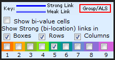
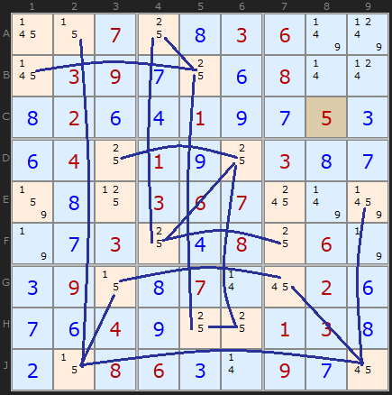
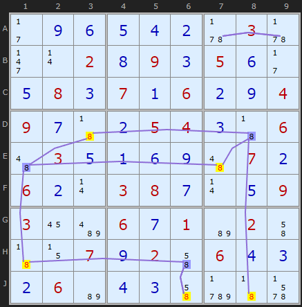
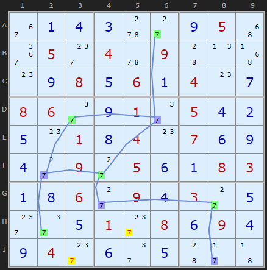
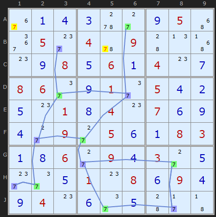
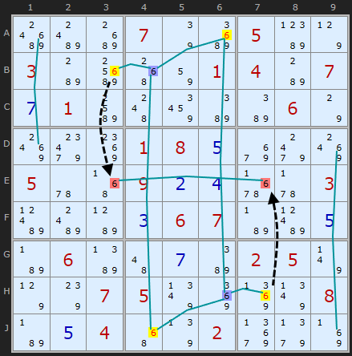
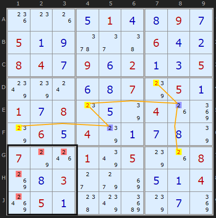

# 06 · Simple Colouring (Singles Chains)

> **Level:** Tough · **Family:** Single-digit chains · **Prerequisites:** [Foundations §3–4](../00-foundations/README.md) · **Next:** [Multi-Colouring](../51-multi-colouring/README.md), [3D Medusa](../15-3d-medusa/README.md)
> Diagrams: [sudokuwiki.org/Simple_Colouring](https://www.sudokuwiki.org/Simple_Colouring) by Andrew Stuart. Text: original to this guide.

## In one sentence

Choose one digit. Connect every pair of cells that are the **only two** places for it in some unit, and colour the connected cells in **two alternating colours**. One colour will be entirely true and the other entirely false. Then look for contradictions.

## The intuition: a network of see-saws

Every strong link (exactly two spots for digit X in a unit) is a **see-saw**: when one end goes up (true), the other goes down (false). Link several see-saws end to end and they move *together*. If you push one end down, the whole network settles into one of two positions.

```
   Blue ═══ Green ═══ Blue ═══ Green
    (A)      (B)       (C)      (D)
State 1:  A,C true   B,D false
State 2:  A,C false  B,D true
```

You don't know which state is real. **You don't need to.** You look for cells that come out badly in one state (a contradiction) or in both states (an elimination).

## How to colour

1. Pick a digit X. Turn on digit highlighting if your app has it.
2. Find every unit (row, column or box) that has **exactly two** X candidates. Each of those is a link.
3. Start at any linked cell and colour it **blue**. Colour its partner **green**, that partner's other partners **blue**, and so on, always alternating.
4. Keep going until the network can't grow any further. (Units with 3+ Xs don't make links, but they still matter for the rules below.)



*In sudokuwiki's solver, click a candidate (here the 5 in C8) to highlight every copy of that digit. The chain tool under the strategy list can draw all the links for one digit. Tick rows, columns and boxes, and untick the other digits.*



*All the links for digit 5. Box 1 and box 6 have three or more 5s, so no links come from them.*

---

## The three rules

| Rule | What you see | Conclusion |
|---|---|---|
| **Colour twice in a unit** (Rule 2) | Two cells of the **same colour** share a unit | That colour is **false** everywhere. The other colour is true everywhere. |
| **Sees both colours** (Rule 4) | An **uncoloured** X candidate sees one blue *and* one green | That candidate is **false** |
| **Colour empties a unit** (Rule 7) | Every X in some unit sees the same colour | That colour is **false** |

### Rule 2: same colour twice in a unit ⇒ that colour is false



The chain on 8s puts two yellow-coloured cells (**J6** and **J8**) in row J. A row can't hold two 8s, so that colour must be the false one. Every 8 of that colour goes, and every 8 of the other colour is **placed**. One rule, a whole handful of solved cells.

▶ [Load position](https://www.sudokuwiki.org/sudoku.htm?bd=S9B2b0i0f0e0d0b5v035v2j0r020h090c050f2b0e080c070a060b0i04090g430b05040c43064a030e0a0f0i4a070b060b0r03080g0r0e090316be060g01b6024i430z070i024i060d0c0b06b60d0c4icz436b) · [From the start](https://www.sudokuwiki.org/sudoku.htm?bd=000000030002090500080706004900054006030000070600380009300601020007020600060000000)

> The solver colours the network blue and green. When it finds the false colour, it repaints that colour yellow (its usual "eliminate" colour).

### Rule 4: a cell that sees both colours ⇒ eliminate



**J3** sees **H2** (one colour, via box 7) and **J8** (the other colour, via row J). Exactly one colour is true, so whichever one it is, J3 is looking at a true 7. J3 can't be 7. **H5** gets knocked out the same way.

▶ [Load position](https://www.sudokuwiki.org/sudoku.htm?bd=S9B360a0d0c5w2c0i054y3a052g045u09440n4z0o0i080e060a040o0g08062e0i012e050d0b0e0o010h040o070f0i0d2c092c050f0a08030a0h062c090d032c0e2g2e0e012g080f090d0i042g0f2e0e442b43)



After those eliminations the network is a little different. Run the same check again and two more 7s fall.

▶ [Load position](https://www.sudokuwiki.org/sudoku.htm?bd=S9B360a0d0c5w2c0i054y3a052g045u09440n4z0o0i080e060a040o0g08062e0i012e050d0b0e0o010h040o070f0i0d2c092c050f0a08030a0h062c090d032c0e2g2e0e010o080f090d0i040o0f2e0e442b43)

> 💡 Rule 4 is by far the most useful rule. In benchmark testing on sudokuwiki it accounts for about **9 out of 10** Simple Colouring finds.

### Rule 7: one colour would empty a unit ⇒ that colour is false



The coloured network on 6s doesn't reach row E, but row E has a strong link of its own: its only 6s are **E3** and **E7** (red). Now look at what each of them sees:

- E3 sees **B3** (yellow), in column 3.
- E7 sees **H7** (yellow), in column 7.

If yellow were the true colour, both E3 and E7 would lose their 6, and row E would have **no 6 at all**. That's impossible, so **yellow is false** and **blue is true**.

▶ [Load position](https://www.sudokuwiki.org/sudoku.htm?bd=S9Bccbgc4077qc605bd7p03b8ck50820104b8070g01bo4c8ebaba067o8s9s8o01080eaa9o8s055u4z090b0d6r5v03bhbgb90c0607b7bh0eb706bb4a0gba02057v7p7s07057z8m8n7z08b70e044y7r02af9j8j)



The same idea works on a unit with more than two candidates. Box 7 has four 2s. **H1, J1** see the yellow **F1**, and **G2, G3** see the yellow **G8**. If yellow were true, box 7 would have no 2, so yellow is false.

▶ [Load position](https://www.sudokuwiki.org/sudoku.htm?bd=S9B1k0o1g0e010d0h090g050a0i5y2e46060d0b08040g090f020a0c05807s0s0f0h077s050a010g080o0e7q041g8m7s060e047s0a0g0h7q077o1o017y057s1g088k0h032c9g8i0e0a048s050a4880c67s0g8m)

---

## Where did Rules 1, 3, 5, 6 go?

The numbering matches [3D Medusa](../15-3d-medusa/README.md), which uses the same colouring idea across *several digits*. Rules 1, 3, 5 and 6 only make sense when a cell can hold more than one coloured candidate, so they live on that page. (The old Rule 5 was merged into Rule 4.)

## Common mistakes

- ❌ **Linking across a unit with 3+ candidates.** Only units with *exactly two* of the digit count as links.
- ❌ **Mixing up two separate networks.** If two groups of coloured cells aren't connected by links, their colours are unrelated. Use different colour pairs for them, and see [Multi-Colouring](../51-multi-colouring/README.md) for what you can do with two networks.
- ❌ **Forgetting to re-colour after eliminations.** New links appear as candidates disappear.

## How it connects

- An [X-Wing](../04-x-wing/README.md) is the smallest closed colouring network.
- [X-Cycles](../14-x-cycles/README.md) are colouring plus weak links, so they find more.
- [3D Medusa](../15-3d-medusa/README.md) is colouring across all digits, using bivalue cells as extra links.

## Practice puzzles

[1](https://www.sudokuwiki.org/sudoku.htm?bd=6.2.7...9...4.........2..7.5.....631.76...54.134.....2.4..1.........2...2...4.1.6) ·
[2](https://www.sudokuwiki.org/sudoku.htm?bd=.2.4.6.....5.8..26.1..........76...54..3.1..71...92..........1.89..1.4.....2.9.3.) ·
[3](https://www.sudokuwiki.org/sudoku.htm?bd=.3.....92...8.43....2...4.5....51...9.......3.2.96......8........42.8...76.....1.) ·
[4](https://www.sudokuwiki.org/sudoku.htm?bd=5.7.8...28...2.........9.7......7.8....3.6....5.2..1...365.............72.....4.1)
