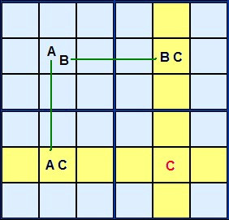
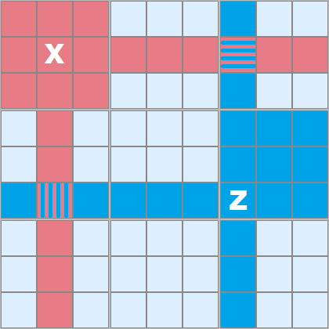
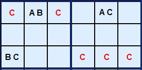
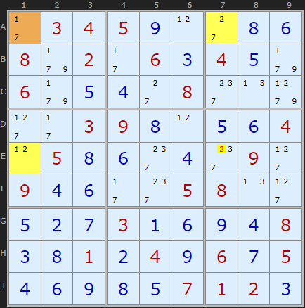
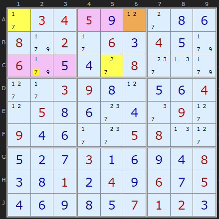
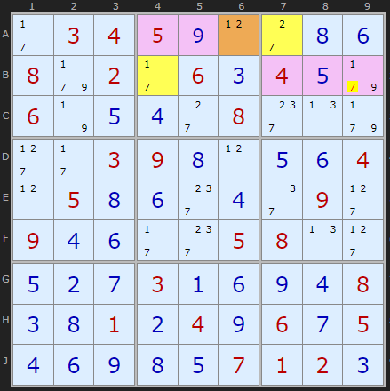
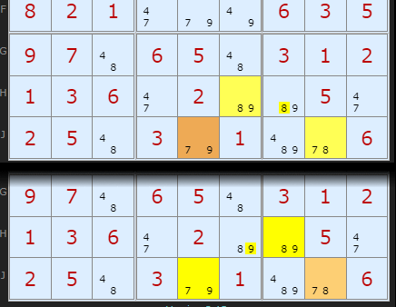

# 07 · Y-Wing (a.k.a. XY-Wing)

> **Level:** Tough · **Family:** Wings (bivalue chains) · **Prerequisites:** [Naked Candidates](../01-naked-candidates/README.md) · **Next:** [XYZ-Wing](../10-xyz-wing/README.md), [W-Wing](../13-w-wing/README.md), [XY-Chains](../25-xy-chains/README.md)
> Diagrams: [sudokuwiki.org/Y_Wing_Strategy](https://www.sudokuwiki.org/Y_Wing_Strategy) by Andrew Stuart. Text: original to this guide.

## In one sentence

A **pivot** cell `{A,B}` sees two **pincer** cells `{A,C}` and `{B,C}`. Whatever the pivot turns out to be, one of the pincers becomes **C**. So any cell that sees *both* pincers can't be C.

## The intuition: a fork in the road

The pivot has only two options, and each one sends you down a different road. Both roads end with a C:

```
            Pivot {A,B}
            /          \
     if A  /            \  if B
          ▼              ▼
  Pincer1 {A,C}     Pincer2 {B,C}
   loses A → C       loses B → C
```

"One of the two pincers is C" is now guaranteed, which means any cell that can see **both** pincers is looking at a guaranteed C.



*The rectangle layout. The pivot `AB` is in the corner, the pincers `AC` and `BC` are in the adjacent corners, and the opposite corner (red C) is the cell that gets cleared.*

## Where to look for victims

The cells that lose C are the **intersection of what the two pincers can see**.



*Each pincer "sees" its row, column and box (red and blue regions). Only the overlap is eliminated.*

When the pincers are spread over a rectangle, the overlap is usually a single cell, the fourth corner. When one pincer shares a **box** with the pivot, the overlap gets much bigger:



*The `BC` pincer shares a box with the pivot, and `AC` shares a row with it. Now the pincers jointly see **six** cells (red Cs): three in the pivot's box and three in the other pincer's box, all on the relevant row.*

## How to spot it

1. List the **bivalue cells**. A Y-Wing is made only of them.
2. Pick a candidate pivot `{A,B}`. Among the bivalue cells it sees, find one with A and some other digit C, and another with B and **the same C**.
3. Check that the two pincers really are `{A,C}` and `{B,C}`. All three cells must have exactly two candidates.
4. Eliminate C from every cell that sees **both** pincers. (The pivot itself doesn't contain C, so it's never affected.)

> 💡 **Quick filter:** in a Y-Wing the three cells together hold exactly **three digits**, and each digit appears in exactly two of the cells. It's like a naked triple `{AB}{AC}{BC}` that has been *bent* so the cells don't all share one unit.

---

## Worked examples

These all come from one puzzle, which needs five Y-Wings in a row.

### Example 1: the rectangle shape



- **Pivot A1** `{1,7}`
- **Pincer A7** `{7,2}`, sharing row A with the pivot
- **Pincer E1** `{1,2}`, sharing column 1 with the pivot
- Shared digit **C = 2**. Either A7 or E1 is a 2, so the fourth corner **E7** loses its 2.

▶ [Load position](https://www.sudokuwiki.org/sudoku.htm?bd=S9B2b0304050i0l2c0h0f089f022b060c040e9f069f0e0d2c082g0n9h2d2b03090h0l0e0f040l050h0f2g0d2g092d090d0f2b2g05080n2d0e0b0g030a0f0i0d080c0h010b040i060g050d0f0i0h0e0701020c) · [From the start](https://www.sudokuwiki.org/sudoku.htm?bd=034500000802060400600008000003900004050000090900005800000300008001040605000007120)

### Example 2: lots of targets, only one is real



The pivot is **A6**. The pincers **A1** and **C5** both carry a 7, and they link to the pivot through 1 and 2. Four cells see both pincers (pink), but three of them are already solved. The one that pays off is the 7 in **C2**.

▶ [Load position](https://www.sudokuwiki.org/sudoku.htm?bd=S9B2b0304050i0l2c0h0f089f022b060c040e9f069f0e0d2c082g0n9f2d2b03090h0l0e0f040l050h0f2g0d2e092d090d0f2b2g05080n2d0e0b0g030a0f0i0d080c0h010b040i060g050d0f0i0h0e0701020c)

### Example 3



**A6** is the pivot again. This time it links to **A7** via 2 and to **B4** via 1. Both pincers carry 7, so **B9**, which sees both of them, loses 7.

▶ [Load position](https://www.sudokuwiki.org/sudoku.htm?bd=S9B2b0304050i0l2c0h0f089f022b060c040e9f067n0e0d2c082g0n9f2d2b03090h0l0e0f040l050h0f2g0d2e092d090d0f2b2g05080n2d0e0b0g030a0f0i0d080c0h010b040i060g050d0f0i0h0e0701020c)

### Example 4: two Y-Wings mirroring each other



Two cells hold `{8,9}` (**H6** and **H7**), and there are two Y-Wings in mirror image: one uses H6 as an endpoint, and the other pivots on **J8** and eliminates 9 from H6. Both arrive at the same result. When a Y-Wing seems arbitrary, look for its twin.

▶ [From the start](https://www.sudokuwiki.org/sudoku.htm?bd=607945023395062000402037569743516298569283741821000635970650312136020050250301006)

---

## Common mistakes

- ❌ **A pincer with three candidates.** All three cells must be bivalue. (A pivot with three candidates is the [XYZ-Wing](../10-xyz-wing/README.md).)
- ❌ **Pincers that don't share C.** Both pincers need the *same* third digit.
- ❌ **Eliminating cells that only see one pincer.** A cell has to see **both** pincers.
- ❌ **Pincers seeing each other.** That's fine, it still works. But if all three cells share one unit, it's simply a naked triple.

## How it connects

- **As a chain:** pincer1 → pivot → pincer2 is the shortest possible [XY-Chain](../25-xy-chains/README.md) (3 cells, both ends on C).
- **Grow the pivot:** [XYZ-Wing](../10-xyz-wing/README.md) → [WXYZ-Wing](../24-wxyz-wing/README.md).
- **Swap the pivot for a strong link:** [W-Wing](../13-w-wing/README.md).
- **Chain several together:** [Y-Wing Chains](../50-y-wing-chains/README.md).

## Practice puzzles

[1](https://www.sudokuwiki.org/sudoku.htm?bd=050000080000086000000201070009020601280000054703060900090605000000170000030000010) ·
[2](https://www.sudokuwiki.org/sudoku.htm?bd=009600000000025090400001078901040800000000000002070906370800002020510000000002400) ·
[3](https://www.sudokuwiki.org/sudoku.htm?bd=009765000600400007070000500090024000500000003000910070005000090100007004000156800) ·
[4](https://www.sudokuwiki.org/sudoku.htm?bd=100007600008010020306020000020000075000385000450000080000040203010030800009700004) ·
[5](https://www.sudokuwiki.org/sudoku.htm?bd=000000001004060208070320400900018000005000600000540009008037040609080300100000000)
