# 08 · Rectangle Elimination

> **Level:** Tough · **Family:** Single-digit chains · **Prerequisites:** [Simple Colouring](../06-simple-colouring/README.md), [Intersection Removal](../03-intersection-removal/README.md) · **Replaces:** [Empty Rectangles](../52-empty-rectangles/README.md)
> Diagrams: [sudokuwiki.org/Rectangle_Elimination](https://www.sudokuwiki.org/Rectangle_Elimination) by Andrew Stuart (pattern credited to Ken Reek). Text: original to this guide.

## In one sentence

If a candidate X being true would force another X through a strong link, and those two Xs together would **wipe out every X in some box**, then the first candidate can't be X.

## The shape

The pattern always has three corners of a rectangle, and the box at the **fourth corner** is the one that would be emptied:

```
            line L2 (column)
                │
   Wing  W ●┄┄┄┄┼┄┄┄┄┄┄┄┄┄┄┄ ▒▒▒▒▒   ← 4th-corner box (W's row passes through it)
                ┊             ▒▒▒▒▒
                ┊ weak        ▒▒▒▒▒   ← S's column passes through it too
                ┊               ║
   Hinge H ●════╪═══════════════● S    ← line L1 (row): ONLY two Xs = strong link
```

| Piece | Requirement |
|---|---|
| **Hinge H** | Has X. Its line L1 holds **exactly two** Xs: H and S. |
| **Strong partner S** | The other X on L1. |
| **Wing W** | Another X on H's *other* line L2, in a **different box** from H. (L2 can have any number of Xs.) |
| **4th-corner box** | The box where W's row (or column) crosses S's column (or row). Every X in this box must lie on W's line or on S's line. |

**Logic:** if W = X, then H ≠ X (they share L2), so S = X (the strong link). W and S together cover every X in the 4th-corner box, so the box has no X. That's impossible, so **W ≠ X**.

## How to spot it

1. Choose a digit. Find a line with **exactly two** Xs. That gives you the H–S pair. Try each end as the hinge.
2. From the hinge, look along its other line for any X in a different box. That's a candidate wing W.
3. Find the box at the opposite corner. Are *all* its Xs on W's line or S's line? If so, eliminate X from W.
4. Check **every** X on the hinge's other line. Several wings can share the same hinge.

---

## Worked examples

### Example 1: the original pattern

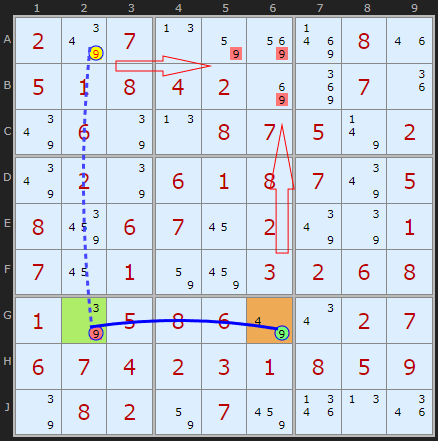

- **Hinge G2** (green) and **S = G6** (orange) are the only 9s in row G, so they form a strong link.
- **Wing A2** (circled) is another 9 in column 2, up in box 1.
- The fourth-corner box is **box 2**. Its 9s are **A5, A6** (in row A, seen by A2) and **B6** (in column 6, seen by G6).
- If A2 = 9, then G2 ≠ 9, so G6 = 9, and box 2 is left with no 9. So **A2 ≠ 9**.

▶ [Load position](https://www.sudokuwiki.org/sudoku.htm?bd=S9B027y070n828y8r081m05010804028i8m071i7y067q0n0807057v027y027q060108077y05088e060716027y7q01071601828a03020608017q0508067u0u02070607040203010805097q080282078a1r0n1q)

### Example 2: same puzzle, a second rectangle

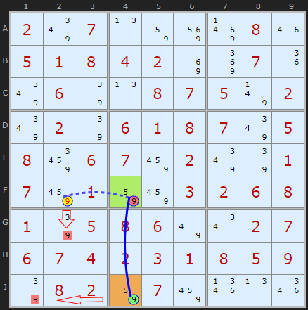

If **F2** were 9, it would knock out G2 (column 2), and it would also knock out F4. Column 4's only other 9 is J4, which would then be forced. J4 = 9 removes the 9 in **J1**, and box 7 runs out of 9s. So F2 ≠ 9.

▶ [Load position](https://www.sudokuwiki.org/sudoku.htm?bd=S9B027y070n828y8r081m05010804028i8m071i7y067q0n0807057v027y027q060108077y05088e06078a027y7q01078a01828a03020608017q0508067u0u02070607040203010805097q080282078a1r0n1q)

### Example 3: several wings from one hinge

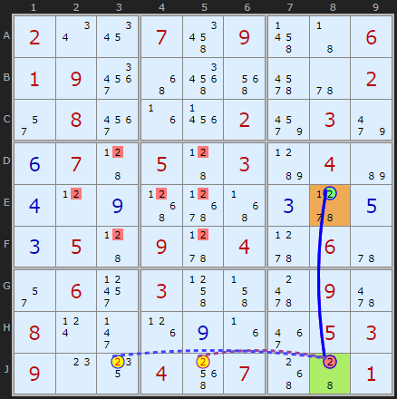

Once you've found a hinge that works, check **every** X along the wing line. Here more than one wing fails the same test.

▶ [Load position](https://www.sudokuwiki.org/sudoku.htm?bd=S9B020u1a074u094r430601093y4y5q5e6i5u022q083u1f2302a2039m0f0745054503b904b60d0l0i516t4z0c5x0e0c0545095x045x065u2q0631034l4j640962080t2j1h0i1f3e0503090o14045g07504401) · [From the start](https://www.sudokuwiki.org/sudoku.htm?bd=200709006190000002080002030070503040000000000050904060060300090800000053900407001)

### Example 4: two digits on the same rectangle

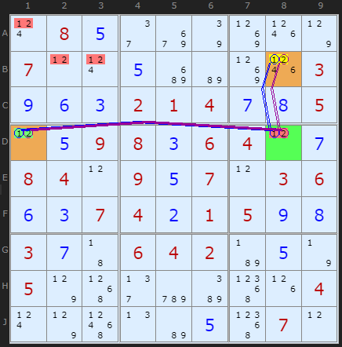

Both 1 and 2 form the same structure. **B8** is the wing for each, **D8–D1** is the strong link, and box 1 is the fourth corner. So B8 loses both 1 and 2.

▶ [Load position](https://www.sudokuwiki.org/sudoku.htm?bd=S9B0t080e2eaa7q8l1p7p070l0t0ec2b68l1p030i0f0c0201040g0h050l0e09080c06040l0g08040l090e070l03060f0c07040b01050i0h030g43060402b70e7n057p512fcyba551h040t7p590nb60e55070l)

The same deduction, seen through two other techniques:

| As an [Empty Rectangle](../52-empty-rectangles/README.md) | As a [Grouped X-Cycle](../27-grouped-x-cycles/README.md) |
|---|---|
| 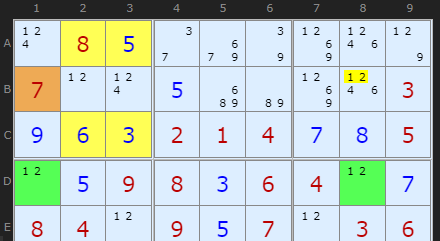 | 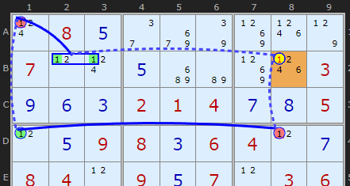 |

As a loop it reads: B8 is 1 ⇒ D8 isn't ⇒ D1 is ⇒ A1 isn't ⇒ the 1 in box 1 is in B2/B3 ⇒ B8 isn't 1. That's a contradiction.

### Example 5: both links strong (rare)

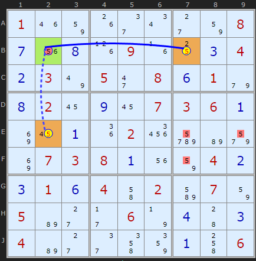

Here the hinge **B2** has a strong link in its row (to **B7**) *and* in its column (to **E2**). If either B7 or E2 were 5, the hinge would be off and the *other* would be forced on too. Together they empty box 6 of 5s. So **neither B7 nor E2 can be 5**, and that means the hinge B2 must be 5.

▶ [Load position](https://www.sudokuwiki.org/sudoku.htm?bd=S9B011m821g2e0u2c82080g1u0h1h091f100c040b037u052i080f019e0h02160i160703060a8i160a1i0226deb69u8i0703080a1u82040b0c010f044i02bm078205b62c2b067n0d440c04b62c2e4m860a4k06)

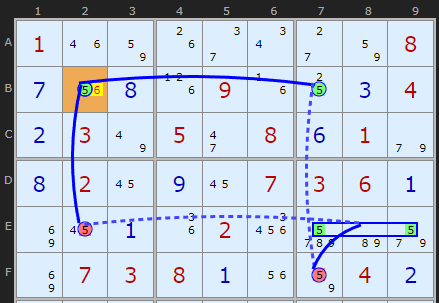

---

## Extensions

### Extended: a longer chain in place of the strong link

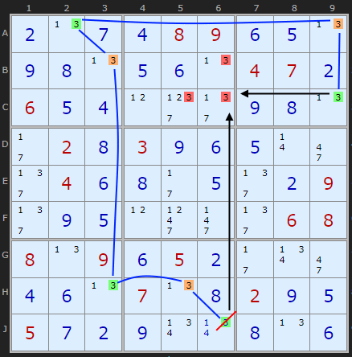

The H–S strong link can be replaced by **any chain** that forces the second X. Here, **J6 = 3** knocks out the 3s at B6 and C6 in column 6. It also travels around the board along the blue chain and forces **C9 = 3**, which takes the last 3 out of box 2. So J6 ≠ 3. *(At the time of crawling, sudokuwiki's solver didn't search for this one yet.)*

▶ [Load position](https://www.sudokuwiki.org/sudoku.htm?bd=S9B0b0n0g0d08090f0e0n0i0h0n0e0f0n04070b060e0d0l0o0g0i0h0n2b020h030i0f0e0r2i0n040f0h0g0e0n0b092e0i0e0l0s0r2e0608080n090f050b2b0v2i0d0f0n070n0h020i0e050g0b0i0v0u0h0n0f)

### Variants

| Variant | Twist | Diagram |
|---|---|---|
| **Jigsaw** | The "4th-corner box" can be any irregular region | 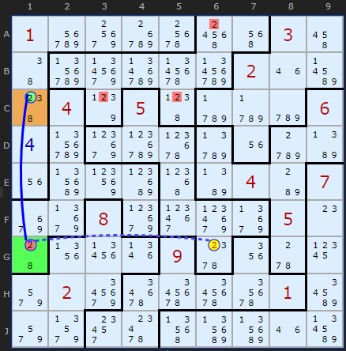 |
| **Jigsaw (lines)** | The emptied unit can be a row or column instead of a region | 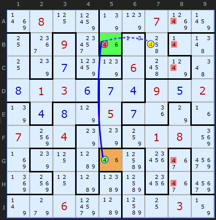 |
| **Sudoku X** | A diagonal can act as one of the lines | 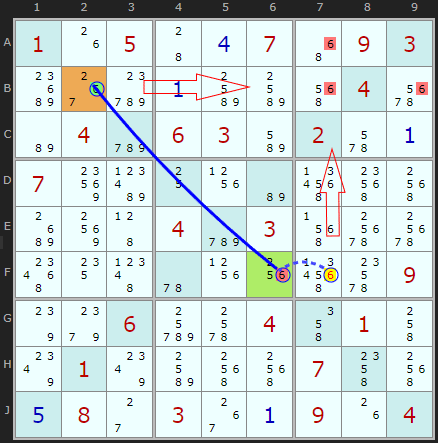 |

---

## Common mistakes

- ❌ **The hinge's line has 3+ Xs.** The H–S link must be **strong** (exactly two Xs).
- ❌ **The wing in the same box as the hinge.** Then the "rectangle" collapses. You'd be looking at a pointing pair instead.
- ❌ **A 4th-corner box with an X that neither W nor S sees.** Then the box isn't emptied, and there's no conclusion.

## How it connects

- Same eliminations as the classic [Empty Rectangle](../52-empty-rectangles/README.md), but much easier to look for.
- Underneath, it's a short [Grouped X-Cycle](../27-grouped-x-cycles/README.md) / [AIC with Groups](../33-aic-with-groups/README.md).

## Practice puzzles

[1](https://www.sudokuwiki.org/sudoku.htm?bd=400038200005000860000600000030920000209000006000041030000004000023000400006850009) ·
[2](https://www.sudokuwiki.org/sudoku.htm?bd=030200040500004008000000706050040001007103800900050030301000000800300002040005080) ·
[3](https://www.sudokuwiki.org/sudoku.htm?bd=000090000046003580209600003090000020000102000030000040300007802087300160000040000) ·
[4](https://www.sudokuwiki.org/sudoku.htm?bd=500403006003807000080050000890000015000182000120000043000040060000706400300508009)
