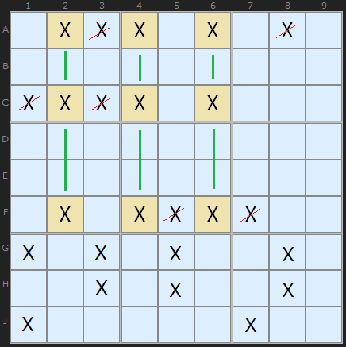
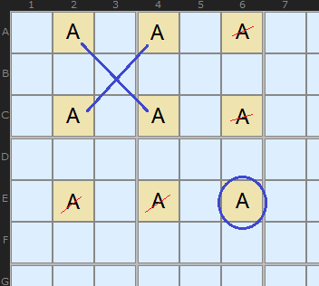
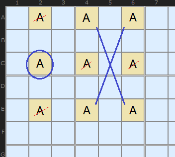
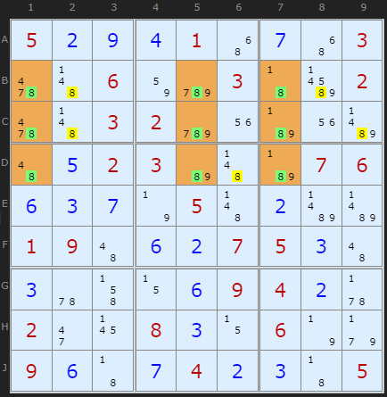
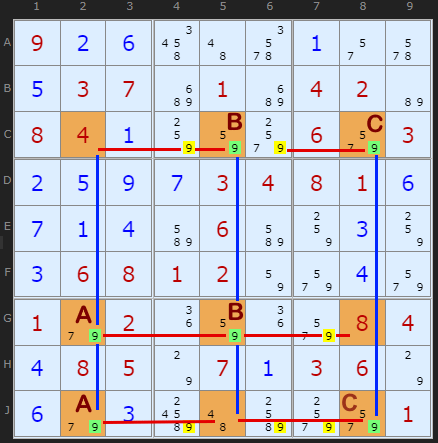
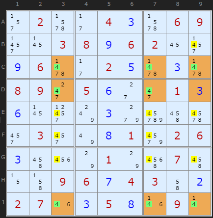

# 09 · Swordfish

> **Level:** Tough · **Family:** Fish (single-digit) · **Prerequisites:** [X-Wing](../04-x-wing/README.md) · **Next:** [Jellyfish](../16-jellyfish/README.md), [Finned Swordfish](../30-finned-swordfish/README.md)
> Diagrams: [sudokuwiki.org/Sword_Fish_Strategy](https://www.sudokuwiki.org/Sword_Fish_Strategy) by Andrew Stuart. Text: original to this guide.

## In one sentence

If, in **three rows**, a digit is confined to the **same three columns** (in total), those three rows will take the digit's three slots in those columns. Remove it from the rest of those columns.

## The intuition: an X-Wing with one more lane

An X-Wing is 2 rows × 2 columns. A Swordfish is **3 × 3**. The counting argument is the same:

- 3 base rows each need one X, so that's **3 Xs**.
- They can only use 3 columns, and each column holds at most one X.
- So each of the 3 columns gets exactly one X *from these rows*, and nothing else in those columns can be X.



*X is confined to columns 2, 4, 6. Those columns line up on rows A, C, F, so X can be cleared from the rest of rows A, C and F.*

### Why it really works: it breaks into X-Wings

If you're not convinced, try placing one corner and watch an X-Wing appear in the remaining cells:

| Suppose **E6** is X... | Suppose **C2** is X... |
|---|---|
|  |  |
| Row E and column 6 clear, leaving an X-Wing in A/C × 2/4 | Row C and column 2 clear, leaving another X-Wing |

Every choice leaves an X-Wing that covers the same columns, so the eliminations hold whichever cell turns out to be true.

## Not every cell needs a candidate

Like a [naked triple](../01-naked-candidates/README.md), a Swordfish only needs the **union** to fit in 3 lines. Each base line can have 2 or 3 candidates:

```
          c1   c2   c3                c1   c2   c3
row 1  [  X    X    X  ]   3-3-3   [  X    X    .  ]   2-2-2
row 2  [  X    X    X  ]           [  .    X    X  ]   (a "ring",
row 3  [  X    X    X  ]           [  X    .    X  ]    easiest to miss)
```

People name the shape by counting candidates per base line, e.g. "3-2-3".

## How to spot it

1. Pick a digit. List every row where it appears **2 or 3 times**.
2. Look for 3 such rows whose candidates all fall within the **same 3 columns**.
3. Clear the digit from those 3 columns, outside the 3 base rows.
4. Repeat with rows and columns swapped.

> 💡 **Tip:** if the digit appears in exactly 2 cells in some row, that row is a great starting point. Follow its two columns and see which other rows stay inside them.

---

## Worked examples

### Example 1: a perfect 3-3-3 (very rare)



All nine cells of the 3×3 grid hold an 8 (green). The yellow 8s outside the base lines go. *(If you load this, turn off Rectangle Elimination, because it gets there first.)*

▶ [Load position](https://www.sudokuwiki.org/sudoku.htm?bd=S9B050b0i0d014y0g4y03624b0682cy0343bv02624b0302cy1ub71ubf4a0e0203b64bb707060f0c0g7n054b0bbfbf01094a0f0b07050c4a0c5u4j0z0f09040b5v022i17080c0z067n9f090f430g040b0c4305)

### Example 2: a minimal 2-2-2



Each of the three base columns has exactly two 9s, labelled **AA**, **BB** and **CC**. They're staggered so that together they cover exactly three rows. That's the minimum possible Swordfish, and it removes six 9s from those rows.

▶ [Load position](https://www.sudokuwiki.org/sudoku.htm?bd=S9B090b0f4u4a6e0a2q6a0e0307c201c20402b608040a84829w069u030b0e0i0g030408010f0g0a0dbm06bm840c840c06080102829u0d9u019e021i821i9u08040d08057o070a03067o0f9e0cbw4abo9w9u01)

### Example 3: rows as the base



This time the base is **rows C, D, J** and the cover is **columns 3, 7, 9**, written compactly as **CDJ379**. Its shape is 3-2-3. Clear the digit from those columns.

▶ [Load position](https://www.sudokuwiki.org/sudoku.htm?bd=S9B2r026b2b040c6b06092z1703080i0602162z0i06632b020e630c6308092k050f2c2i010c0f17317w0c9gdm4q6i2y032y7u0h01a202060c4q227o017o5m074q0z4j09060g04034i0b02071m0c050h1n090r)

---

## Common mistakes

- ❌ **A base line with 4+ candidates.** Every base line must fit inside the 3 cover lines.
- ❌ **Only two base lines really used.** If two of your "Swordfish" lines already form an X-Wing on their own, that X-Wing is what's doing the work.
- ❌ **Clearing the base lines.** Eliminate only from the **cover** lines (the direction the fish *doesn't* start from).

## How it connects

- **Fish family:** [X-Wing](../04-x-wing/README.md) (2) → **Swordfish** (3) → [Jellyfish](../16-jellyfish/README.md) (4). Larger ones always have a smaller complementary fish, so 4 is the useful maximum.
- **With fins:** [Finned Swordfish](../30-finned-swordfish/README.md).
- **Boxes as base sets:** [Franken Swordfish](../31-franken-swordfish/README.md).

## Practice puzzles

[1](https://www.sudokuwiki.org/sudoku.htm?bd=204600005800070900000030020000000096100302007680000000040050000006020008300009602) ·
[2](https://www.sudokuwiki.org/sudoku.htm?bd=500608000008009060260000050006004090700020004010800200090000037080300500000105006) ·
[3](https://www.sudokuwiki.org/sudoku.htm?bd=008900004010580300400000000050302010007000800090001050000000005001036090300008100) ·
[4](https://www.sudokuwiki.org/sudoku.htm?bd=000002801000908007093700400300000004050030020200000006002005170700103000901600000)
