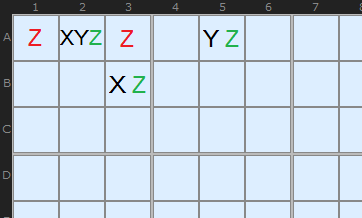
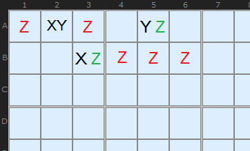
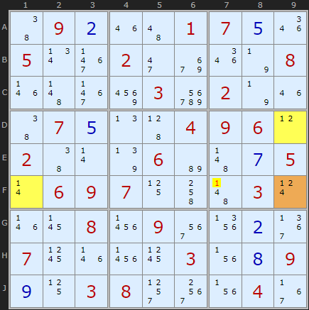
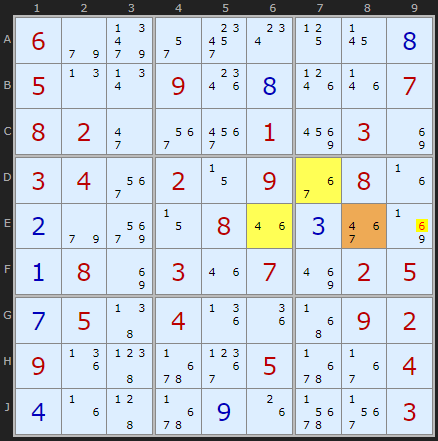

# 10 · XYZ-Wing

> **Level:** Tough · **Family:** Wings · **Prerequisites:** [Y-Wing](../07-y-wing/README.md) · **Next:** [WXYZ-Wing](../24-wxyz-wing/README.md)
> Diagrams: [sudokuwiki.org/XYZ_Wing](https://www.sudokuwiki.org/XYZ_Wing) by Andrew Stuart. Text: original to this guide.

## In one sentence

A Y-Wing whose pivot has **three** candidates `{X,Y,Z}`, with pincers `{X,Z}` and `{Y,Z}`. Now Z could be in *any* of the three cells, so you can only eliminate Z from cells that see **all three**.

## The intuition

Compare it with the Y-Wing:

| | Y-Wing | XYZ-Wing |
|---|---|---|
| Pivot | `{X,Y}` | `{X,Y,Z}` |
| Pincers | `{X,Z}`, `{Y,Z}` | `{X,Z}`, `{Y,Z}` |
| Where Z must be | one of the 2 pincers | one of the **3** cells |
| Victims must see | both pincers | both pincers **and the pivot** |

Why is Z guaranteed? Go through the pivot's three possibilities:

```
Pivot = X  →  pincer {X,Z} loses X → it's Z     ✔ Z appears
Pivot = Y  →  pincer {Y,Z} loses Y → it's Z     ✔ Z appears
Pivot = Z  →  the pivot itself is Z               ✔ Z appears
```

Z is somewhere in the trio every time.

Another way to see it: three cells with only **three digits between them** behave like a naked triple, even though they don't share one unit.



## Why the victim zone is tiny

The pivot must see both pincers, so one pincer is in the pivot's **box** and the other is in the pivot's **row or column**. The only cells that see all three are the (at most two) other cells in the pivot's box that lie on that same line.



*Remove Z from the pivot and it becomes a Y-Wing, which reaches more cells. Adding Z to the pivot shrinks the target zone down to the pivot's own box-line segment.*

## How to spot it

1. Find a cell with exactly **3 candidates**. That's a possible pivot.
2. In the **same box**, look for a bivalue cell that's a subset of the pivot's candidates.
3. On the pivot's **row or column** (outside the box), look for another bivalue subset.
4. The two pincers must share exactly one digit, Z, and the three cells together must hold just 3 digits.
5. Eliminate Z from cells in the pivot's box that sit on the pivot–pincer line.

---

## Worked examples

### Example 1



- **Pivot F9** `{1,2,4}`
- **Pincer D9** `{1,2}`, in the same box
- **Pincer F1** `{1,4}`, in the same row
- Z = **1**. If D9 is 2, then F9 and F1 become a `{1,4}` naked pair. If F1 is 4, then F9 and D9 become a `{1,2}` naked pair. Either way a 1 lands inside the trio.
- **F7** sees all three, so it loses 1.

▶ [Load position](https://www.sudokuwiki.org/sudoku.htm?bd=S9B46090b1m4a01070e1q050v3f022iaa1q7n081n4b3f9603ea027n1m46070e0n450409060l02460r7r06b64b0g050r060907114k4b030t1n170823093m1z0b3b07191n2319031v0h090i1103082t3o1v0437) · [From the start](https://www.sudokuwiki.org/sudoku.htm?bd=090001700500200008000030200070004960200060005069700030008090000700003009003800040)

### Example 2



The pivot is **E8**, and Z = **6**. One pincer is in the box and the other is along row E. **E9** sees the whole formation and loses its 6.

▶ [Load position](https://www.sudokuwiki.org/sudoku.htm?bd=S9B069e9r2q340w11170h050n0v091s0h1p1n0708022i3m3u0196038i03043m020z0936081f0b9eaq0z081m0c3e8j0a088i031m078q02050g0547041j1i4z0902091j496r3d056r37040d1f456r0i1g773n03)

---

## Common mistakes

- ❌ **Eliminating cells that only see the pincers.** With an XYZ pivot, the target must also see the **pivot**.
- ❌ **A pincer with a digit the pivot doesn't have.** All three cells together must hold exactly `{X,Y,Z}`.

## How it connects

- Every XYZ-Wing is also caught by [Aligned Pair Exclusion](../26-aligned-pair-exclusion/README.md), though APE is much harder to do by hand.
- Add a fourth digit and cell: [WXYZ-Wing](../24-wxyz-wing/README.md).
- In general, this is an [Almost Locked Set](../37-almost-locked-sets/README.md) pattern.

## Practice puzzles

[1](https://www.sudokuwiki.org/sudoku.htm?bd=000900300005821000190600000016000290000070000043000670000008069000213800004009000) ·
[2](https://www.sudokuwiki.org/sudoku.htm?bd=000400600050030000309100200180605004000000000700901053001009408000060010002007000) ·
[3](https://www.sudokuwiki.org/sudoku.htm?bd=075000148002000000003070000000760209000108000109045000000010400000000600967000530) ·
[4](https://www.sudokuwiki.org/sudoku.htm?bd=000000009504780100000006000050400390700000005060001080000200800009057603600000000)
