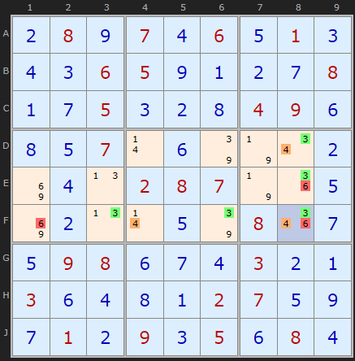
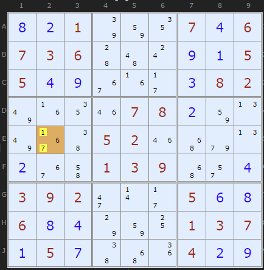
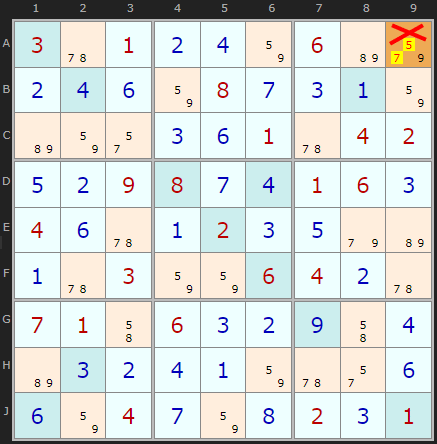

# 11 · BUG+1 (Bivalue Universal Grave)

> **Level:** Tough · **Family:** Uniqueness · **Prerequisites:** [Foundations](../00-foundations/README.md) · **See also:** [Unique Rectangles](../17-unique-rectangles/README.md)
> Diagrams: [sudokuwiki.org/BUG](https://www.sudokuwiki.org/BUG) by Andrew Stuart. Text: original to this guide.

## In one sentence

If every unsolved cell has **exactly two** candidates except **one cell with three**, the extra digit in that cell is the answer. Find it by looking for the digit that appears **three times** in that cell's row, column and box.

## The intuition: a board that can't make up its mind

Picture a board where every remaining cell has exactly two candidates, and every candidate appears exactly **twice** in each row, column and box. That board is a "**grave**". Every digit could be swapped with its partner all around the board, so there are at least two solutions (or none). A proper puzzle has **exactly one** solution, so it can never reach that state.

So if you're **one candidate away** from a grave, that one candidate has to be the one that keeps the puzzle alive. It must be true.

```
Almost-BUG:        all cells {a,b} ... and one cell {x,y,z}
Fix:               the digit that appears 3× in that cell's units
                   is the "+1" that breaks the grave → place it
```

> ⚠️ **Uniqueness techniques** assume the puzzle has exactly one solution. That's true for any properly published puzzle. If you're solving something of unknown origin, these deductions might not hold.

## How to apply it

1. Check that **every** unsolved cell is bivalue except one, which has 3 candidates.
2. In the triple cell, look at each of its three candidates and count how often it appears in that cell's **row**, **column** and **box**.
3. Two of the digits will appear exactly twice in each. **One digit will appear three times.** That digit is the solution.

---

## Worked examples

### Example 1



Every unsolved cell is bivalue except **F8** `{3,4,6}`. Count around F8:

| Digit | Row F | Column 8 | Box 6 |
|---|---|---|---|
| **3** | F3, F6, F8 → **3** | D8, E8, F8 → **3** | D8, E8, F8 → **3** |
| 4 | 2 | 2 | 2 |
| 6 | 2 | 2 | 2 |

**F8 = 3.** If you try the alternatives, they fail. With 4 you end up with two cells in row F that both need a 6. With 6 you empty F3 and get two 1s in row D.

▶ [Load position](https://www.sudokuwiki.org/sudoku.htm?bd=S9B0b080i070d060e010c0d0c06050i0a0b0g080a0g050c0b0h04090f0h0e070r0f7q7n0u0b8i0d0n0208077n1i0e8i0b0n0r0e7q081q0g0e09080f0g0d030b0a030f0d0h0a02070e0i0g010b090c050f080d) · [From the start](https://www.sudokuwiki.org/sudoku.htm?bd=080706010006500008005000490007000000000287000000000800098000300300002700010905080)

### Example 2: a sea of pairs



The BUG state can arrive with a huge number of bivalue cells still on the board. Here two whole boxes are bivalue-only.

▶ [From the start](https://www.sudokuwiki.org/sudoku.htm?bd=001000706736000005500000082000078000000520000000139000392000500600000137050000400)

---

## Variant warning: Sudoku X



In Sudoku X the **diagonals** are units as well. If you only count rows, columns and boxes, you can see a BUG that isn't one. Here **A9** `{5,7,9}` doesn't meet the "three times" test once the diagonal is counted too. Always count *every* unit type the variant has.

---

## Common mistakes

- ❌ **More than one non-bivalue cell.** BUG+1 needs *exactly one* cell with three candidates. (BUG+2 and above exist, but they're harder to apply.)
- ❌ **Counting in only one unit.** The answer digit appears three times in the row **and** the column **and** the box.

## How it connects

- Any BUG+1 can also be cracked by an [XY-Chain](../25-xy-chains/README.md). BUG is just a much faster way to see it.
- It belongs to the uniqueness family with [Unique Rectangles](../17-unique-rectangles/README.md) and [Avoidable Rectangles](../12-avoidable-rectangles/README.md).

## Practice puzzles

[1](https://www.sudokuwiki.org/sudoku.htm?bd=200400501001038090030000708070002003060090005040000009004000060620300800810047000) ·
[2](https://www.sudokuwiki.org/sudoku.htm?bd=000009004000000015832000070100703060900080003060102009010000647490000000700800000) ·
[3](https://www.sudokuwiki.org/sudoku.htm?bd=560904000002003000100070080000302500090000020000106000040030009000600700000709056) ·
[4](https://www.sudokuwiki.org/sudoku.htm?bd=200039005107500042000000000004008200050000000006400900000000000620004108700950004)
