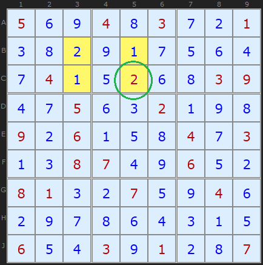
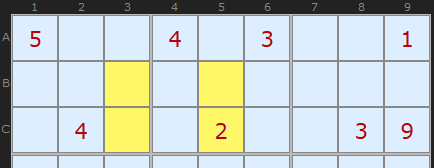
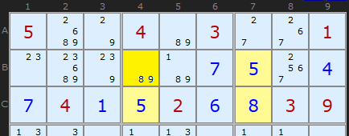
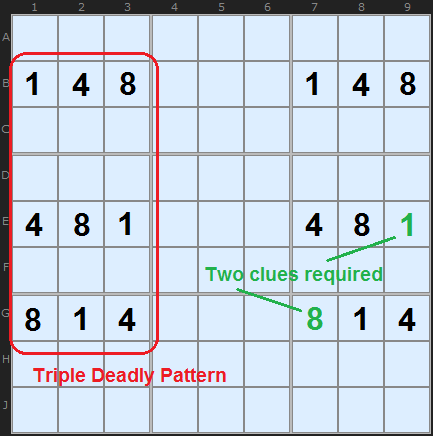

# 12 · Avoidable Rectangles

> **Level:** Tough · **Family:** Uniqueness · **Prerequisites:** [Unique Rectangles](../17-unique-rectangles/README.md) (the "deadly pattern" idea) · **See also:** [BUG](../11-bug/README.md)
> Diagrams: [sudokuwiki.org/Avoidable_Rectangles](https://www.sudokuwiki.org/Avoidable_Rectangles) by Andrew Stuart. Text: original to this guide.

## In one sentence

If **three corners** of a two-box rectangle are cells **you solved** (not givens), and they form two diagonal pairs like `5 · 8 / 8 · 5`, then the fourth corner **can't** complete the swap pattern. Eliminate that digit.

## The intuition: think like the puzzle setter

This is the only common technique that gets information from **solved cells**. The trick is to imagine how the puzzle was *made*.



In this finished grid, the four shaded cells hold 1, 2, 2, 1 at the corners of a rectangle that spans **exactly two boxes**. If the setter removed all four of those digits, a solver could fill them in either as 1/2/2/1 or as 2/1/1/2. Both would be valid, so the puzzle would have two solutions.



So the setter **must keep at least one of those four cells as a given**. A rectangle like this is an *unavoidable set*. If the four cells were spread over four boxes, the box constraints would stop the swap, and there would be no problem.

Now flip back to the solver's side:



You've already *solved* (not been given) **C4 = 5**, **B7 = 5** and **C7 = 8**. The last corner **B4** is `{8,9}`. If B4 were **8**, the four cells would be a swappable 5/8 rectangle with **no givens** in it, which is exactly the situation the setter had to avoid. So B4 ≠ 8, and **B4 = 9**.

```
         col 4      col 7
row B   [8|9]  ?     5 (solved)
row C    5 (solved)  8 (solved)
                     → 8 at B4 would complete a clue-free swap → B4 = 9
```

▶ [Example in the solver](https://www.sudokuwiki.org/Sudoku.aspx?bd=S9B1u2b040i2q021v03084i2b02066e2e17170903095e044i0a071w10900301082c9e1u1w04901g3m130d7q4j5h2t04446a0z0l0603092t444c090n0n054a0706011m1i0g0i08021612070546020f0d09430n) (turn off 3D Medusa to see it)

## The rule

> Given a rectangle spanning **2 rows, 2 columns and 2 boxes**: if three corners are **solved cells, not givens**, and they hold `a, b, a` in the swap shape, then remove **b** from the fourth corner.

## How to apply it

1. You must be able to tell **givens apart from cells you filled in**. Most apps show them in different colours.
2. Look for pairs of solved digits in "swapped" positions: `a` at (r1,c1) and (r2,c2), `b` at (r1,c2).
3. Check that the rectangle covers exactly **two boxes**.
4. Remove `b` from the fourth corner (r2,c1).

---

## Higher-order version



The same idea extends to 3 rows × 3 columns × 3 boxes. Here the digits {1,4,8} could be cycled around nine cells. To prevent that, the setter must leave at least **two** of these cells as givens, and they must be **different digits** (shown in green).

---

## Common mistakes

- ❌ **Counting a given as a solved corner.** If any corner is a given, the setter already broke the symmetry, so there's no deduction.
- ❌ **Rectangle spanning four boxes.** Then nothing can be swapped, so there's no deadly pattern.
- ❌ **Puzzles that might have more than one solution.** Like all uniqueness techniques, this one assumes exactly one solution.

## How it connects

[Unique Rectangles](../17-unique-rectangles/README.md) use the same deadly-pattern idea with **candidates**. Avoidable Rectangles use it with **solved digits**.
