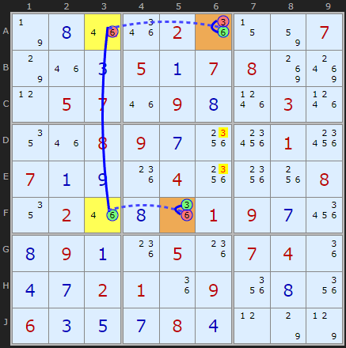
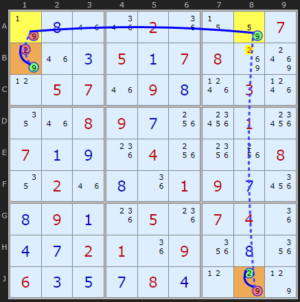
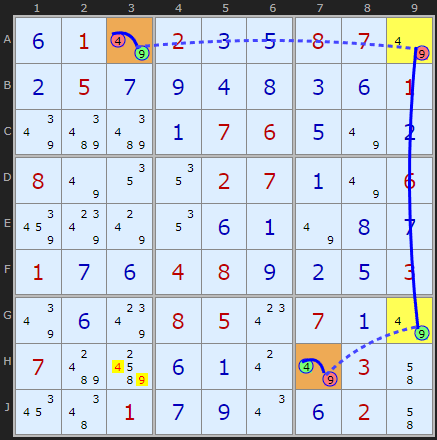
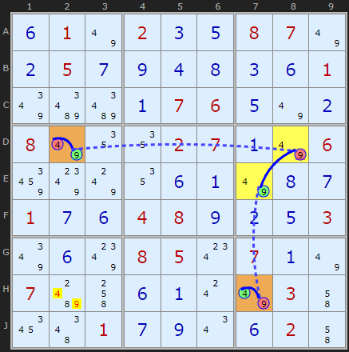
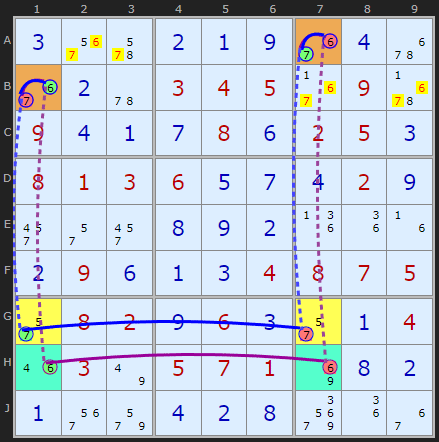

# 13 · W-Wing (and the 4-cell Remote Pair)

> **Level:** Tough · **Family:** Wings · **Prerequisites:** [Y-Wing](../07-y-wing/README.md), [Foundations §4](../00-foundations/README.md) · **See also:** [Chute Remote Pairs](../05-chute-remote-pairs/README.md), [Remote Pairs](../49-remote-pairs/README.md)
> Diagrams: [sudokuwiki.org/W_Wing_Strategy](https://www.sudokuwiki.org/W_Wing_Strategy) by Andrew Stuart (pattern credited to George Woods). Text: original to this guide.

## In one sentence

Two identical bivalue cells `{x,y}` that can't see each other, **bridged by a strong link on y** (a unit with exactly two ys, one seen by each cell). One of the two cells must be **x**, so anything that sees both cells loses x.

## The intuition

```
  P {x,y}  ─── sees ───  y ═══ strong link ═══ y  ─── sees ───  Q {x,y}
```

Suppose **neither** P nor Q is x. Then both are **y**. P = y removes the y at its end of the strong link, which forces the **other** end to be y, and that end sees Q. So Q can't be y. That's a contradiction, so **at least one of P, Q is x**.

Written as an alternating chain (strong = `═`, weak = `─`):

```
x(P) ═ y(P) ─ y(end1) ═ y(end2) ─ y(Q) ═ x(Q)
```

Both ends of the chain are x, and they're joined by alternating links, so one of them is true. **Cells that see both P and Q can't be x.**

> 💡 It's a [Y-Wing](../07-y-wing/README.md) where the pivot cell has been replaced by a strong link.

## How to spot it

1. Find two bivalue cells with the **same pair** `{x,y}` that **don't** see each other. (If they did, they'd be a naked pair.)
2. For one of the digits, say y, look for a unit with **exactly two** ys, where P sees one and Q sees the other. Neither of those two ys can be P or Q themselves.
3. Eliminate the **other** digit x from every cell that sees both P and Q.
4. Then try the same with the roles of x and y swapped.

---

## Worked examples

### Example 1: a single W-Wing



- **A6** and **F5** are both `{3,6}`, and they don't see each other.
- Column 3 has exactly two 6s, **A3** and **F3**, which makes a strong link. A6 sees A3 (row A), and F5 sees F3 (row F).
- If A6 isn't 3, it's 6, so A3 ≠ 6, so F3 = 6, so F5 ≠ 6, so **F5 = 3**. One of the orange cells is 3.
- **D6** and **E6** see both orange cells, so they lose 3.

▶ [Load position](https://www.sudokuwiki.org/sudoku.htm?bd=S9B7n0h1m1q021i0z82077o1m0c050a07088k8s0l05071m090h1p031p121m08090g20280128070a0i1k0420201w0812021m0h1i01090g260h090a1k051k07041i0d0g02011i091y0h1y060c0e0g080d0l7o7p) · [From the start](https://www.sudokuwiki.org/sudoku.htm?bd=000020007000507800057090030008900010700040008020001900090050740002109000600080000)

### Example 2: on the very next move



`{2,9}` at **B1** and **J8** are bridged by the 9s in row A (**A1** and **A8**, the only two 9s in that row). One of the orange cells is 2. There's one more W-Wing after this step, so try to find it yourself.

▶ [Load position](https://www.sudokuwiki.org/sudoku.htm?bd=S9B7n0h1m1q021i0z82077o1m0c050a07088k8s0l05071m090h1p031p121m08090g1w280128070a0i1k041w201w0812021m0h1i01090g260h090a1k051k07041i0d0g02011i091y0h1y060c0e0g080d0l7o7p)

---

## The "double" W-Wing = 4-cell Remote Pair

If the bridge cells are **also** `{x,y}`, the logic works in both directions at once, so **both** x and y are eliminated from common peers.



The board is full of `{4,9}` cells. **A3** and **H7** are linked through **A9** and **G9**, which are also `{4,9}`. Every cell in the chain is 4 or 9, and they alternate. So A3 and H7 are *opposite* digits: one is 4 and the other is 9. **H3** sees both, so it loses its 4 *and* its 9.

▶ [Load position](https://www.sudokuwiki.org/sudoku.htm?bd=S9B0f017u020c0e08077u0b050g0i0d0h0c0f017ybibi0a07060e7u0b087u121202070a7u068e807w120f0a7u0h0g010g0f04080i0b0e037y0f8008050w070a7u07bgbw0f0a0s7u034i1a4e010g0i0u0f024i) · [From the start](https://www.sudokuwiki.org/sudoku.htm?bd=010200870050000001000076000800027006000000000100480003000850700700000030001000020)



The very next step uses a slightly different set of `{4,9}` cells to clear **H2**.

▶ [Load position](https://www.sudokuwiki.org/sudoku.htm?bd=S9B0f017u020c0e08077u0b050g0i0d0h0c0f017ybibi0a07060e7u0b087u121202070a7u068e807w120f0a7u0h0g010g0f04080i0b0e037y0f8008050w070a7u07bg4k0f0a0s7u034i1a4e010g0i0u0f024i)

> Remote pair chains always have an **even** number of cells (4, 6, 8, ...). Longer ones are covered in [Remote Pairs](../49-remote-pairs/README.md).

---

## The "split double" W-Wing



The same two end cells, **B1** and **A7** (both `{6,7}`), are bridged **twice**, by two *different* strong links:

| Bridge | Proves |
|---|---|
| 7s in **G1–G7** | if B1 = 6 then A7 = 7, so at least one end is 7 |
| 6s in **H1–H7** | if B1 = 7 then A7 = 6, so at least one end is 6 |

Together these say the ends are exactly {6,7} in some order, so cells that see both lose **both** 6 and 7.

▶ [Load position](https://www.sudokuwiki.org/sudoku.htm?bd=S9B0e2i0i0h010c062i0b0c1n1m070b090h0r052b080b0f050d09032b1m053e01030h0b093e0h0c3e0b090e2j373f0i020a0d06070e080c3e09030e080a2i023e020r0h030g060r0e0i3737050i040b0c370h) · Practice: [a diabolical with two split doubles](https://www.sudokuwiki.org/sudoku.htm?bd=080000070100600003006200000030080010001409700040070090600001400800004009090000050)

---

## Common mistakes

- ❌ **A bridge with 3+ ys.** The middle link **must be strong** (exactly two ys in that unit).
- ❌ **Eliminating the bridge digit.** In a single W-Wing you remove **x**, the digit that is *not* used in the bridge.
- ❌ **Using a bridge cell that is P or Q.** The bridge has to be made of separate cells.

## How it connects

- [Chute Remote Pairs](../05-chute-remote-pairs/README.md) are W-Wings where the chute's geometry acts as the bridge.
- Every W-Wing is a 4-node [XY-Chain](../25-xy-chains/README.md) / [AIC](../32-alternating-inference-chains/README.md).
