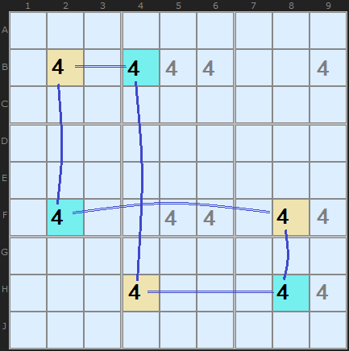
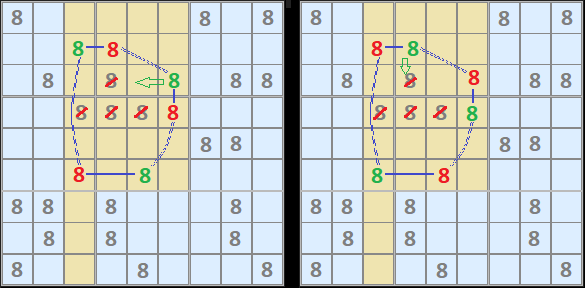
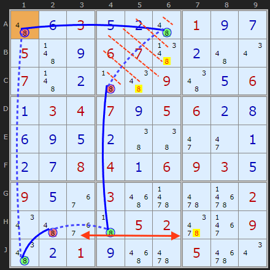
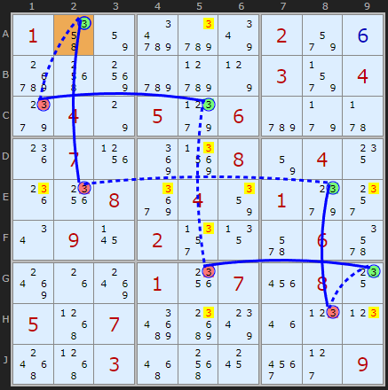
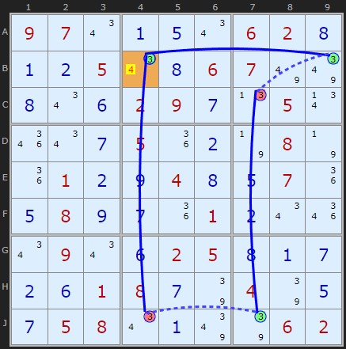
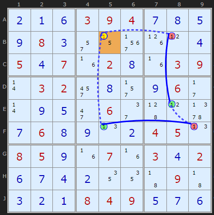
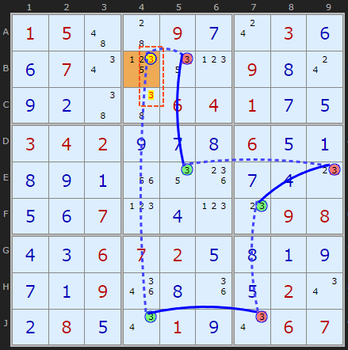
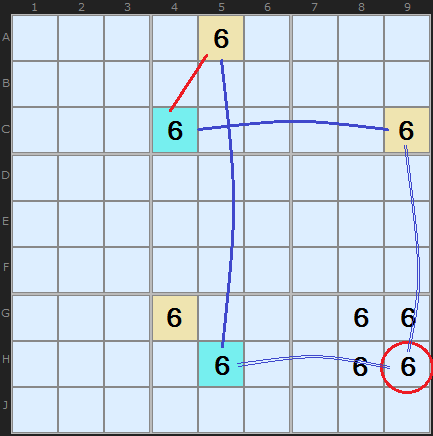

# 14 · X-Cycles (Nice Loops on a single digit)

> **Level:** Diabolical · **Family:** Single-digit chains · **Prerequisites:** [Foundations §4](../00-foundations/README.md), [Simple Colouring](../06-simple-colouring/README.md) · **Next:** [Grouped X-Cycles](../27-grouped-x-cycles/README.md), [AIC](../32-alternating-inference-chains/README.md)
> Diagrams: [sudokuwiki.org/X_Cycles](https://www.sudokuwiki.org/X_Cycles) and [Part 2](https://www.sudokuwiki.org/X_Cycles_Part_2) by Andrew Stuart. Text: original to this guide.

## In one sentence

Pick one digit and build a **closed loop** of candidates in which links alternate **strong, weak, strong, weak...** If the loop alternates perfectly, you can clear the digit along its weak links. If the loop has **one flaw** (a "discontinuity"), that flaw tells you the answer for one cell.

## Why you should care

X-Cycles are the **unifying theory** for single-digit techniques:

| Technique | As an X-Cycle |
|---|---|
| [X-Wing](../04-x-wing/README.md) | perfect loop, 4 nodes |
| 2-2-2 [Swordfish](../09-swordfish/README.md) | perfect loop, 6 nodes |
| [Simple Colouring](../06-simple-colouring/README.md) | the strong links of a loop |
| [Rectangle Elimination](../08-rectangle-elimination/README.md), Skyscraper, Kite | short loops with a discontinuity |

Learn this once and those other techniques all make sense in the same terms.

## Quick refresher: link types

| Link | Exists when | Carries |
|---|---|---|
| **Strong** `═══` | the unit has **exactly 2** of the digit | OFF ⇒ ON |
| **Weak** `- - -` | the two candidates simply share a unit | ON ⇒ OFF |

A strong link can also be *used as* a weak link, but never the other way round. (See [Foundations §4](../00-foundations/README.md#4-strong-and-weak-links-the-one-idea-that-unlocks-everything).)

### Reading the notation

`+8[A6]` means "8 is ON in A6", and `-8[C4]` means "8 is OFF in C4". A loop is written as a sequence of these, and the last cell connects back to the first:

```
-8[A1] +8[A6] -8[C4] +8[H4] -8[H2] +8[J1]  (→ back to A1)
```

---

## The three Nice Loop rules

| Rule | Loop shape | Node count | Conclusion |
|---|---|---|---|
| **1** | perfect alternation | even | clear the digit from **other cells in each weak link's unit** |
| **2** | two **strong** links meet at a cell | odd | that cell **is** the digit |
| **3** | two **weak** links meet at a cell | odd | that cell **is not** the digit |

### Rule 1: continuous loop ⇒ eliminate along the weak links

When the loop alternates all the way round, it has exactly two consistent states: every "+" ON, or every "−" ON. In **both** states, each **weak** link has exactly one true end, so the rest of that weak link's unit can't hold the digit.

#### Warm-up: the X-Wing as a loop


Start at B3 OFF. Row B is strong, so B8 is ON. Column 8 is weak, so H8 is OFF. Row H is strong, so H3 is ON. Column 3 is weak, so B3 is OFF, which is where we started. ✅ The loop is consistent. The weak links run down columns 3 and 8, so those columns get cleared.

#### A 2-2-2 Swordfish as a loop



```
+4[B2] -4[B4] +4[H4] -4[H8] +4[F8] -4[F2]  (→ B2)
```

You can start anywhere, go in either direction, and flip all the signs. It's the same loop.

#### Seeing both states



The left and right halves of this picture show the loop's only two possible states. Whichever one is real, each weak-link unit (column 3, box 2, box 5) gets its 8 from the loop, so other 8s there (yellow) go. For example, **C4** sees both B4 and C6, and one of those is ON in either state.

#### A real example



```
-8[A1] +8[A6] -8[C4] +8[H4] -8[H2] +8[J1]  (→ A1)
```

There are weak links in box 2 (A6–C4) and in row H (H4–H2). Off-loop 8s in those units (**B6, C5, H7**) are eliminated.

▶ [Load position](https://www.sudokuwiki.org/sudoku.htm?bd=S9B4a0f030e0b4a010i0g054b0i06074f0b4a0u074b0b434e094e0e060a0304070i05060b0h0f0i0e0b46462i2i0a0b0g08040a0609030e090e36035663626z020u4a36430502663f094e0b010i5662056y0u) · [From the start](https://www.sudokuwiki.org/sudoku.htm?bd=003000100500670000700009006034705600000000000008406930900300002000052009001000500)



*A longer Rule 1 loop (from Denis Berthier's "Hidden Logic of Sudoku" examples) with eliminations scattered around it. In the solver's "explore" list it's the 5th chain.*

▶ [Load position](https://www.sudokuwiki.org/sudoku.htm?bd=S9B014m82dad27y029u0fdw5g90cyd17p039v049k047o059l06cy9f5v1k071x8m93088204141k2008ae0486019k2w0u0917022v136a066e8s1g8s012007220814055107cec8801m0p0p585103565g183u2d09)

---

### Rule 2: two strong links meet ⇒ place the digit



```
-3[B4] +3[B9] -3[C7] +3[J7] -3[J4] +3[B4]
```

At **B4**, both of its links are strong (row B and column 4). Suppose B4 isn't 3. Then B9 and J4 are both 3, which means C7 and J7 can't be 3, and **column 7 has no 3 left**. That's a contradiction, so **B4 = 3**, whatever else it has as candidates.

▶ [Load position](https://www.sudokuwiki.org/sudoku.htm?bd=S9B09070u0a0e0u06020h0a0b050u0h06077u7y0h0u0f02090g0n050v1q0u0g051i0b7n087n1i010b0i040h0e071i0e080i0g1i010b0u1q0u090u0f02050h0a0g0b0f01080g7q047q0e0g05080u0a7y7q0602) (untick Rectangle Elimination)

### Rule 3: two weak links meet ⇒ eliminate the digit



```
+1[B5] -1[B8] +1[E8] -1[F9] +1[F5] -1[B5]
```

**B5** (orange) is joined to the loop by two **weak** links: row B to B8, and column 5 to F5. If B5 were 1, B8 would be off, so E8 on (col 8 strong), so F9 off (box 6), so F5 on (row F strong). But F5 sees B5. That's a contradiction, so **B5 ≠ 1**, and it becomes 5.

This is the **most common** kind of X-Cycle in practice.

▶ [Load position](https://www.sudokuwiki.org/sudoku.htm?bd=S9B0b0a0f0309040g0h0e0i080c2q0z3n1h0l0d050d071f020h1f03090r03022y0h2r0i062b0r0i0e2i062e450l5z0g060h0i0n0b04050n08050i1f071f030d020f0g0d0b12124309430c0b0a0804090e0g0f)

> 🧠 **Shortcut for Rule 3:** you don't actually need the loop to close back on itself. If the cell sees **both ends** of an alternating chain that starts and ends with strong links, it's eliminated. This is exactly how [AICs](../32-alternating-inference-chains/README.md) are usually used.

---

## Bonus: catching a group



The solver finds a Rule 3 loop that removes 3 from **B4**, and then a near-identical one removes 3 from **C4**. Both cells get "seen" from the same two directions, so you can treat **B4+C4 as a group** and remove both 3s in one go. This idea grows into [Grouped X-Cycles](../27-grouped-x-cycles/README.md).

▶ [Load position](https://www.sudokuwiki.org/sudoku.htm?bd=S9B01054a44090g0s030f0f070u15120p090h0s0i0b46460604010g0e0304020i0g0h060e0a0h0i0a1u121k0g0d0o0e0f070p0d0p0o09080d0c0607020e0h0a0i0g0a091q0h1i0e020u0b080e0u010i0u0607)

## Bonus: a strong link playing a weak role



This loop seems to have three strong links in a row. The fix is to treat the red link (box 2, only two 6s) as **weak**. That's legal, because "at most one is 6" is always true. Now the loop alternates, and the two weak links that meet at **H9** eliminate its 6.

---

## Named short X-Cycles worth memorising

These are just short Rule 3 chains, but they have names because they're so easy to spot:

**Skyscraper:** two columns, each with exactly two Xs (strong links). Their bottom ends share a row, but their top ends don't.

```
        col 2   col 6
row A    X(R1)    .         R1, R2 = "roof" ends (different rows)
row B    .       X(R2)
          ║       ║         ║ = strong link (only 2 Xs in the column)
row G    X ----- X          base: same row → weak link
```

The chain is R1 ═ base ─ base ═ R2, so one roof end is X. Any cell that sees **both** R1 and R2 (for example, cells in box 1 on row B, or in box 2 on row A) loses X.

**2-String Kite:** one row with exactly two Xs, and one column with exactly two Xs. One end of each sits in the **same box**.

```
          col 2          col 7
row B    X(a) ══════════ X(A)      row strong link
row C    X(b)                      a and b share box 1 → weak link
          ║
row H    X(B)                      column strong link
```

The chain is A ═ a ─ b ═ B, so one of A and B is X. The cell at the intersection of A's column and B's row (**H7** here) loses X.

## Common mistakes

- ❌ **Two strong links touching, treated as "alternating".** That's Rule 2, not Rule 1.
- ❌ **Eliminating on strong-link units in Rule 1.** A strong-link unit has nothing else to eliminate. The payoff is on the **weak** links.
- ❌ **More than one discontinuity.** The rules need **exactly one**.

## Practice puzzles

[1](https://www.sudokuwiki.org/sudoku.htm?bd=028309040000080002006000300700031200000000000002490001009000700100060000070104930) ·
[2](https://www.sudokuwiki.org/sudoku.htm?bd=250000000080060000000809004000000026003701500410000000700306000000050008000000073) ·
[3](https://www.sudokuwiki.org/sudoku.htm?bd=000005000040700200200000703000820005080000040600013000908000006003004070400607000) ·
[4](https://www.sudokuwiki.org/sudoku.htm?bd=007420800008009000000030460400000005070000040900050008050090000000700600003085900)
