# 15 · 3D Medusa

> **Level:** Diabolical · **Family:** Colouring nets · **Prerequisites:** [Simple Colouring](../06-simple-colouring/README.md) · **See also:** [AIC](../32-alternating-inference-chains/README.md), [Multi-Colouring](../51-multi-colouring/README.md)
> Diagrams: [sudokuwiki.org/3D_Medusa](https://www.sudokuwiki.org/3D_Medusa) by Andrew Stuart. Text: original to this guide.

## In one sentence

[Simple Colouring](../06-simple-colouring/README.md) with one upgrade: the colouring is also allowed to **jump between digits inside bivalue cells**. That builds one big two-colour network across many digits, and then you hunt for contradictions.

## The intuition: adding a third dimension

Simple Colouring stays on one digit's "layer" of the board. Medusa stacks all nine layers on top of each other and adds **vertical** links:

| Link | Connects | Rule |
|---|---|---|
| **Bi-location** (horizontal) | same digit, two cells in a unit | only 2 places for X in the unit |
| **Bi-value** (vertical) | two digits, same cell | the cell has only 2 candidates |

Colour along both kinds of link, alternating two colours. The result is a tangle of connections, which is where the name *Medusa* comes from. The key fact stays the same: **one colour is entirely true and the other is entirely false.**

> ✨ **Bonus:** whenever a rule tells you which colour is false, every candidate of the *other* colour is **placed**, even in cells that have three or more candidates. One Medusa can solve dozens of cells.

## How to colour

1. Start anywhere, ideally a bivalue cell or a strong link. Colour one candidate **A**.
2. For each coloured candidate, its strong-link partners get the opposite colour:
   - the other X in any unit where X appears exactly twice;
   - the other digit in its cell, if the cell is bivalue.
3. Keep going until the network can't grow. Then check the rules below.

---

## The rules (sorted by how often they fire)

| # | Name | You see | Conclusion | How often* |
|---|---|---|---|---|
| **5** | Unit + cell | Uncoloured candidate X sees an **X of colour A** in a unit, and its **own cell** holds a **colour B** candidate | eliminate X | ~57% |
| **4** | Two colours elsewhere | Uncoloured X sees an X of **both** colours | eliminate X | ~22% |
| **3** | Two colours in a cell | A cell holds **both** colours | eliminate all *uncoloured* candidates in that cell | ~9% |
| **1** | Same colour twice in a cell | A cell holds **two candidates of one colour** | that colour is false | ~6% |
| **6** | Cell emptied by a colour | Every candidate in an **uncoloured cell** sees the same colour | that colour is false | ~3% |
| **2** | Same colour twice in a unit | Two Xs of one colour share a unit | that colour is false | ~2% |
| **7** | Unit emptied by a colour | Every X in a unit sees the same colour | that colour is false | ~2% |

* Share of all Medusa finds when sudokuwiki benchmarked 50,000 hard puzzles.

Rules **1, 2, 6, 7** find a **false colour**, which is huge because it solves many cells at once. Rules **3, 4, 5** remove individual **uncoloured** candidates.

---

## Worked examples

### Rule 1: same colour twice in one cell

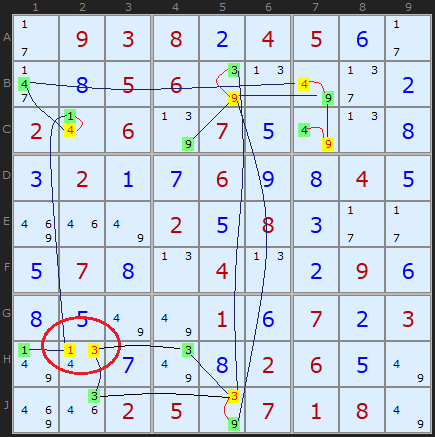

Starting from the 4s in row B, the network jumps through bivalue cells (B7 holds 4 and 9, so colouring its 4 forces the opposite colour on its 9) and spreads out. Eventually **H2** ends up with **two yellow candidates**. A cell can only be one digit, so yellow is false. Every green candidate is true, including **H1 = 1**, which isn't bivalue but is still forced.

▶ [Load position](https://www.sudokuwiki.org/sudoku.htm?bd=S9B2b0903080b04050f2b2j0h05067q0n7u2f0b020r067r070e7u0n0h0c020a0g060i0h040e8i1m7u020e080c2b2b0e070h0n040n0b090f0h0e7u7u010f070b030r0v0g7y0h02060e7u8i1q02057q0701087u) · [From the start](https://www.sudokuwiki.org/sudoku.htm?bd=093804500005600000206070000020060040000208000070040090000010703000002600002507180)

### Rule 2: same colour twice in a unit

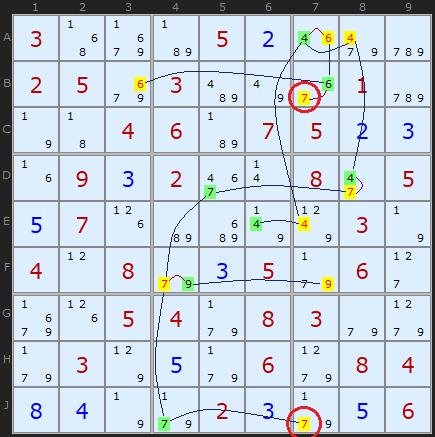

The two 7s circled in **column 7** have the same colour, so that colour is false.

▶ [Load position](https://www.sudokuwiki.org/sudoku.htm?bd=300052000250300010004607523093200805570000030408035060005408300030506084840023056)

### Rule 3: both colours in one cell ⇒ clear its other candidates

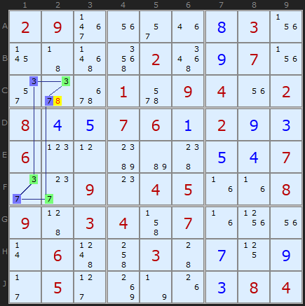

**C2** contains a blue candidate and a green candidate. One of them is true, so the cell's **8** (uncoloured) can't be. Simple Colouring can't do this, because it never has two digits in play at once.

▶ [Load position](https://www.sudokuwiki.org/sudoku.htm?bd=S9B02093f1u2q1m0h030z1743575i025a0i071v2u5y6q016a09041u02080d0e07060a020i0c060p0lbcb6480e0d072e2g090o04051f1f08094503044j071f101u0r064d4k03440g110i2b052d8k7n1g0c0804) (turn off Rectangle Elim and XYZ-Wing)

### Rule 4: an uncoloured X sees both colours

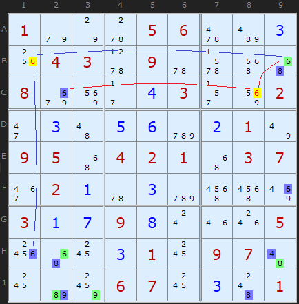

The 6 in **B1** sees a 6 of one colour along row B (**B9**) and a 6 of the other colour down column 1 (**H1**). Whichever colour is true, B1 sees a real 6, so B1 can't be 6. **C8** falls the same way.

▶ [Load position](https://www.sudokuwiki.org/sudoku.htm?bd=100056003043090000800043002030560210950421037021030000317980005000310970000670301)

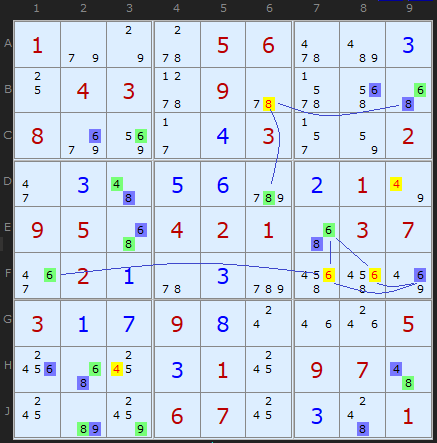

A few moves later, the same rule clears a cluster of 4s, 6s and an 8.

### Rule 5: sees colour A outside, holds colour B inside (the most common!)

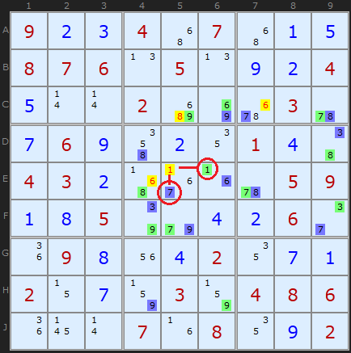

Take the 1 in **E5**. If it were true, it would kill the **green 1** in E6 (same row) *and* the **blue 7** in its own cell. One of the two colours has to survive, and both can't die, so E5 ≠ 1. Four eliminations happen this way here.

▶ [Load position](https://www.sudokuwiki.org/sudoku.htm?bd=923407015876050924500200030769020140432000059185004260098042071207030486000708092)

### Rule 6: a colour would empty a cell

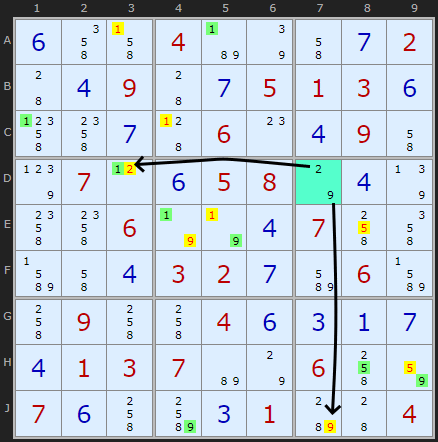

**D7** (cyan) is uncoloured and holds `{2,9}`. Its 2 sees the yellow 2 in **D3**, and its 9 sees the yellow 9 in **J7**. If yellow were true, D7 would have no candidates left, so yellow is false.

▶ [Load position](https://www.sudokuwiki.org/sudoku.htm?bd=S9B0f4m4j04b77q4i0g02440d09440g0501030f4p4o0g45060o0d094i7t070l0f05087o0d7r4o4o067n7n0d074k4mbn4i0d03020gbm06bn4k094k4k040f0c0a0g0d010307b67o064k82070f4kbo0c01b84404)

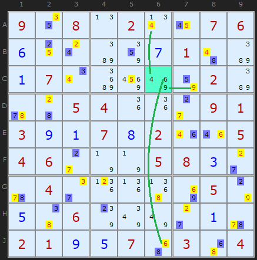

It works for any number of candidates. Here **C6** `{4,6,9}` has each digit seeing the same colour.

### Rule 7: a colour would empty a unit

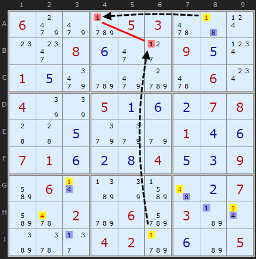

Box 2's only 1s are **A4** and **B6** (a strong link the network didn't reach). A4 sees the yellow 1 in **A8**, and B6 sees the yellow 1 in **J6**. If yellow were true, box 2 would have no 1, so yellow is false.

▶ [Load position](https://www.sudokuwiki.org/sudoku.htm?bd=S9B069o9mcz050362430t0o2o080f2i2d090e0x010e9qcy9md062060w047q7q050a0f0b070844440e9i9i9e010d0f07010f0b0h040e0c09bm060rbb7qbn4a0b07bm6202cy06de03b70rba5y2f0402cz0fb605)

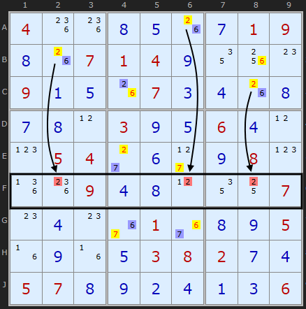

Row F has three 2s, at F2, F6 and F8. They're covered by the same colour at B2, A6 and C8 respectively, so that colour is false.

### Showpiece: one Medusa, 37 eliminations

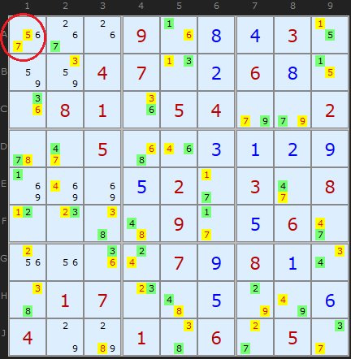

**A1** holds 5 and 7 in the same colour. That one contradiction removes 37 candidates and solves the rest of the puzzle in a single stroke. (Found by Klaus Brenner.)

▶ [Load position](https://www.sudokuwiki.org/sudoku.htm?bd=000908430004702680081054002005003129000520308000090560000079810017005006400106050)

---

## Tips for paper solvers

- Use **two highlighter colours**, or mark candidates with a dot and a circle.
- Build the net from **bivalue cells outward**. They're the only way to move between digits.
- After a colour is shown false, **fill in every true-colour cell at once**, not only the bivalue ones.

## Common mistakes

- ❌ **Jumping digits through a cell with 3+ candidates.** Vertical links need a **bivalue** cell.
- ❌ **Merging two separate networks.** If they aren't connected, their colours are independent.
- ❌ **Rule 3 on a coloured candidate.** Rule 3 removes only the **uncoloured** candidates in the two-coloured cell.

## How it connects

- Without the vertical links, Medusa *is* [Simple Colouring](../06-simple-colouring/README.md).
- Any single Medusa deduction can be written as an [AIC](../32-alternating-inference-chains/README.md) or Nice Loop. Medusa just finds whole networks of them at once.

## Practice puzzles

[1](https://www.sudokuwiki.org/sudoku.htm?bd=007000103190000086000040000060302000510000090000905010000020000950000021802000500) ·
[2](https://www.sudokuwiki.org/sudoku.htm?bd=800100305002000800300608700001500000070000060000003100004307008006000200203009001) ·
[3](https://www.sudokuwiki.org/sudoku.htm?bd=000000009010503000003290700400001300900050008006300005008037400000108060700000000) ·
[4](https://www.sudokuwiki.org/sudoku.htm?bd=900008007000000060000710403005030006009802000100090800403059000050000000700600000)
