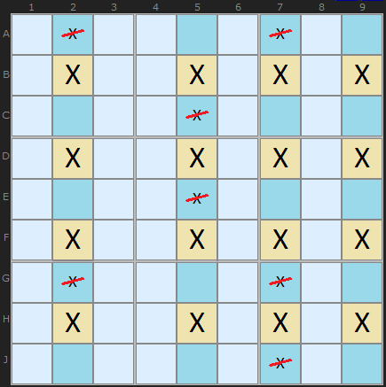
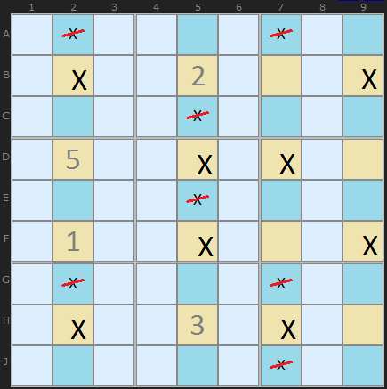
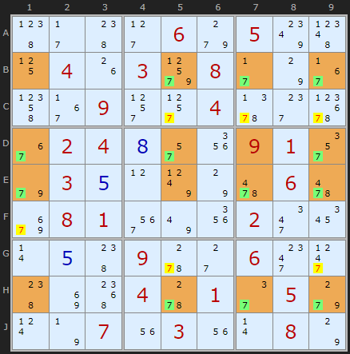
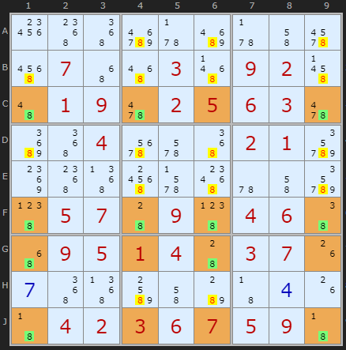
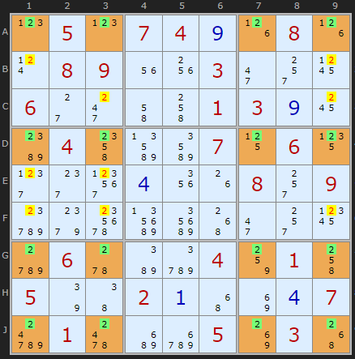
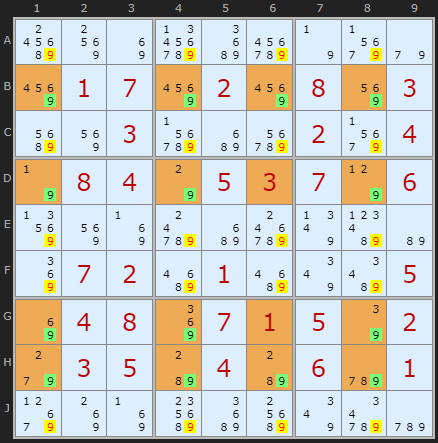

# 16 · Jellyfish

> **Level:** Diabolical · **Family:** Fish (single-digit) · **Prerequisites:** [Swordfish](../09-swordfish/README.md) · **See also:** [Finned fish](../29-finned-x-wing/README.md), [Franken Swordfish](../31-franken-swordfish/README.md)
> Diagrams: [sudokuwiki.org/Jelly_Fish_Strategy](https://www.sudokuwiki.org/Jelly_Fish_Strategy) by Andrew Stuart. Text: original to this guide.

## In one sentence

The 4×4 member of the fish family. If a digit is confined to the **same four columns** across **four rows** (in total), clear it from the rest of those columns. The same works with rows and columns swapped.

## The family at a glance

| Fish | Base lines | Cover lines | Minimum candidates |
|---|---|---|---|
| [X-Wing](../04-x-wing/README.md) | 2 | 2 | 4 (2-2) |
| [Swordfish](../09-swordfish/README.md) | 3 | 3 | 6 (2-2-2) |
| **Jellyfish** | 4 | 4 | 8 (2-2-2-2) |

The logic is identical at every size: **N base lines need N copies of the digit, and they're squeezed into N cover lines, so the cover lines are full.**

### Why it works: it shrinks to smaller fish

Pretend any cell in the 4×4 grid holds X. That removes one row and one column, and what's left is a **Swordfish**. Place another cell and it shrinks to an **X-Wing**. Every possible placement keeps the X's inside the grid, so nothing outside it, on the cover lines, can be X.

*The minimal 2-2-2-2 shape. To check the logic, pretend a crossed-out X is true and follow it. Some base line will end up with no X at all.*

## Why bigger fish aren't needed

In a 9-cell line, a fish of size N on digit X always has a **complementary fish** of size 9 − N − (number of placed Xs) on the *other* lines. So a "Squirmbag" (size 5) always comes with a fish of size 4 or smaller. **Jellyfish is the largest fish you ever need to look for.**

## How to spot it (honestly: rarely by eye)

1. Pick a digit that still has **lots of candidates**, since a Jellyfish needs at least 8.
2. List the rows where it appears 2–4 times, together with the columns it uses in each.
3. Look for 4 rows whose combined column set has exactly 4 columns.
4. Clear those 4 columns outside the 4 rows.

> 💡 Most apps that offer hints can find Jellyfish. If you're solving by hand, check for them after X-Wings and Swordfish have come up empty on a digit that still has many candidates.

---

## Worked examples

### Example 1: a real 2-3-3-2

The 7s in rows **B, D, E, H** sit only in columns **1, 5, 7, 9** (orange cells). That's four rows, four columns, and four 7s needed, so the 7s elsewhere in those columns (yellow) go. B1 and H2 have no 7, which is why it's 2-3-3-2 rather than a full 4-4-4-4.

▶ [Load position](https://www.sudokuwiki.org/sudoku.htm?bd=S9B492b482d069g05804h11041g039x082b7o374p37092t2t045z2g6x3602040h2q1y09012u9e030e0l7x7o620662aa08013m7u1y022m1a0r0e48095w2c062o2l488i54045w012e059g0t7n071u031u0r087o) · [From the start](https://www.sudokuwiki.org/sudoku.htm?bd=000060500040308000009004000024000910030000060081000200000900600000401050007030080)

### Example 2: 18 eliminations

A puzzle built by Klaus Brenner so that the Jellyfish is **required**, and it pays off with 18 eliminations. (Turn off Rectangle Elimination.)

▶ [From the start](https://www.sudokuwiki.org/sudoku.htm?bd=000000000070030920019025630004000210000000000057090460095140370000000000042367590)

### Example 3: a perfect 4-4-4-4

All 16 cells of the grid still hold a 2 as a candidate. This is about as rare as Sudoku patterns get.

▶ [Load position](https://www.sudokuwiki.org/sudoku.htm?bd=S9B0p050p07040i1h081h0t08091u1w032i2s19062c2k4i4k01030i18bc044obrbq071106152h2g3t0d1y1g082s09d49k7ccncm502i2s1dd0065wbad20484014k057q46020a4y8i0d07d80164c2du058k0350)

### Example 4: the maximum

Every 9 outside the pattern on the cover lines goes, 20 of them in total.

▶ [From the start](https://www.sudokuwiki.org/sudoku.htm?bd=000000000017020803003000204084053706000000000072010005048071502035040601000000000)

---

## Common mistakes

- ❌ **Five columns sneaking in.** Write down the union of the column numbers. It must be exactly four.
- ❌ **A hidden smaller fish.** If 2 or 3 of your base lines already form an X-Wing or Swordfish, that smaller fish is what's doing the work.

## Practice puzzles (all by Klaus Brenner)

[1](https://www.sudokuwiki.org/sudoku.htm?bd=140000097970000016000000000000453000060170000730020000000000000420060071610000039) ·
[2](https://www.sudokuwiki.org/sudoku.htm?bd=000000000803024010901076080607083920000009100000000000708010030000000000102030690) ·
[3](https://www.sudokuwiki.org/sudoku.htm?bd=000000000003024609000036501024067905000000000075041203001093704009005100000000000) ·
[4](https://www.sudokuwiki.org/sudoku.htm?bd=000000000009003100081024905064059203000000000023006501015000309000000000096005408)
