# 17 · Unique Rectangles

> **Level:** Diabolical · **Family:** Uniqueness · **Prerequisites:** [Naked Candidates](../01-naked-candidates/README.md), [Hidden Candidates](../02-hidden-candidates/README.md) · **Next:** [Extended URs](../22-extended-unique-rectangles/README.md), [Hidden URs](../23-hidden-unique-rectangles/README.md)
> Diagrams: [sudokuwiki.org/Unique_Rectangles](https://www.sudokuwiki.org/Unique_Rectangles) by Andrew Stuart (type names from "MadOverLord"). Text: original to this guide.

## In one sentence

Four cells forming a rectangle over **2 rows, 2 columns and 2 boxes** can never all end up as the **same pair** `{a,b}`, because that would give the puzzle two solutions. So whatever stops that from happening must be true.

> ⚠️ This assumes the puzzle has **exactly one solution**. That's true for every properly published puzzle, but not necessarily for random or user-made grids.

## The deadly pattern

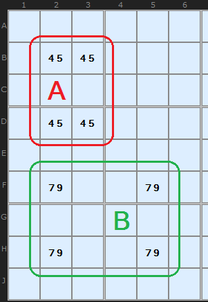

- **Red (A)** has `{4,5}` in four cells spanning **two boxes**. You could fill it as 4/5/5/4 *or* 5/4/4/5, and every row, column and box would still be happy. That's **two solutions**, so a valid puzzle can never reach this state.
- **Green** has `{7,9}` in a rectangle spanning **four boxes**. Swapping would move digits between boxes and break them, so this one is harmless.

```
Deadly:  2 rows × 2 cols × 2 boxes, all four cells = {a,b}  → impossible
```

**Vocabulary:** the **floor** is the corners holding exactly `{a,b}`. The **roof** is the corners that have **extra candidates**. The extras are the puzzle's "escape hatch".

---

> 🛠 **Solver tip:** when the solver finds a UR, you can step through **every** UR it found at that point, not just the first:
>
> 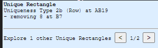

## Pick your type: a decision tree

```
Rectangle with {a,b} in all 4 corners, across 2 boxes
│
├── 3 corners are bivalue {a,b}, 1 corner has extras ─────────────► TYPE 1
│                                                          remove a,b from that corner
│
├── 2 corners bivalue (floor), 2 corners have extras (roof)
│     │
│     ├── roof extras are the SAME single digit x ────────────────► TYPE 2
│     │     (roof side-by-side → 2/2B,  roof diagonal → 2C)        remove x from cells seeing both roof cells
│     │
│     ├── roof extras form a "pseudo-cell" that, with other cells,
│     │   makes a naked/hidden set ──────────────────────────────► TYPE 3 / 3B
│     │
│     └── one of a/b is a CONJUGATE PAIR across the roof's unit ──► TYPE 4 / 4B
│                                                          remove the OTHER of a/b from the roof
│
└── 2 DIAGONAL corners bivalue, plus strong links on one digit ───► TYPE 5
```

---

## Type 1: one corner with extras ⇒ remove the pair from it

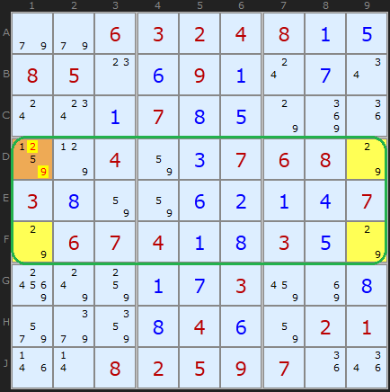

Three corners are `{2,9}` and the fourth corner, **D1**, is `{1,2,5,9}`. If D1 were 2 or 9, all four cells would be locked into the deadly 2/9 swap. So **D1 can't be 2 or 9**, and it must be 1 or 5.

▶ [Load position](https://www.sudokuwiki.org/sudoku.htm?bd=S9B9e9e06030204080a0e08050o0f090a0s0g0u0s0w0a070h0e7o8m1i857p04820c0706087o030h82820f0b0a0d077o0607040a0h030e7o987w840a0g038a8i0h9u9i860h040f8202011n0r08020509071i1q) · [From the start](https://www.sudokuwiki.org/sudoku.htm?bd=006324800850090000000700000004007680300000007067400300000003000000040021008259700)

> 💡 **The most common UR, and the easiest to see:** three identical bivalue cells at the corners of a 2-box rectangle.

## Type 2: both roof cells share one extra digit x ⇒ x is in the roof

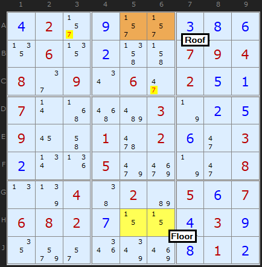

The floor is `{1,5}`. The roof cells **A5** and **A6** are both `{1,5,7}`. If neither one were 7, the rectangle would be deadly, so **one of them is 7**. Any cell that sees **both** roof cells loses its 7. Here those are **A3** (row A) and **C6** (box 2). This cracks the puzzle.

▶ [Load position](https://www.sudokuwiki.org/sudoku.htm?bd=S9B0d022r0i2r2r0c0h0f1306130b4n4j070904082e090u062i020e0a070r4z56be037n0b0e09164i0162020f2i030b0v1j059mai7n2i080n7r044602b6050f070608020g0z0z0d030i129u2q1q7y8q0h010b)

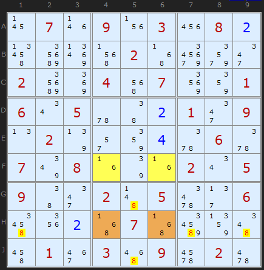

Another Type 2: the `{1,6}` rectangle has roof cells **H4** and **H6**, both with an extra 8. Every 8 that sees both of them (brown) goes.

▶ [Load position](https://www.sudokuwiki.org/sudoku.htm?bd=S9B17071n091v032208024vcm8v5f024zb29y2m02cm8m045e07928601060u055u4602012m090n027r2q86045y065y077y081f7q1f020u0509462m024b05662f064u1y024z074zby874e4q013e0356096i0262)

### Type 2B: roof split across the two boxes

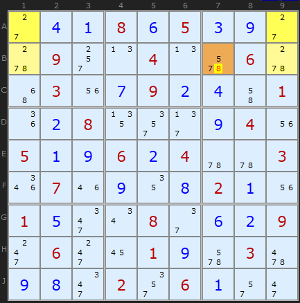

When each box holds one floor cell and one roof cell, the two roof cells (**B1** and **B9**) share only a **row**, not a box. So you can only eliminate along that row: **B7** loses its 8. *(Turn off 3D Medusa to see this one in the solver.)*

▶ [Load position](https://www.sudokuwiki.org/sudoku.htm?bd=S9B2c0d0a080f050c0i2c5w092s0n040n6a065w4y031u0g090b0d4i011i0b08132u2f0i041u050a0i060b045u5u031q071m0i120h020a1u010e2m0u082e0f0b092k062k16010i6a03620i0h2m022u060a2q2i)

### Type 2C: roof cells on a diagonal

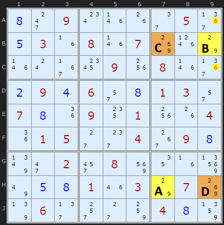

The extra 6 sits in diagonally opposite corners, **B7** and **H9** (C and D). One of them is 6, so any 6 that sees **both** goes. (HoDoKu calls this a Type 5.)

▶ [Load position](https://www.sudokuwiki.org/sudoku.htm?bd=S9B0h2k090w1n1g2e053b0e031f081n078k1p7o1n0s371c091w081n3b0b090d062q0h01032q070h1i0914011w1g041i01052c2g0438090h7z2i022y088y121f937u0e0h011m037o078k7r062f2s2c84040h87)

### Type 2D: the escape hatch has only one exit

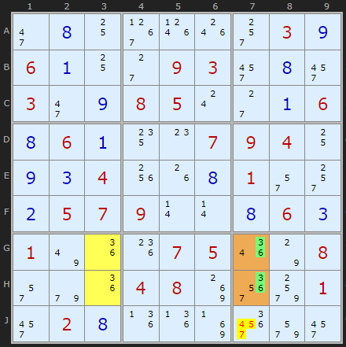

The rectangle **G3/G7/H3/H7** needs an escape digit from *outside* `{a,b}` in its roof. But in box 9 (and column 7), the escape digits **3 and 6** only appear in **J7**, outside the rectangle. So to break the deadly pattern, J7 has to supply one of them. **J7 keeps only {3,6}**, and its other candidates go.

▶ [Load position](https://www.sudokuwiki.org/sudoku.htm?bd=S9B2i0h10391p1o2s030i060a102c09032y0h2y032i0i08050s2c0a060h060a140o070904100i0c041w1g0h012q2s0b0507090r0r0h060c017u1i1k07051q7o082q9e1i04088k3q9w012y020h1j1j8j3y9u2y)

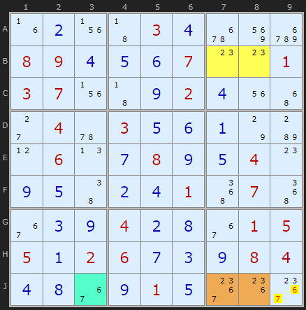

The same reasoning applies here: **2 and 3** exist only in **J9** outside the roof, so 6 and 7 come off J9.

---

## Type 3: the roof acts like an extra cell in a naked set

When the roof has **different** extra digits, think of the roof's extras as a single **pseudo-cell**. At least one of those extras must be true, so the pseudo-cell "holds" one of them.

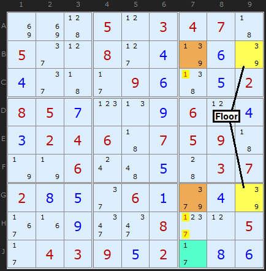

- Floor **B9, G9** = `{3,9}`. Roof **B7** has an extra 1, and **G7** has an extra 7.
- The pseudo-cell is **{1,7}**: either B7 is 1 or G7 is 7.
- **J7** is a real `{1,7}` cell in the same column. Pseudo-cell + J7 make a **naked pair on {1,7}** in column 7.
- So other 1s and 7s in column 7 (**C7, H7**) go.

▶ [Load position](https://www.sudokuwiki.org/sudoku.htm?bd=S9B8i8i45050l03040743052e0l082d047r067q042e432b09064705020805070p0n09060l040302040643070509437n7n060s4a054403070208052e06019i047q371f092m2m082h0l052b04030905022b0806) (pick the second UR after the Type 5)

### Type 3B: roof in one box, so search the box too

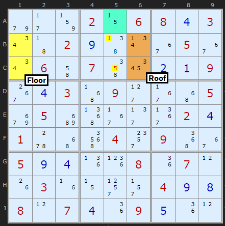

The roof cells share a **box**, so the partner cell(s) can come from the box as well as the line. Roof extras {1,5} pair with **A5** `{1,5}`, which clears 1 from **B5** and 5 from **C5**.

▶ [Load position](https://www.sudokuwiki.org/sudoku.htm?bd=S9B9e2b83020z06080d030u43020i470v3605360u064i074m1a0b0a09380d034z092d374y05aa05c253372f3b020d015w4y5i042w095236050i0d1j1l081i070l1g031f0z2t2r040i0h080l070d1i090e1i0l)

### Type 3 with a triple

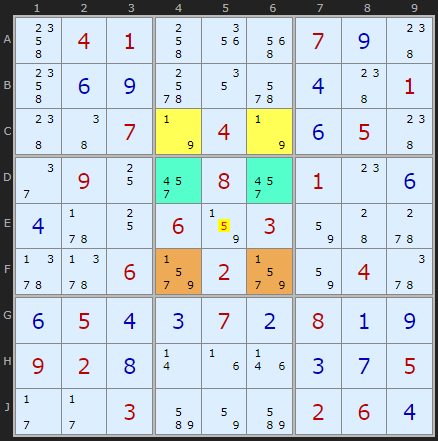

The roof extras are {5,7}. Two more cells, **D4** and **D6**, are `{4,5,7}`. Together with the pseudo-cell that's a **naked triple {4,5,7}** in box 5, so **E5** loses 5 and 7.

▶ [Load position](https://www.sudokuwiki.org/sudoku.htm?bd=S9B4o04014k1y5e070i484o0f0i6c126a0d48014846077n047n0f05482e09102y082y010o0f0d5v1006830382445w5z5z069v029v82045y0f050d0c070b080a0i09020h0r1f1n0c0g052b2b03bm82bm02060d)

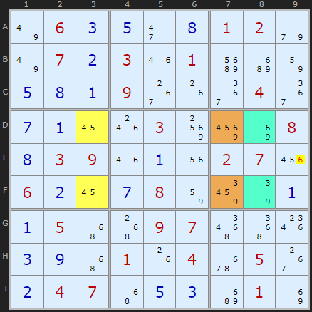

Here the roof extras are {3,6,9}, and the cells **D8, F8** cover the same three digits. That's another triple, and **E9** loses its 6.

---

## Type 4: a conjugate pair inside the roof

Look at the roof's `{a,b}` digits, not its extras. If **one of them (say a) is a conjugate pair** across the roof (the only two places for a in a unit they share), then one roof cell **is** a. That means the roof can't also be b-and-a, so **b can't be in either roof cell**.

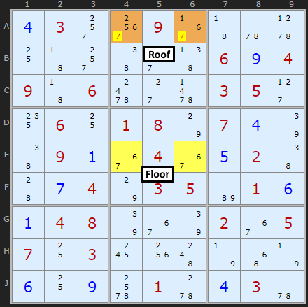

In box 2, the only 6s are the roof cells **A4** and **A6**. One of them is 6, so if either were 7 you'd have a deadly 6/7 swap. **7 comes off both A4 and A6.**

▶ [Load position](https://www.sudokuwiki.org/sudoku.htm?bd=S9B0d032s3o0937435u5x10432s462s47060i04094306642c6303052d14061001087o070d7q46090a3604360e0246440g047o0305b6010f0a04087q367q023605071003181w4c7n4y7n0f100i6c015w0d035u)

### Type 4B: same idea with the roof split across boxes

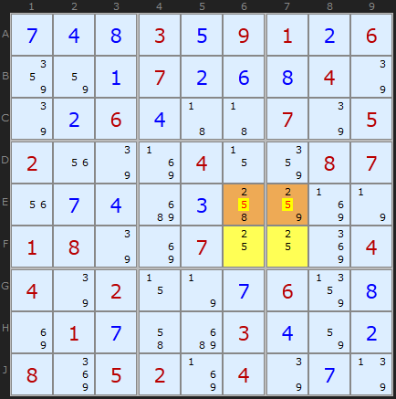

The roof cells share only **row E**, and in row E the 2 can only go in those two cells. So **5** is removed from both.

▶ [Load position](https://www.sudokuwiki.org/sudoku.htm?bd=S9B0g0d0h030e09010b0686820a070b0f0h047q7q0b060d4343077q05021u7q8j040z8608071u0g0dc20c4k848j7n01087q8i0710108m04047q020z7n0g06870h8i010g4ic2030d820b088m05028j047q0g7r)

> Type 4 "uses up" the rectangle, so apply it **after** any Type 2/3 eliminations on the same rectangle.

---

## Type 5: a diagonal pair plus strong links

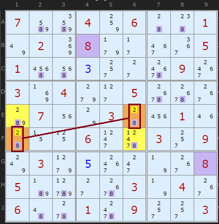

The diagonal corners **E6** and **F1** are both `{2,8}`. The rectangle's rows and columns have **strong links on 8** connecting the corners. If 2 were true in E6 (or F1), the strong links would push 8 into the two other corners and 2 into the opposite diagonal corner, which is the deadly pattern. So **2 comes off E6 and F1**.

▶ [Load position](https://www.sudokuwiki.org/sudoku.htm?bd=S9B07bmbq0484064448017u028m089f2b3e3a05015m5e0c2s2c70093g038j049g2d056s6s38b8071u7o034422011m440z11062l65032s097w039h0e3g2k7n380805b7d12c6s037n0438064a5w0164092s2s03)

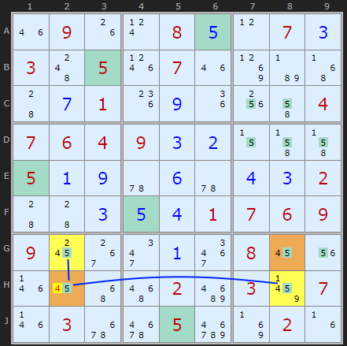

You only need **one pivot** with two strong links. **H2** has strong links on 5 to **G2** and **H8**. If H2 = 4, then G2 = H8 = 5, which pushes G8 to 4, and that's deadly. So **H2 ≠ 4**. (Untick XY-Chains to see it.)

▶ [Load position](https://www.sudokuwiki.org/sudoku.htm?bd=S9B1m091g0t080e0l070c034c051p071m8lb74z440g011k0i1i1w4i04070604090c0b0z4j4j050a0i5u0f5u0d0c0244440c0e0d010706090918383i0a3i08161u1n164y5602ca038b071n036q6y05e28j021f)

---

## Common mistakes

- ❌ **A rectangle spread over four boxes.** It must span exactly **two** boxes.
- ❌ **Using it on puzzles with multiple solutions.** UR logic is only valid for unique puzzles.
- ❌ **Type 2 eliminations from cells that see only one roof cell.** The cell must see **both**.
- ❌ **Type 4 using the wrong digit.** The conjugate digit stays, and the **other** pair digit is removed.

## How it connects

- **Bigger rectangles:** [Extended Unique Rectangles](../22-extended-unique-rectangles/README.md) (2×3, 3×3).
- **Strong links instead of bivalue roofs:** [Hidden Unique Rectangles](../23-hidden-unique-rectangles/README.md).
- **Inside chains:** [AIC with URs](../35-aic-with-unique-rectangles/README.md).
- **Using solved cells:** [Avoidable Rectangles](../12-avoidable-rectangles/README.md).

## Practice puzzles (by Klaus Brenner)

[1](https://www.sudokuwiki.org/sudoku.htm?bd=000806000200010074009700010006000201300000600020000000030005000002000080810002953) ·
[2](https://www.sudokuwiki.org/sudoku.htm?bd=000000000074180060020004030080000000600009000200356000000203100000001640065000900) ·
[3](https://www.sudokuwiki.org/sudoku.htm?bd=080720013000000000100300000000006031030504060020910700200100908005008004000000000) ·
[4](https://www.sudokuwiki.org/sudoku.htm?bd=100000040060010000070900056000009000009005030510070090000000200806000307204000000)
