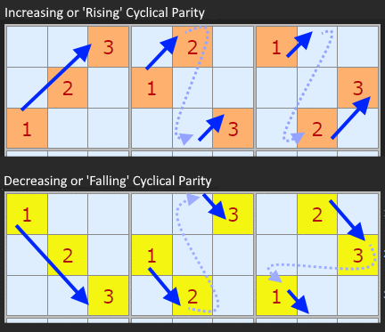
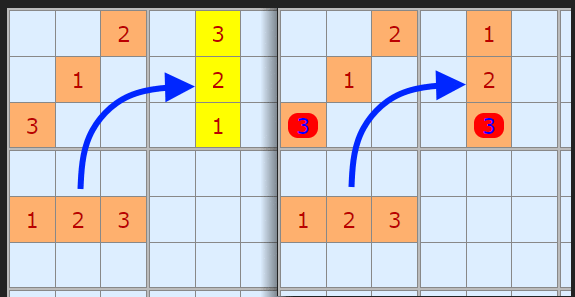
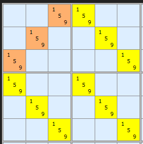
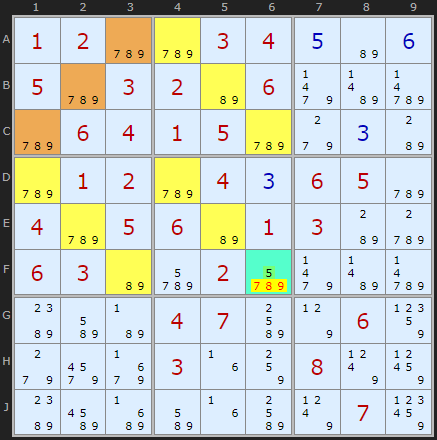
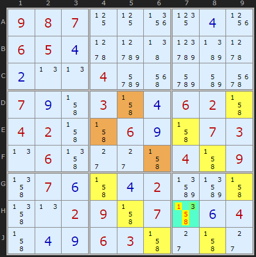
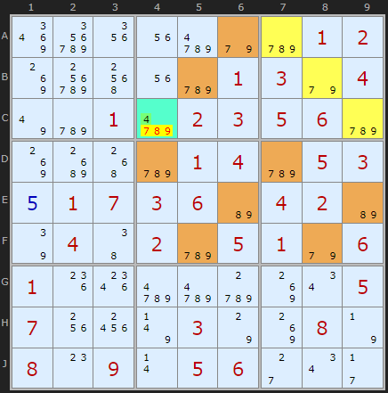
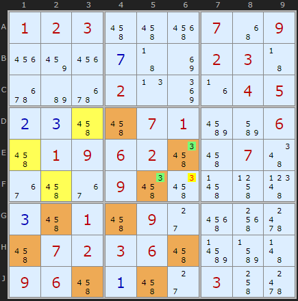

# 18 · Tridagons (Thor's Hammer)

> **Level:** Diabolical (rare) · **Family:** Impossible patterns · **Prerequisites:** [Naked Candidates](../01-naked-candidates/README.md) (triples), [Unique Rectangles](../17-unique-rectangles/README.md) (the "impossible pattern + guardian" idea) · **See also:** [Guardians](../54-guardians/README.md)
> Diagrams: [sudokuwiki.org/Tridagons](https://www.sudokuwiki.org/Tridagons) by Andrew Stuart (pattern by Denis Berthier; examples via Phil's Folly). Text: original to this guide.

## In one sentence

If **four boxes** forming a rectangle each have the **same three digits** confined to three cells, one per row and one per column ("diagonal-ish"), and the slants don't balance (3 one way, 1 the other), the puzzle would have **no solution**. So the one cell with an **extra candidate** (the guardian) must take that extra.

## The intuition

### Step 1: diagonals have a direction

Inside a box, there are exactly **six** ways to place three cells so that each row and each column of the box is used once. Three of them slant **up** (rising ↗), and three slant **down** (falling ↘):

*Orange = rising, yellow = falling.*

### Step 2: the slants have to fit together

Suppose the same three digits {a,b,c} fill such a pattern in each box. Rows and columns then force a relationship between neighbouring boxes. Think of the three digits as being **rotated** (cyclically shifted) from box to box. A rising pattern turns the rotation one way and a falling pattern turns it the other way. When you go round a **rectangle of four boxes**, the rotations have to cancel out.

*With rising patterns in boxes 4 and 1, box 2 is forced to be falling. A rising pattern there can't be filled with {1,2,3} without a clash.*

### Step 3: the impossible combination

With **three rising + one falling** (or three falling + one rising), the rotations can never cancel. **No assignment of the three digits works**, so the pattern can't be completed.

A valid puzzle has a solution, so something in those 12 cells **must not** be from {a,b,c}. If exactly **one** cell has extra candidates (a **guardian**), that cell must use one of its extras. **Remove a, b and c from it.**

> 🧠 It's like a [Unique Rectangle](../17-unique-rectangles/README.md) turned up a notch. A UR pattern would give **two** solutions, and a Tridagon pattern would give **zero**. Either way, the cell holding the escape candidate must use it.

## How to spot it

1. Look for a triple of digits that keeps showing up in **diagonal-ish** cell sets in **four boxes** forming a rectangle (two bands × two stacks).
2. Check that each box's three cells use three different rows and three different columns of the box, and that the boxes line up with each other.
3. Classify each box as rising or falling. You need a **3–1 split**.
4. Find the guardian, the cell with extra candidates. If there's exactly one, remove the triple from it.

As with naked triples, the cells don't each need all three digits. `{12}{13}{23}` still counts.

---

## Worked examples

### Example 1: the classic

The triple {7,8,9} fills diagonal cell sets in **boxes 1, 2, 4, 5**. Box 1 is rising (orange), and boxes 2, 4 and 5 are falling (yellow). The only cell with anything else is **F6** (cyan), with an extra 5, so **F6 = 5**.

▶ [Load position](https://www.sudokuwiki.org/sudoku.htm?bd=S9B0102cycy03040eb60f05cy0302b6069nbfd7cy06040105cy9g0cb8cy0102cy040c0605cy04cy0506b60103b8d00603b6de02de9nbfd7bcbmb70407bo7p06899ga2ab031f84087x8dbcbuc3bm1fbo7x078h) · [From the start](https://www.sudokuwiki.org/sudoku.htm?bd=000000001000000234000005060000070000007208096029560008096052000208607000750980000)

### Example 2: not just straight diagonals

The per-box patterns can be **any** of the six one-per-row, one-per-column shapes. They don't have to be the two main diagonals.

▶ [Load position](https://www.sudokuwiki.org/sudoku.htm?bd=S9B09080711111z150d1x06050d5xd147d5bb5x0b0n0n04de5edebm76070i4j034j0d06024j04024j4j060i4j07030n064n2c2c4j044j094n070f4j0d02brbr4j4n0n02094j074n0f044j0d0i06034j2c4j2c)

### Example 3: sparse cells

Some pattern cells only hold two of the three digits, and that's fine. The guardian logic puts **4** in **C4**.

▶ [Load position](https://www.sudokuwiki.org/sudoku.htm?bd=S9B8uee1y1ud69ecy01028kec5g1ucy01039e047ucy01d602030506cy8kc450cy0104cy05030e01070306b60402b67q044602cy05019e06011k1sd6d6d08k0u05071w247v037o8k087n080o090r05062c0u2b)

### Example 4: two guardians that form a pointing pair

With **two** guardian cells, all you know is that at least one guardian is true. That only helps if both guardians are the **same digit** and **see each other**. Then they act like a pointing pair, and that digit can be removed from cells that see both. This happens very rarely: only about 22 times in roughly 15,500 useful Tridagons, according to sudokuwiki's tests.

▶ [Load position](https://www.sudokuwiki.org/sudoku.htm?bd=S9B0102034q4q5m074y09228a220g438i0203436qb66q020n8m1f04050b0c4q4q0701bubm064q010906024u4q074e364q36094u4u4r4l4h0c4q014q092c5m5g644q070203064qbvbn4b09064q0a4q2c034k64)

---

## Common mistakes

- ❌ **2–2 or 4–0 slant splits.** Those can be solved, so there's no deduction. You need an *odd one out*.
- ❌ **Boxes not in a rectangle.** The four boxes must sit at the corners of two bands × two stacks.
- ❌ **Two or more guardians.** In general this gives no direct elimination (apart from the pointing-pair special case).

## Further reading

[Phil's Folly: Tridagon help](http://www.philsfolly.net.au/Sudoku/tridagon_help.htm) · [Forum thread](http://forum.enjoysudoku.com/the-tridagon-rule-t39859.html) · [Rangsk's video explanation](https://www.youtube.com/watch?v=V7RC1hJ8vZ8)
