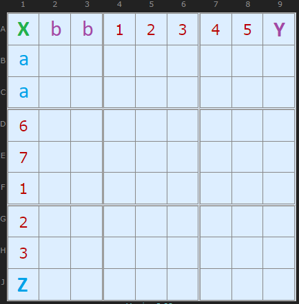
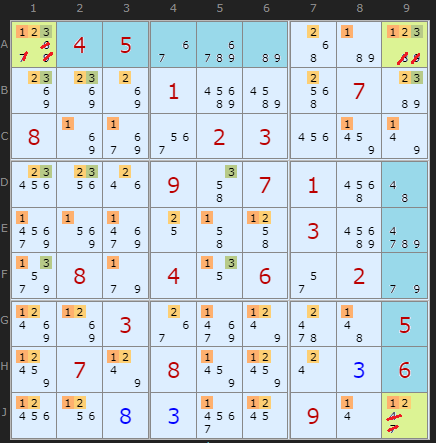
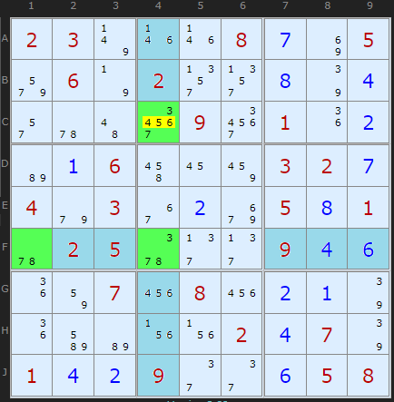
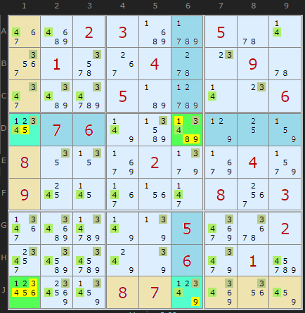

# 19 · Fireworks

> **Level:** Diabolical · **Family:** Locked sets · **Prerequisites:** [Hidden Candidates](../02-hidden-candidates/README.md), [Intersection Removal](../03-intersection-removal/README.md)
> Diagrams: [sudokuwiki.org/Fireworks](https://www.sudokuwiki.org/Fireworks) by Andrew Stuart (pattern by "shye", New Sudoku Players Forum, 2021). Text: original to this guide.

## In one sentence

When a row and a column cross inside a box, and digit X can only escape that box at **one cell on the row** and **one cell on the column**, then X must appear in at least one of those three cells (the crossing plus the two escapes). If **three digits** share the same three cells this way, those cells form a **locked triple**.

## The intuition



Take **row A**, **column 1**, and their crossing cell **X** = A1 in box 1. Suppose that, for digit 9:

- Row A has only **one** possible 9 outside box 1, at cell **Y**.
- Column 1 has only **one** possible 9 outside box 1, at cell **Z**.

Now ask where row A's 9 goes. It's either in box 1 (the `b` cells or X) or at Y. Likewise, column 1's 9 is either in box 1 (the `a` cells or X) or at Z.

- If X is 9, then X is in the set.
- If X isn't 9, can **both** Y and Z avoid being 9? Then row A's 9 would be among the `b` cells and column 1's 9 among the `a` cells. That's two 9s in box 1, which is impossible.

**So at least one of X, Y, Z is 9.** On its own, that doesn't eliminate anything. It only becomes powerful when **several digits** behave the same way on the same three cells.

```
         box 1          Y (only other 9 in row A)
     X  b  b  · · · · · Y
     a
     a
     ·
     ·
     Z   (only other 9 in column 1)
```

## The payoff: Triple Firework = locked set

If **three digits** {p,q,r} each have the firework property on the **same** X, Y, Z:

- each of p, q, r appears at least once in {X, Y, Z}
- that's three digits needing three cells

So **X, Y, Z hold exactly {p,q,r}**, and you can remove every other candidate from those three cells, just like a hidden triple.

> 🎯 **How to spot it:** pick a box, and a row and a column through it. Look along the row *outside* the box: are several digits missing from all but one cell? Do the same on the column. If the same digits also fit the crossing cell, you've found a firework.

---

## Worked examples

### Example 1: "Triple Laser"



Crossings at **A1**, **A9** and **J9** carry fireworks for digits **1, 2, 3**. The blue cells are where none of those digits can go, and that's what makes the pattern visible. The three cells become a locked set on {1,2,3}, and everything else in them goes. Without this, the puzzle needs long chains. *(Puzzle by Qinlux.)*

▶ [From the start](https://www.sudokuwiki.org/sudoku.htm?bd=045000000000100070800023000000907100000000300080406020003000005070800006000000900)

### Example 2



The crossing cell is **F4**, inside box 5. Outside box 5, row F and column 4 each have only one cell that can hold {3,7,8} (the light-blue cells show where they can't go). **F1, F4, C4** lock {3,7,8}, so 4, 5 and 6 come off **C4**.

▶ [Load position](https://www.sudokuwiki.org/sudoku.htm?bd=S9B02037v1n1n080g8i059u067n022v2v0h7q0d2q5u4a3y093y011i0bb60a064q168a03020g049e03360baa050h015u02055y2f2f090d0f1i82072208220b0a7q1ibmb61v1v020d077q010d0b092e2e0f0508)

> Rarity check: about 300 triple fireworks in ~45,000 hard puzzles. That's about as common as a naked quad.

### Example 3: Quadruple Firework (a showpiece)



Two **double** fireworks share their wing cells:

| Crossing | Digits | Wings |
|---|---|---|
| **J1** | {1,2} | D1, J6 |
| **D6** | {3,4} | D1, J6 |

That's four cells holding four digits. **J1 keeps only {1,2}**, **D6 keeps only {3,4}**, and **D1 and J6** keep only {1,2,3,4}. *(Puzzle "Cobra Roll" by jovi_al.)*

▶ [From the start](https://www.sudokuwiki.org/sudoku.htm?bd=002300500010040090000500006076000000800020040900000803000005002000006010000870000)

---

## Beyond eliminations

Even a **double** firework (two digits) gives you a useful fact: at least one of Y, Z holds p or q. Advanced solvers use this as a link inside [AICs](../32-alternating-inference-chains/README.md).

## Practice puzzles (by Klaus Brenner)

[1](https://www.sudokuwiki.org/sudoku.htm?bd=609000015000050000030000080000007000207004600100800003000080034900020000400105070) ·
[2](https://www.sudokuwiki.org/sudoku.htm?bd=000902300507600000600807005000300600070000010800010000400080000002000094905400000) ·
[3](https://www.sudokuwiki.org/sudoku.htm?bd=000400300060907005080201000004000010000700000190005006000000803000006001740000060) ·
[4](https://www.sudokuwiki.org/sudoku.htm?bd=100000400000010000098000006000420000700005300002086700900000005300002000470600000)

**Further reading:** [the original forum thread](http://forum.enjoysudoku.com/fireworks-t39513.html)
