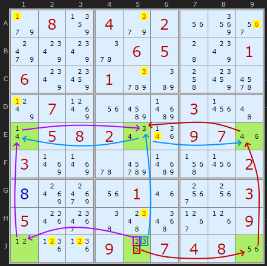
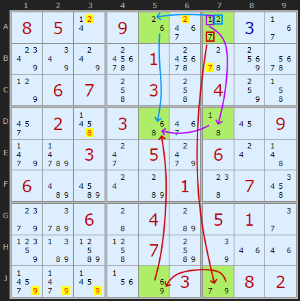
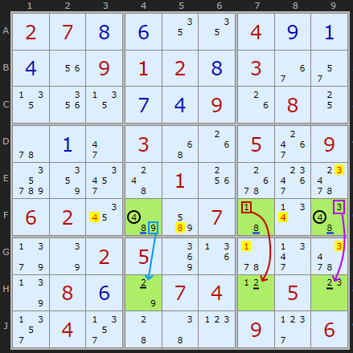

# 20 · Twinned XY-Chains

> **Level:** Diabolical (rare) · **Family:** Locked sets / bivalue patterns · **Prerequisites:** [XY-Chains](../25-xy-chains/README.md), [Naked Candidates](../01-naked-candidates/README.md)
> Diagrams: [sudokuwiki.org/Twinned_XY_Chains](https://www.sudokuwiki.org/Twinned_XY_Chains) by Andrew Stuart (pattern by Nils Leder). Text: original to this guide.

## In one sentence

Six cells in a **2×3 grid** (two rows × three columns, or the reverse) that between them hold **exactly six digits**, arranged so that two overlapping XY-loops are possible. Whichever loop turns out to be real, all six digits end up placed in those six cells. That makes them a big **locked set**, so each digit can be cleared from the units it's confined to.

## The intuition

The six green cells and their candidates are:

| | col 1 | col 5 | col 9 |
|---|---|---|---|
| **row E** | {1,4} | {3,4} | {4,6} |
| **row J** | {1,2} | {2,3,**5**} | {5,6} |

**J5** is the only cell with three candidates. Think about what it does:

- **If J5 isn't 5**, it's {2,3}, and the **left** four cells (E1, E5, J1, J5) form a closed **XY-loop** on {1,2,3,4}.
- **If J5 isn't 2**, it's {3,5}, and the **right** four cells (E5, E9, J5, J9) form a closed loop on {3,4,5,6}.

One of the two loops has to be real, and they share the digit **4** (row E has a 4 in all three cells). Activating one loop squeezes the other into place as well. Either way, **each of the digits 1–6 lands exactly once** in the six cells.

Another way to see it: every digit's copies here either share a row or share a column, so no digit can appear twice. With 6 digits and 6 cells, it's a naked "sextuple".

### Eliminations

Each digit is confined to a single line within the pattern, so it gets cleared from the rest of that line:

- 4s are all in row E, so row E's other 4s go (E6).
- 2s are in row J, so J2 and J3 lose their 2.
- 1s are in column 1, so A1 and D1 lose their 1. 3s are in column 5, and 6s are in column 9, likewise.

▶ [Load position](https://www.sudokuwiki.org/sudoku.htm?bd=S9B9f0887049i021u923m9o80805y060544800106808g01d2ba4k8g6i7x078t1ubucb03234a0r0508020u1r09071m038r8r5udmcb5f23020h8sak1u011m3o1w03051s3k464g5a391h090l1l1l09140704081u) · [From the start](https://www.sudokuwiki.org/sudoku.htm?bd=080402000000065001600100000070000300058200970300000002800010003500000009000907480)

## How to spot it

1. Look for a row (or column) with **three bivalue cells sharing one digit**, like the three 4s in row E.
2. Look at the cells in a parallel line in the **same three columns**. Together, the six cells need to hold only six digits.
3. Check that each digit's copies stay inside **one line** (one row or one column), so no digit can be used twice.
4. Clear each digit from the rest of its line.

---

## More examples

### Example 2: column-oriented

Here **6** is the shared digit in **A5, D5, J5** (column 5), with partners in column 7. The loops are traced from row A this time. Using this pattern drops the puzzle's sudokuwiki grade from *extreme* to *diabolical*.

▶ [Load position](https://www.sudokuwiki.org/sudoku.htm?bd=S9B08050t091g3g2d0c37807y7w7g017g5w90767p06074k034k04844j2y024r034y3e4316099nd7032k059o060s4b06bebu0sb80148074u9kd2064404b805012e89bbbp4l07bo7q1m1ma39n8b1v8i039e0802)

### Example 3: a looser version

This one doesn't have a single shared digit. Instead, the 4s, 8s and 2s each stay within their own row, and 1, 3 and 9 each pair up within a column. The "chains" are more of a metaphor here, but the counting argument (6 digits, 6 cells, no duplicates possible) still holds.

▶ [Load position](https://www.sudokuwiki.org/sudoku.htm?bd=S9B02070h0f1212040i0a0d1u0901020h03362q131y130g0d091g08105u0a2i034y1g053g09di86324c011w6s3k6806021abebm07430v4e9j7q02058m1j5v2n667r080f7o07040l050o2v042v44460p092h06)

---

## Common mistakes

- ❌ **A digit that appears in two different rows *and* two different columns.** Then it could appear twice and the locked-set argument fails.
- ❌ **Seven digits in the pattern.** The six cells must contain exactly six digits in total.
