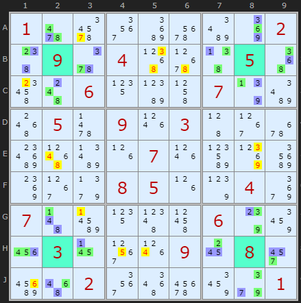
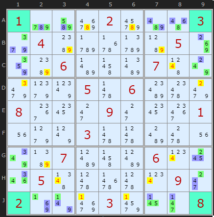
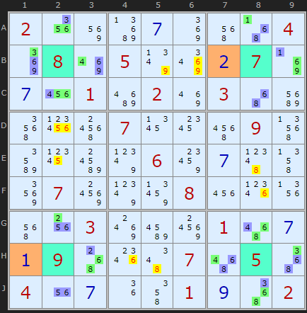

# 21 · SK Loops

> **Level:** Diabolical / Extreme (very rare) · **Family:** Locked sets · **Prerequisites:** [Hidden Candidates](../02-hidden-candidates/README.md), [AIC](../32-alternating-inference-chains/README.md) notation helps
> Diagrams: [sudokuwiki.org/SK_Loops](https://www.sudokuwiki.org/SK_Loops) by Andrew Stuart (write-up and examples credited to Phil, "pjb", of Phil's Folly). Text: original to this guide.

## In one sentence

Four **given** cells at the corners of a rectangle across four boxes, each surrounded by a pair of cells in its row and a pair in its column. If those **eight pairs** link around the rectangle so that a total of **16 candidates** (fewer if some cells are already solved) must fill exactly 16 cells, the whole ring is one locked set. Clear those digits from the rest of each pair's line.

## The shape



This is the famous **"Easter Monster"** puzzle, one of the hardest well-known Sudokus.

- Four givens sit at the corners of a rectangle in four different boxes.
- In each of those boxes, take the **two cells beside the given in its row** and the **two cells beside it in its column**. That gives 2 pairs per box and **8 pairs** (16 cells) in total.
- Each pair is linked to its neighbour pair in the next box (along the shared row or column) by a set of digits that **must** be in one or the other. These are hidden-pair-style links.

Reading it as a loop, starting top-left and going clockwise:

```
(27=38)B13 – (38=16)B79 – (16=39)AC8 – (39=27)GJ8
– (27=45)H79 – (45=16)H13 – (16=48)GJ2 – (48=27)AC2 – (back to B13)
```

Each `(xy=zw)` is one pair of cells, with its digits split into the set shared with the previous pair and the set shared with the next. Count how many digits each link carries: 2-2-2-2-2-2-2-2 = **16**. Sixteen digits for sixteen cells, so everything is locked.

### The payoff

The solution fills the 16 cells with one of two colourings (green or blue in the solver), or a mix pair by pair. Either way, the digits linking two neighbouring pairs are fully used **within that line**. So:

> **B13** and **B79** both carry {3,8} for row B, so the rest of row B (**B5, B6**) can't contain 3 or 8.

## Rules of the pattern

| Requirement | Detail |
|---|---|
| Geometry | 4 boxes in 2 bands × 2 stacks. One row-pair and one column-pair per box, crossing at a **given**. |
| Links | 8 links: one in each box, row and column of the loop. A link can carry 1, 2 or 3 digits. |
| Count | The total number of digits carried by the links must be **≤ 16**. |
| Solved cells | A pair may include one **solved** (not given) cell. That uses up a slot and lowers the target below 16. |

---

## More examples

### Single and triple links



The links alternate between carrying **3 digits** and **1 digit**: 3-1-3-1-3-1-3-1, which is still 16.

```
(579=8)A23 – (8=469)A78 – (469=2)BC9 – (2=457)GH9
– (457=1)J78 – (1=469)J23 – (469=3)GH1 – (3=579)BC1
```

▶ [From the start](https://www.sudokuwiki.org/sudoku.htm?bd=100020003040000050006000700000506000800090001000300000007000600050000090200030008)

### With solved cells



Two of the 16 cells are already solved (beige). The links count 2-2-1-2-2-2-1-2 = **14**, which is exactly the 14 cells still open.

▶ [From the start](https://www.sudokuwiki.org/sudoku.htm?bd=200000004080500070001020300000700090000060000070008000003000100090007050400001002)

---

## Should you learn this?

Honestly, only if you're tackling the **hardest puzzles ever published**. SK Loops almost never appear in ordinary puzzles, but in the Easter Monster family they're the cleanest way in.

**Further reading:** [Phil's Folly: SK and related loops](http://www.philsfolly.net.au/Sudoku/loops_help.htm) (with a large example list) · [Forum thread](http://forum.enjoysudoku.com/sk-and-related-loops-t35883.html)

▶ [Easter Monster from the start](https://www.sudokuwiki.org/sudoku.htm?bd=100000002090400050006000700050903000000070000000850040700000600030009080002000001)
