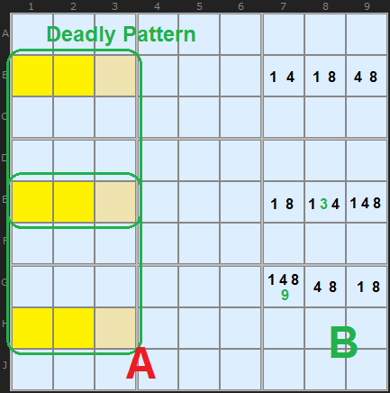
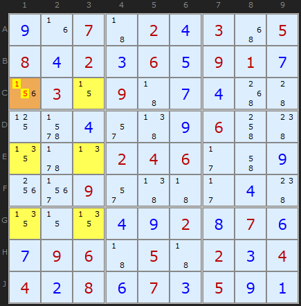
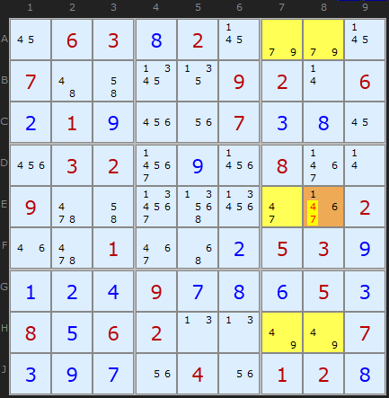
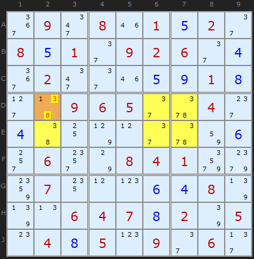
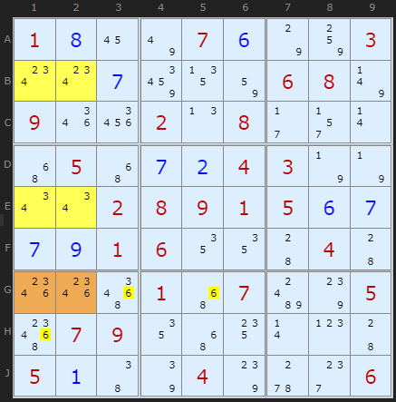
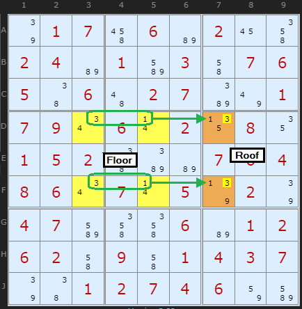

# 22 · Extended Unique Rectangles

> **Level:** Diabolical · **Family:** Uniqueness · **Prerequisites:** [Unique Rectangles](../17-unique-rectangles/README.md), [Naked Candidates](../01-naked-candidates/README.md) (triples)
> Diagrams: [sudokuwiki.org/Extended_Unique_Rectangles](https://www.sudokuwiki.org/Extended_Unique_Rectangles) by Andrew Stuart. Text: original to this guide.

## In one sentence

A Unique Rectangle with a **triple** instead of a pair. **Six cells** (2 lines × 3 lines across **3 boxes**) that could all be reduced to the same three digits would give multiple solutions, so whatever extra candidate prevents that must be true.

## From 2×2 to 2×3

A UR's two digits can be "swapped" between two cells in each line. Three digits **{a,b,c}** spread over three rows and three boxes can be **permuted** in the same way.



- **A:** the full 3×3 deadly pattern. It spans three rows, three columns **and three boxes**.
- **B:** the candidates {1,4,8} fill every row and column of it as a triple, and only the **green extras** prevent multiple solutions.

Here's the shortcut. Delete *any one* column from the 3×3 pattern, and the remaining 3×2 is **still** ambiguous. For example, a column of three cells can be filled 1-8-4, 4-1-8 or 4-8-1, and its partner column fits around each choice. So you never need to look for the 3×3 version, because the **2×3** version catches it.

```
   3 rows × 2 columns, 3 boxes        (or the transpose)
   ┌───┐┌───┐
   │abc││abc│   ← box 1/2/3 in a stack
   ├───┤├───┤      each COLUMN is a triple on {a,b,c}
   │abc││abc│      each ROW is a pair from {a,b,c}
   ├───┤├───┤
   │abc││abc│
   └───┘└───┘
```

Like any triple, a cell doesn't need all three digits. `{a,b}` or `{b,c}` cells are fine, as long as each 3-cell line holds exactly {a,b,c} in total.

---

## Type 1: one cell has extras ⇒ remove the triple from it

### Example 1: vertical



The yellow cells hold only {1,3,5}, except **C1**, which also has a **6**. Without that 6 the pattern would be deadly, so **C1 = 6** (1 and 5 are removed).

▶ [Load position](https://www.sudokuwiki.org/sudoku.htm?bd=907024305842365917030907400004009600000246009009000040000492876796050234428673591) · [From the start](https://www.sudokuwiki.org/sudoku.htm?bd=007020305802060910030900000000000600000246000009000000000002070096050204408070500)

### Example 2



The cells in rows **A, E, H** × columns **7, 8** hold {4,7,9}. **E8** also has 1 and 6, which are the escape route, so 4 and 7 come off E8.

▶ [Load position](https://www.sudokuwiki.org/sudoku.htm?bd=063820000700009206219007380032090800900000002001002539124978653856200007397040128)

### Example 3: horizontal



The triple {3,7,8} spans rows **D and E** across three boxes. A single **1** in **D2** is the only escape, so D2 = 1.

▶ [Load position](https://www.sudokuwiki.org/sudoku.htm?bd=090801520851092604020005918009650040400000006060084100070006480006478205048509060)

---

## Type 2: two roof cells share one extra digit



The floor is four yellow cells on {2,3,4}. The roof cells **G1** and **G2** (orange) each have one extra: **6**. One of them must be 6 to avoid the deadly pattern, so other 6s in **row G** and **box 7** go. (Turn off Fireworks to see this one in the solver.)

▶ [Load position](https://www.sudokuwiki.org/sudoku.htm?bd=S9B010h167u070f7o84030w0w0g8e138206087v091q26020n082b2r0r4y054y0g0b04037n7n0u0u02080901050f0g0g0i010612124404441s1s5a014y07bg7s055c0709124y140r0p44050a467q047s5w2g06)

## Type 4: locked pairs reduce to a UR



In **DF35**, two locked pairs (held in place by the 4s) effectively reduce to a {1,3} pair. Combined with **D7/F7**, where the 1s are a conjugate pair in column 7 and box 6, that's a Type 4 UR, and **3 comes off D7 and F7**. (Turn off the Tough strategies and XY-Chains to see it.)

▶ [Load position](https://www.sudokuwiki.org/sudoku.htm?bd=017060200240103076506027001790602080152000764860705020470006012620901437001274600)

---

## Tip

Extended URs aren't common. But when you're scanning for ordinary URs and notice a **cluster of the same three digits** spread over three boxes in two lines, stop and check.
