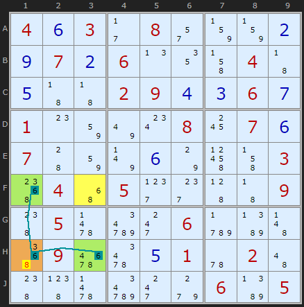
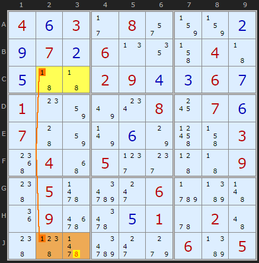
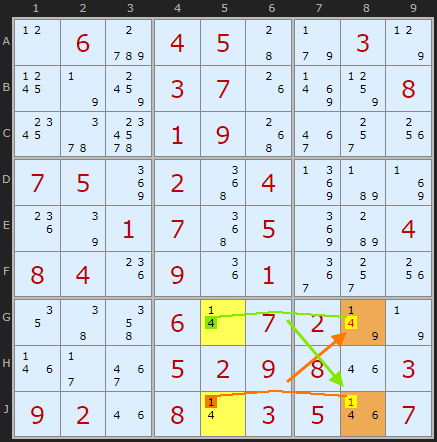
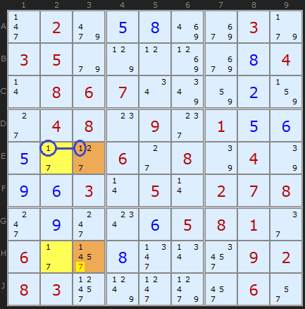
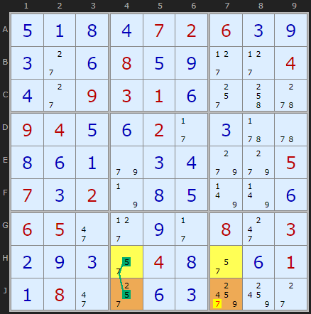

# 23 · Hidden Unique Rectangles

> **Level:** Diabolical · **Family:** Uniqueness · **Prerequisites:** [Unique Rectangles](../17-unique-rectangles/README.md), [Foundations §4](../00-foundations/README.md) (strong links)
> Diagrams: [sudokuwiki.org/Hidden_Unique_Rectangles](https://www.sudokuwiki.org/Hidden_Unique_Rectangles) by Andrew Stuart. Text: original to this guide.

## In one sentence

A UR where most corners are **cluttered** with extra candidates, but **strong links** on one of the pair digits leave a corner with only one way to avoid the deadly pattern. That rules out the *other* pair digit in that corner.

## The intuition

Ordinary URs need at least two clean bivalue corners. A Hidden UR makes do with **one** (or a bivalue floor), and uses **strong links** to stand in for the missing clean corners.

The core move:

> If a candidate's **row and column both have strong links on digit a** around the rectangle, then placing **b** in that corner forces **a** into the neighbouring corners, and you're straight into the deadly a/b pattern.

---

## Type 1: one bivalue corner + two strong links at the opposite corner



The rectangle is **F1, F3, H1, H3**, with potential deadly pair {6,8}.

- **F3** is the only clean corner, `{6,8}`.
- At the **opposite** corner, **H1**, the digit **6** has a strong link along row H (to H3) *and* a strong link down column 1 (to F1).

Try **H1 = 8**:
- Then H1 isn't 6, so the strong links put **6 in H3** and **6 in F1**.
- F3 can't be 6 (it shares row F with F1), so **F3 = 8**.
- Now the four corners are 8/6/6/8, which is the deadly pattern.

So **H1 ≠ 8**. (We still don't know if H1 is 6. It has other candidates too.)

```
           col 1          col 3
row F   [6 8 ...]   ─   [6 8]        ← the only clean corner
           ║                │
row H   [6 8 ...] ═══ [6 8 ...]
           ↑ opposite corner: 6 strongly linked both ways → remove 8
```

▶ [Load position](https://www.sudokuwiki.org/sudoku.htm?bd=S9B040f032b082q83830b0i070b060n124j04430e434302090d0c060g010o827u0w0818070f0744827v0f7o4t4j0354044y052h2g454309480563da2k06czbb4b52096y660e015u024a484963da2k9g06bb05) · [From the start](https://www.sudokuwiki.org/sudoku.htm?bd=403080000070600040000290060100008070700000003040500009050006000090001020000000605)

---

## Type 2: bivalue floor in one box + one strong link



This is the next step of the same puzzle. The rectangle is **C2, C3, J2, J3** on {1,8}.

- The floor is **C2, C3**, both `{1,8}` (a naked pair).
- The roof **J2, J3** is cluttered.
- **1** has a strong link in **column 2** (C2–J2).

Try **J3 = 8**. Then C3 = 1, so C2 = 8, so (strong link on 1 in column 2) J2 = 1. That's 8/1/1/8, deadly. So **J3 ≠ 8**.

▶ [Load position](https://www.sudokuwiki.org/sudoku.htm?bd=S9B040f032b082q83830b0i070b060n124j04430e434302090d0c060g010o827u0w0818070f0744827v0f7o4t4j0354044y052h2g454309480563da2k06czbb4b1i096y660e015u024a484963da2k9g06bb05)

> Why only J3 and not J2? Because it's the **other** 1s and 8s in those columns (or their absence) that decide which corner is trapped. Always check which strong links actually exist.

### Two eliminations at once



The rectangle **GJ58** has a strong link on **1** (J5–J8) and another on **4** (G5–G8). Each gives its own elimination: 4 comes off **G8**, and 1 comes off **J8**.

▶ [Load position](https://www.sudokuwiki.org/sudoku.htm?bd=S9B0l06d00405449f037p197n8c03071g8r85081c5y6o0109503e2s1w07058m0252048nb78j1k7q010752058mb80408041k091i013a2s1w12464m060r07027v7n1n2b3e050209081m0309021m080r03051n07)

---

## Type 2B: floor split across two boxes



The yellow floor cells are `{1,7}`, but they're in **different boxes**. The roof is **E3** and **H3** (orange). There's a strong link on **1** in row E (**E2–E3**), so a **7 in H3** would complete the deadly pattern, and H3 loses its 7.

This is the **most common** Hidden UR, about twice as frequent as Type 1.

▶ [Load position](https://www.sudokuwiki.org/sudoku.htm?bd=020580030350000084086700020048090156500608040963050278090065810600800092830000060)



The floor is in row H here. A strong link on 5 (**H4–J4**) removes **7 from J7**. *(Puzzle by Klaus Brenner. It needs a Type 1, a Type 2 and a Type 2B in a row. Uncheck XY-Chains to see them.)*

▶ [Load position](https://www.sudokuwiki.org/sudoku.htm?bd=S9B0e0a0h0d0702060c0i0c2c0f080e0i2d2d040d2c0903010f2s4k5w09040e0f022b0c5v5u0h0f0a9e0c0d9g9g05070c027n0h0e7v7v0f06052i2d0i2b082k030b0i0c2q040h2q0f010a082i2s0f0ca4a42c)

---

## How to spot them

1. Find rectangles (2 rows × 2 columns × **2 boxes**) where all four corners contain both digits a and b.
2. Find the clean corner(s).
3. For each candidate corner, ask: *if this were b, would the strong links on a fill the other corners with a/b?* If yes, remove b.

## Common mistakes

- ❌ **Assuming a link is strong.** Count: the digit must appear **exactly twice** in that row or column.
- ❌ **Placing a instead of eliminating b.** Hidden URs only tell you what the corner **isn't**.
