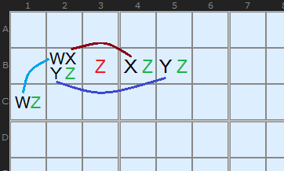
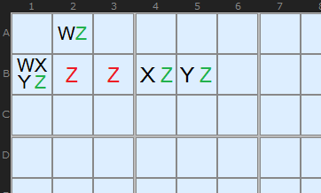
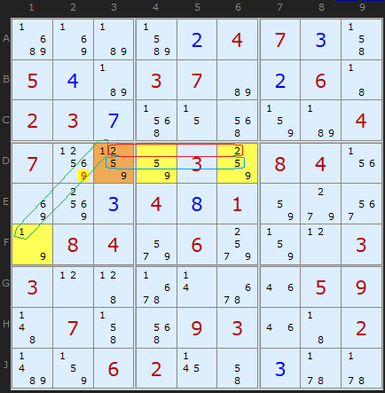
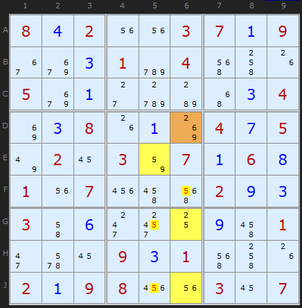
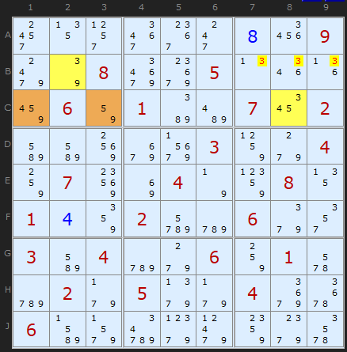
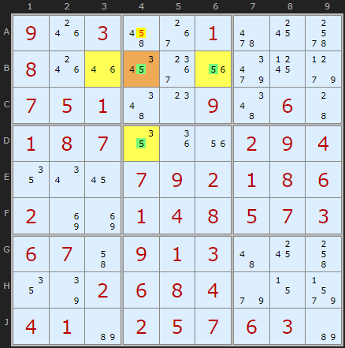
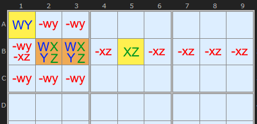
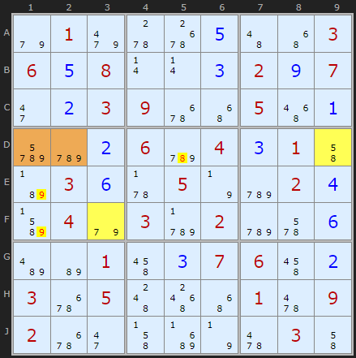
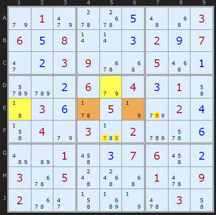

# 24 · WXYZ-Wing (Bent Quads)

> **Level:** Diabolical · **Family:** Wings / Almost Locked Sets · **Prerequisites:** [XYZ-Wing](../10-xyz-wing/README.md), [Naked Candidates](../01-naked-candidates/README.md) (quads) · **Next:** [Almost Locked Sets](../37-almost-locked-sets/README.md)
> Diagrams: [sudokuwiki.org/WXYZ_Wing](https://www.sudokuwiki.org/WXYZ_Wing) by Andrew Stuart (general definition from StrmCkr; Type 2 from David Hollenberg). Text: original to this guide.

## In one sentence

**Four cells** that contain only **four digits** in total, spread over **two units**, act like a naked quad that has been "bent" around a corner. If exactly one of those digits (Z) has copies that **can't all see each other**, then Z is guaranteed to be in the pattern somewhere, and any cell seeing **every** Z in it loses Z.

## Key idea: restricted vs non-restricted digits

For each digit in the pattern, ask: **can all of its copies in the pattern see each other?**

| Digit type | Its copies... | Implication |
|---|---|---|
| **Restricted** | all share one unit | it can appear **at most once** in the pattern |
| **Non-restricted** | at least two copies can't see each other | it **could** appear twice |

*W's copies share a box, and X's and Y's share a row, so all three are restricted. Some Z's don't see each other (C1 vs B4/B5), so **Z is non-restricted**.*

### Why Z must appear

There are 4 cells and 4 digits. If Z were absent, the other three digits would have to fill four cells. But each of them is restricted to **at most one** cell, so they can cover at most three. That's impossible, so **at least one Z is true**.

*The classic shape, which is like an XYZ-Wing with one more cell: hinge {W,X,Y,Z}, with outliers {W,Z}, {X,Z}, {Y,Z}. The general rule doesn't require the hinge to hold all four digits.*

## How to spot it

1. Find a **hinge** area: a box plus a row (or column) through it, or a row plus a column.
2. Pick **four cells** within those two units whose candidates add up to exactly **four digits**.
3. Check each digit. Exactly **one** should be non-restricted. That digit is Z.
4. Eliminate Z from any cell that sees **all** the Zs in the pattern.

> 💡 The fewer cells Z appears in, the more cells can see them all, which means **more eliminations**.

---

## Type 1 examples

### Example 1: the classic layout

- The hinge **D3** (brown) holds `{1,2,5,9}`. Three yellow outliers each contain a 9.
- The 1s share a box, and the 2s and 5s each share a row, so they're all restricted.
- The 9s aren't: **F1** can't see **D4/D6**. So Z = 9.
- **D2** sees every 9 in the pattern, so it loses its 9.

▶ [Load position](https://www.sudokuwiki.org/sudoku.htm?bd=S9Bc38jb7bn0b04070c4j050db70307b60b064302030g5f0z5e83b70407918582038408041v8i900c040h01829g3m7n08049u069w830l03030l456r0r6q1m05094b074j5e09031m4302bf830602174i0c5v5v) · [From the start](https://www.sudokuwiki.org/sudoku.htm?bd=000004700500370060230000004700030840000401000084060003300000059070093002006200000)

### Example 2: the hinge doesn't need Z

**{D6, E5, G6, J6}** together hold {2,5,6,9}. The hinge **D6** has **no 5**, but whatever D6 turns out to be, a 5 gets pushed into E5 or into G6/J6. So **F6, G5 and J5** lose their 5.

▶ [Load position](https://www.sudokuwiki.org/sudoku.htm?bd=S9B0804021u1u0307010936aa0301cy045e4k1g05aa012cd0b84y03048i03081g018k0407057u0216038207010608011u07224q5e020903034i062k3010094q012i6a160903015e4k1g02010908221u031607)

### Example 3: Z in only two cells

**{C1, B2, C8, C3}** hold {3,4,5,9}, and only two of those cells contain a 3. For instance, if C1 = 4, then C8 becomes {3,5}, and C8 + C3 + B2 act like a [Y-Wing](../07-y-wing/README.md). The result: **B7, B8, B9** lose 3.

▶ [Load position](https://www.sudokuwiki.org/sudoku.htm?bd=S9B30132t3i3c2k0826099o7q08amag050n1q1j8a068201babe071a02bmbm90aaar03859g048407948i047n89081301048602decy069i2u03bm04cy9g0684016acy029f059j9f04ae6u06bn9vda9l9p889g6e)

### Example 4: row + column (no box)

The two units can be a **row and a column**. The hinge is **B4**, and the 5s in **B6** and **D4** can't see each other. **A4** sees all of the pattern's 5s, so it loses its 5.

▶ [Load position](https://www.sudokuwiki.org/sudoku.htm?bd=S9B091o034q380162186c081o1m1a3c1u9q199h0705014e0o094e0644010807121i1u020904120u16070902010806028i8i01040805070306074i0901034a184k127q020608049e0z9v0401b60205070603b6)

---

## Type 2: all four digits restricted

Two hinge cells sit in the same box and the same line, and hold four digits between them. Add one partner cell **in the box** and one partner **along the line**, where the partners can't see each other. Now **every** digit is restricted, so each one appears **exactly once** in the four cells, which makes them a full locked set.

**Rule:** any outside cell that sees all of a digit's copies in the pattern loses that digit.

*Why?* Suppose an outside cell is digit d. Then every d in the pattern is gone, and four cells have to be filled with three restricted digits. That's impossible.

The hinge **D1+D2** holds {5,7,8,9}. The partner **D9** `{5,8}` is along row D, and the partner **F3** `{7,9}` is in box 4. Eliminations: 8 off **D5**, and 9 off **E1** and **F1**.

▶ [Load position](https://www.sudokuwiki.org/sudoku.htm?bd=S9B9e019m5w6s0e4a4y03060e080r0r0c020i072i0b03096q4y05560adecy0b06cy040c014ib7030f5v057ncy020dbn049e03cz02cy6a0fbeb6014q0c07064q0b036q054c584y016209026q2i4jc37n62034i) · [From the start](https://www.sudokuwiki.org/sudoku.htm?bd=010000003608000207003900500000604010030050020040302000001007600305000109200000030)

On the next step, {1,7,8,9} are all restricted. **F5** sees both 9s in the pattern (**D5, E6**), so it loses its 9.

▶ [Load position](https://www.sudokuwiki.org/sudoku.htm?bd=S9B9e019m5w6s0e4a4y03060e080r0r0c020i072i0b03096q4y05560adecy0b069e040c014i43030f5v057ncy020d4j049e03cz02cy6a0fbeb6014q0c07064q0b036q054c584y016209026q2i4jc37n62034i)

---

## Common mistakes

- ❌ **Two non-restricted digits.** Then you can't tell which one is guaranteed, so there's no Type 1 elimination.
- ❌ **Five digits in four cells.** That's not a locked set. Recount.
- ❌ **Removing Z from a cell that misses one of the Zs.** The target must see **all** of them.

## How it connects

Every WXYZ-Wing is an [Almost Locked Set](../37-almost-locked-sets/README.md) pattern. Once you're comfortable with ALS-XZ, you'll see these as a special case.
