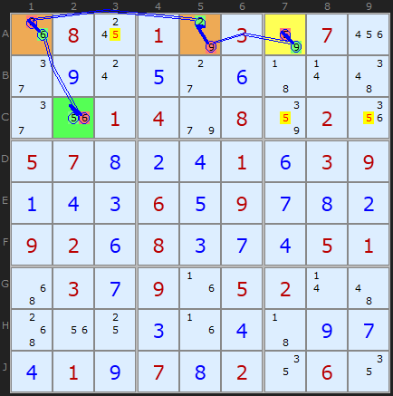
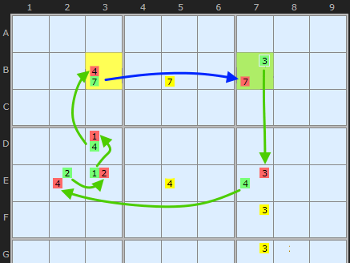
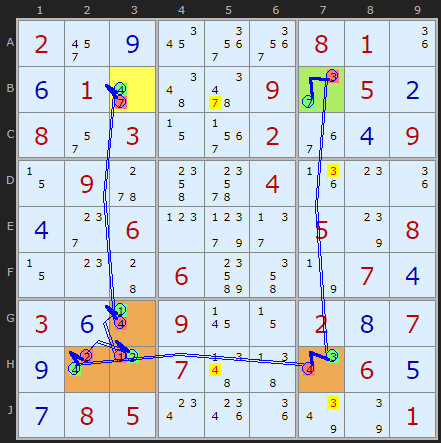
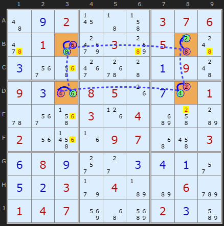
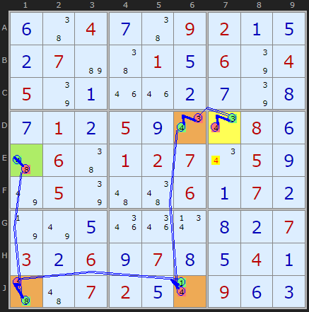

# 25 · XY-Chains

> **Level:** Diabolical · **Family:** Bivalue chains · **Prerequisites:** [Y-Wing](../07-y-wing/README.md), [Foundations §3–4](../00-foundations/README.md) · **Next:** [AIC](../32-alternating-inference-chains/README.md)
> Diagrams: [sudokuwiki.org/XY_Chains](https://www.sudokuwiki.org/XY_Chains) by Andrew Stuart. Text: original to this guide.

## In one sentence

A path of **bivalue cells**, where each step passes along a shared digit to a cell that can see the previous one. If the path **starts and ends on the same digit Z**, at least one end is Z, so any cell that sees **both ends** loses Z.

## The intuition: dominoes

Each bivalue cell is a domino with two faces. Knock over the first one (by saying "this end is *not* Z") and each cell forces the next:

```
 [Z|a] → [a|b] → [b|c] → [c|Z]
  ↑ not Z means a        ↓ ... so this end must be Z
```

- If the first cell **is** Z, you're done: the first end is Z.
- If it **isn't** Z, it's a, which makes the next cell b, which makes the next c... and the last cell is **Z**.

Either way, Z is at one end or the other. A [Y-Wing](../07-y-wing/README.md) is just the 3-cell version.

## How to build one

1. Choose a target: a candidate Z in some cell that you suspect is false.
2. Start at a bivalue cell `{Z, a}` that sees the target.
3. Hop to a bivalue cell that **sees** the current cell and contains the "other" digit (a). Its other digit becomes the next hand-off.
4. Keep going until you reach a bivalue cell whose **leftover digit is Z** and that also sees the target.
5. Eliminate Z from every cell that sees **both** ends.

> 💡 **Paper trick:** lightly draw arrows between the cells as you go, writing the hand-off digit on each arrow. Dead ends are common, so backtrack and try another branch.

---

## Worked examples

### Example 1: a 4-cell chain



```
A7 {5,9} →9→ A5 {9,2} →2→ A1 {2,6} →6→ C2 {6,5}
```

- If **A7 = 5**, that end is 5.
- If **A7 ≠ 5**, then A7 = 9, A5 = 2, A1 = 6 and **C2 = 5**.

One of the ends is 5 either way. **A3, C7 and C9** see both ends, so they lose 5.

In the solver's notation (`-` = off, `+` = on):

```
-5[A7] +9[A7] -9[A5] +2[A5] -2[A1] +6[A1] -6[C2] +5[C2]
```

▶ [Load position](https://www.sudokuwiki.org/sudoku.htm?bd=S9B1g0818017o038207222e0i0s0e2c0f430r4e2e1u01049e0886021y05070h0b0d010f03090a0d0c060e090g0h0b09020f080c0g0d05014y030g091f05020r4a501u100c1f0d430i0g0d010i070h02120612) · [From the start](https://www.sudokuwiki.org/sudoku.htm?bd=080103070000000000001408020570001039000609000920800051030905200000000000010702060)

> 📊 Fun fact: in tests on more than 10,000 puzzles, **both** ends turned out to be Z in 57% of XY-Chains.

---

## Closed XY-Chains (XY-Loops): a big bonus

If the two ends **can see each other** (and both end on Z), the chain closes into a **loop**. Now every link alternates perfectly, so **every** hop is effectively strong, and you can eliminate along **every link**, not just at the ends.



*The ends B3 and B7 both hold 7 and share row B. The 7s connect them (blue arrow) and close the loop.*

### Example 2



The red and green candidates alternate all the way round, so one colour is entirely true. Each link between two cells pins its digit to one of those two cells:

- the link **H2–H7** removes 4 from **H5**
- the link **B7–H7** removes 3 from **D7** and **J7**

This is the same as [Nice Loop Rule 1](../14-x-cycles/README.md#rule-1-continuous-loop--eliminate-along-the-weak-links).

▶ [Load position](https://www.sudokuwiki.org/sudoku.htm?bd=S9B022y0i1a3q3q08011i0f012i4e66092e050b082q030z3n02360d090z095w4o6g041j0o1i0d2g060p9l2f057s080z0o4406bs4m7n070d030f0r09170z020h070i0s0l074f470u060e0g08050w1s1i7y7q01)

### Example 3: a rectangle



```
B3 {6,8} → D3 {6,4} → D8 {4,2} → B8 {2,8} → back to B3
```

If B3 = 6, then D3 = 4, D8 = 2 and B8 = 8. If B3 = 8, every digit flips. Either way each link's digit is locked into its two cells, so it gets cleared from the rest of that row or column.

▶ [Load position](https://www.sudokuwiki.org/sudoku.htm?bd=S9B4a0i0217434j03070662014yak03c405444c0c3m5e3g6s440a094c090c1m08051g0g0s015u3m5f031h04c24kb8021u5n1f09074y4q030f080i2s2c0c0d0a2q0e0b039f04b7b606cy0104078y4yci020cbm)

### Example 4: from an easy puzzle



The chain proves that **E1 or D7 is 4**, so **E7** (which sees both) loses its 4.

▶ [Load position](https://www.sudokuwiki.org/sudoku.htm?bd=S9B0f46040g4609020a0e0b07b646010e067q04057q0a1m1m0b0g7q0h0g010b050i0u0u080f4a06460102070u050i7u057q4a4e060a070b7n7u0e1q1q0v0h0b07030b060i070h0e040a434a07020e0r090f0c)

---

## Common mistakes

- ❌ **A 3-candidate cell in the chain.** Every cell must be **bivalue**. (To use other cells, move up to [AICs](../32-alternating-inference-chains/README.md).)
- ❌ **Consecutive cells that don't see each other.** Each hop must share a unit.
- ❌ **Ends on different digits.** Both ends must leave the **same** digit Z.

## How it connects

- Y-Wing = 3-cell XY-Chain. [W-Wing](../13-w-wing/README.md) and [Remote Pairs](../49-remote-pairs/README.md) are special cases.
- An XY-Chain is an [AIC](../32-alternating-inference-chains/README.md) whose strong links are all *inside* bivalue cells.

## Practice puzzles

[1](https://www.sudokuwiki.org/sudoku.htm?bd=001005004060080057072900000004000060009060400030000700000007840610050030300200100) ·
[2](https://www.sudokuwiki.org/sudoku.htm?bd=020080600000500007078000340000290006050000090600037000042000570300009000009050030) ·
[3](https://www.sudokuwiki.org/sudoku.htm?bd=000007001790006085500800000020063000009000600000740030000005008350900074100300000) ·
[4](https://www.sudokuwiki.org/sudoku.htm?bd=010027050020600400800000007000004070006708900070300000700000009005009010030160020)
