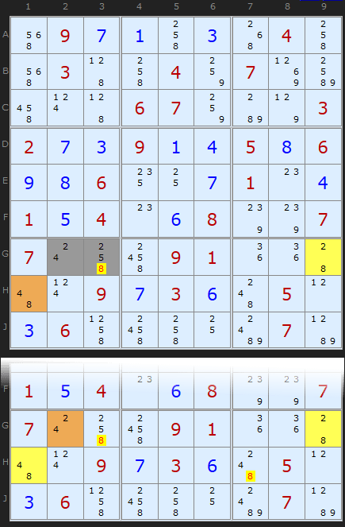
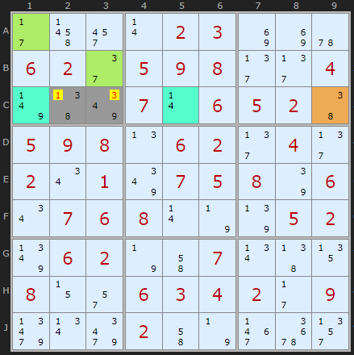
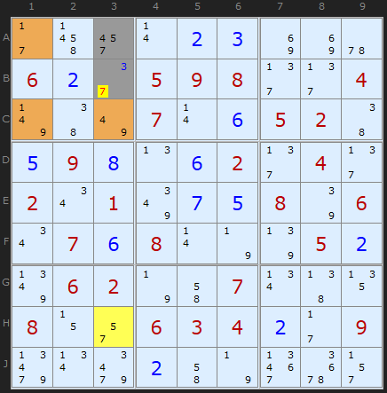
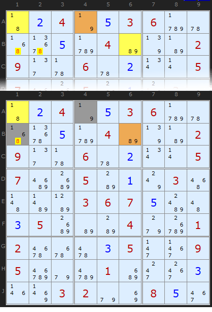
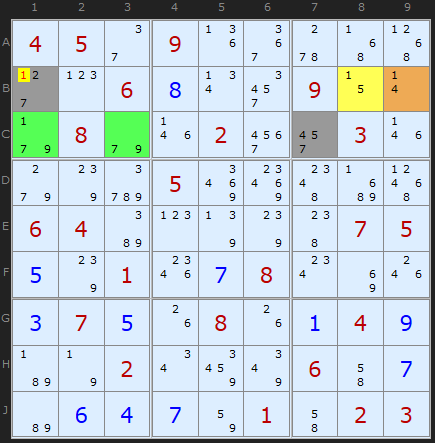
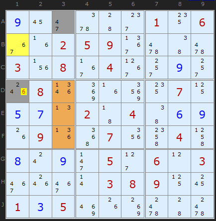
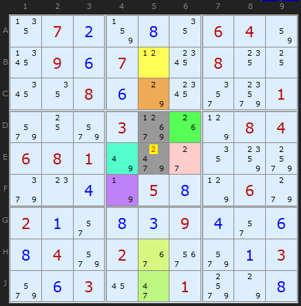

# 26 · Aligned Pair Exclusion (APE)

> **Level:** Diabolical · **Family:** Almost Locked Sets · **Prerequisites:** [Y-Wing](../07-y-wing/README.md), [XYZ-Wing](../10-xyz-wing/README.md) · **See also:** [Almost Locked Sets](../37-almost-locked-sets/README.md)
> Diagrams: [sudokuwiki.org/Aligned_Pair_Exclusion](https://www.sudokuwiki.org/Aligned_Pair_Exclusion) by Andrew Stuart. Text: original to this guide.

## In one sentence

Take **two cells** (the base pair). List every combination of values they could take together. Cross out any combination that would **leave some other cell or group of cells without enough digits**. If a candidate doesn't appear in any surviving combination, eliminate it.

## The intuition: brute force, made safe

APE is really **"try all the pairings"**, but done in a bounded, checkable way.

The killers are **Almost Locked Sets (ALS)**: N cells with N+1 candidates.

| ALS size | Example | Combinations that kill it |
|---|---|---|
| 1 cell (bivalue) | `{a,b}` | the pair **(a,b)**. If the base cells take a and b, this cell has nothing left. |
| 2 cells | `{a,b,c}` over 2 cells | any **two** of a,b,c: (a,b), (a,c), (b,c) |
| 3 cells | `{a,b,c,d}` over 3 cells | any two of the four digits, since it would leave 2 digits for 3 cells |

**An ALS can only kill a combination if every one of its cells sees both base cells**, or more precisely, sees the base cell holding each digit it relies on.

## The procedure

1. Pick two base cells, P and Q. Small candidate lists make this easier.
2. Write out every pairing (p, q).
   - If P and Q **see each other** (Type 1, "aligned"), cross out pairs where p = q.
   - If they **don't** (Type 2, "unaligned"), p = q is allowed!
3. For each pairing, check every ALS that the base cells can see. Would (p, q) empty it? If so, cross it out.
4. Any candidate of P that appears in **no surviving pairing** can be eliminated, and the same goes for Q.

---

## Worked examples

### Example 1: two bivalue cells (the simplest case)

The base pair is **G2** `{2,4}` and **G3** `{2,5,8}`, which see each other.

| G2 | G3 | Status |
|---|---|---|
| 2 | 2 | ✗ same digit in the same row |
| 2 | 5 | ✓ |
| 2 | 8 | ✗ empties **G9** `{2,8}` |
| 4 | 2 | ✓ |
| 4 | 5 | ✓ |
| 4 | 8 | ✗ empties **H1** `{4,8}` |

No surviving combination puts 8 in G3, so **G3 ≠ 8**. (A Y-Wing gets the same result here. Uncheck Y-Wing in the solver to see the APE.)

▶ [Load position](https://www.sudokuwiki.org/sudoku.htm?bd=097103040030040700000670003273914586986007104154068007700091000009736050360000070)

### Example 2: a 2-cell ALS joins in

The base pair is **C2/C3**. The 2-cell ALS **A1+B3** holds {1,3,7}, so it kills (1,3), (1,7) and (3,7).

| C2 | C3 | Status |
|---|---|---|
| 1 | 3 | ✗ ALS A1+B3 |
| 1 | 4 | ✗ ALS C1+C5 |
| 1 | 9 | ✗ ALS C1+C5 |
| 3 | 3 | ✗ same digit |
| 3 | 4 | ✓ |
| 3 | 9 | ✓ |
| 8 | 3 | ✗ C9 |
| 8 | 4 | ✓ |
| 8 | 9 | ✓ |

**C3 can no longer be 3**, but C2 still can (3+4 and 3+9 survive). Be careful to check each cell separately.

▶ [Load position](https://www.sudokuwiki.org/sudoku.htm?bd=S9B2b4r2y0r02038i8i5u06022e0509082f2f047v477y070r060502460509080n06022f042f020u017y0705087q060u0706080r7n7r05027z06027n4i070v4713080z2q060304022b099r0v9q024i7n3f6u2v)

### Example 3: a 3-cell ALS

The base pair is **A3/B3**. The ALS **A1, C1, C3** holds {1,4,7,9}. If the base pair takes two of those digits, the ALS is left with two digits for three cells, which is fatal. Together with the bivalue **H3**, that leaves no room for 7 in A3.

▶ [Load position](https://www.sudokuwiki.org/sudoku.htm?bd=000000370706003000300172009967238500531496728824517936600305000000000403083000000)

---

## Type 2: the pair doesn't need to be aligned

If the base cells **can't see each other**, they *can* hold the same digit, so "p = q" pairings stay alive. Everything else works the same way.

### Example 4: matches a Y-Wing

The Y-Wing **A1 / A4 / B6** removes 8 from B1 and B2. APE gets the same result using the unaligned pair **A4/B1**:

| A4 | B1 | Status |
|---|---|---|
| 1 | 1 | ✓ allowed, since they don't see each other |
| 1 | 6 | ✓ |
| 1 | 8 | ✗ A1 |
| 9 | 1 | ✓ |
| 9 | 6 | ✓ |
| 9 | 8 | ✗ B6 |

**B1 ≠ 8.**

▶ [Load position](https://www.sudokuwiki.org/sudoku.htm?bd=024053600005040002900602005700501030000367500350004001200035009500010003003200850)

### Example 5: no wing can do this one

The base pair is **B1/C7**. The bivalue cells **B9** and **B8**, plus the 2-cell ALS **C1+C3**, kill every pairing that has **1** in B1. So **B1 ≠ 1**. On the next step the same structure removes 1 from B2.

▶ [Load position](https://www.sudokuwiki.org/sudoku.htm?bd=450900000006800900080020030000500000640000075501078000375080149002000607064701023)

### Example 6: try it yourself

A bivalue cell plus a 3-cell ALS remove **6 from D1**. Work out which pairings die and why.

▶ [Load position](https://www.sudokuwiki.org/sudoku.htm?bd=900000106002590000308040090080000070570204069090070040809050603000038900135000000)

### Showpiece: eight ALSs at once

The base pair is **D5/E5**. **Eight** separate cells or ALSs are needed to kill all the pairings. Klaus Brenner found this after checking roughly **21 million** hard puzzles.

▶ [Load position](https://www.sudokuwiki.org/sudoku.htm?bd=S9B1307028308120604821b0906070l1c0814101a1208067o1ca0a0019u109u03ad1g7p08040608017u9o2c88889w9i0o047n05087p069g02012q080309042q0608049u02363m9u01039u0603162i019w9w08)

---

## Tips

- Choose base cells with **2–3 candidates**, otherwise the table gets big.
- A good starting point is any cell that sees **several bivalue cells** that share digits with it.
- APE covers every [XYZ-Wing](../10-xyz-wing/README.md) and many [Y-Wings](../07-y-wing/README.md), but the wings are much faster to spot. Look for the wings first and save APE for when they come up empty.

## Common mistakes

- ❌ **Using an ALS that doesn't see both base cells.** If it doesn't see the cell holding the digit, that digit doesn't reduce it.
- ❌ **Eliminating from one cell based on the other.** Check each base cell's candidates on their own.
