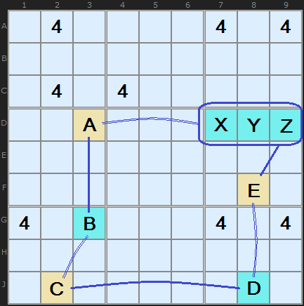
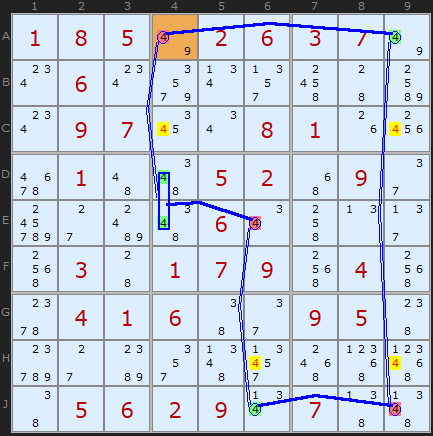
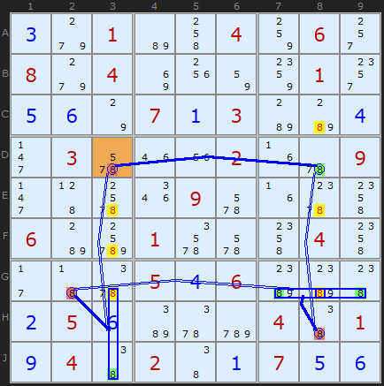
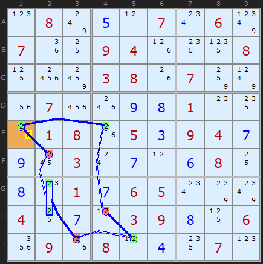
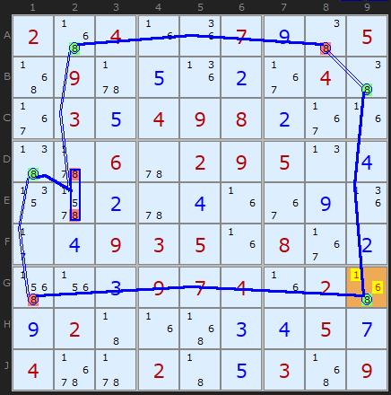
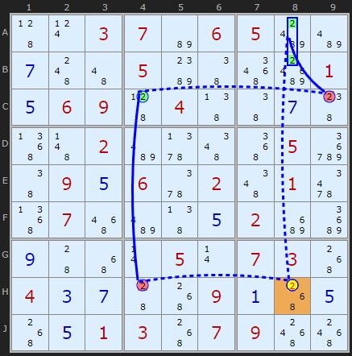
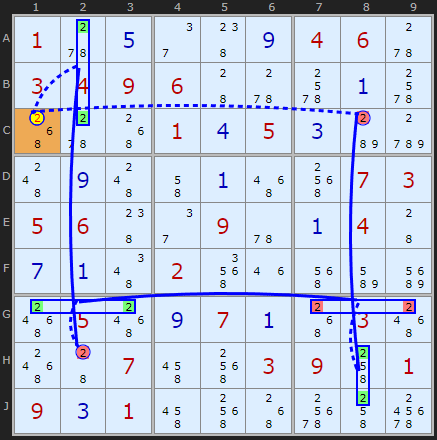
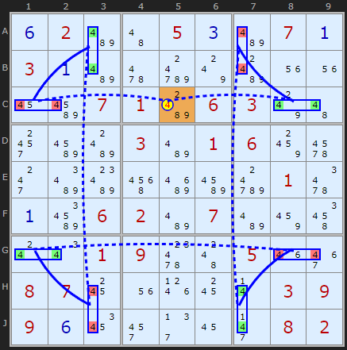

# 27 · Grouped X-Cycles

> **Level:** Diabolical · **Family:** Single-digit chains · **Prerequisites:** [X-Cycles](../14-x-cycles/README.md), [Intersection Removal](../03-intersection-removal/README.md) · **Next:** [AIC with Groups](../33-aic-with-groups/README.md)
> Diagrams: [sudokuwiki.org/Grouped_X_Cycles](https://www.sudokuwiki.org/Grouped_X_Cycles) by Andrew Stuart. Text: original to this guide.

## In one sentence

An [X-Cycle](../14-x-cycles/README.md) where a node can be a **group** of 2–3 cells (the digit somewhere in a box–line intersection) instead of a single cell. Groups bridge gaps that single cells can't, so many more loops become possible.

## The intuition: a pointing pair as one node

Remember [pointing pairs](../03-intersection-removal/README.md)? "The 4 is somewhere in D7/D8/D9" acts on the rest of row D exactly as if it were one cell. So treat it as **one node**:

- If the group is **ON** (the digit is in one of its cells), every other X in the line and box that the group's cells all share is OFF.
- If every other X in a unit is OFF, the digit is forced into the group, so the group is **ON**.



The cells **X, Y, Z** (D7, D8, D9) act as one node. If E (**F8**) is ON, the whole group is OFF, so A (**D3**) must be ON (the strong link in row D). If A is ON, the group is OFF... and so on. In notation, groups are written with `|`:

```
+4[F8] -4[D7|D8|D9] +4[D3] ...
```

**Rule of thumb:** all the cells of a group must sit in **one box and one line** (a box–line intersection).

## The same three Nice Loop rules apply

| Rule | Loop | Conclusion |
|---|---|---|
| **1** | perfectly alternating | clear the digit from other cells in each weak link's unit |
| **2** | two strong links meet at a cell | that cell **is** the digit |
| **3** | two weak links meet at a cell | that cell **isn't** the digit |

See [X-Cycles](../14-x-cycles/README.md) for the full explanation.

---

## Worked examples

### Rule 1: a short loop with one group



```
-4[A4] +4[A9] -4[J9] +4[J6] -4[E6] +4[D4|E4] -4[A4]
```

The group **D4|E4** points up column 4 to A4. Off-loop 4s on the weak links are cleared: **C9, H9** (column 9), **H6** (column 6) and **C4** (column 4).

▶ [Load position](https://www.sudokuwiki.org/sudoku.htm?bd=185026370060000000097008100010052090000060000030179040041600950000000000056290700)

### Rule 1: two groups



```
-8[D3] +8[D8] -8[H8] +8[G7|G8|G9] -8[G2] +8[G3|J3] -8[D3]
```

The group **G7|G8|G9** points along row G, and **G3|J3** points up column 3. Six 8s are cleared: C8, E8 and G8 (column 8), G3 (row G), and E3 and F3 (column 3).

▶ [Load position](https://www.sudokuwiki.org/sudoku.htm?bd=301004060804000010560713804030002009000090000600100040000546000256000401940201756)

### Rule 2: placing a digit



```
-2[E1] +2[E4] -2[H4] +2[J5] -2[J3] +2[G2|H2] -2[F2] +2[E1]
```

E1 sits between two strong links, so **E1 = 2**.

▶ [Load position](https://www.sudokuwiki.org/sudoku.htm?bd=080507060700940008000380700070098100018053947903070680801765000407039806090804070)



Here the group **D2|E2** is switched off as a block by the 8 in A2 pointing down column 2. That proves **G9 = 8**.

▶ [Load position](https://www.sudokuwiki.org/sudoku.htm?bd=204007905090502040035498200006029504002040090049350802003974020920003457400205309)

### Rule 3: removing a digit (the most common)



```
+2[H8] -2[H4] +2[C4] -2[C9] +2[A8|B8] -2[H8]
```

C4 being ON removes C9. The remaining 2s in box 3 are **A8|B8**, both in column 8, and they point down at H8. H8 is reached by two weak links, so **H8 ≠ 2**.

▶ [Load position](https://www.sudokuwiki.org/sudoku.htm?bd=003706500700500001569040070002000050095602010070005200900050730437009105051307900)

### Two groups back-to-back



```
+2[C1] -2[C8] +2[H8|J8] -2[G7|G9] +2[G1|G3] -2[H2] +2[A2|C2] -2[C1]
```

Row G holds **two consecutive groups**, one ON and the next OFF. Groups can link straight to groups. **C1 ≠ 2.**

▶ [Load position](https://www.sudokuwiki.org/sudoku.htm?bd=S9B015w0e2e480i04065w03040906445w6c0a6c505w50010d050cb8d04c0i4c4i0a565g07030506482e095u0a04440g0a4e025i1m5ebmci5805580i070a5003585844074q5g03094k01090c014q5g50784k7g)

### Showpiece: eight groups in one loop



```
+4[C5] -4[C1|C2] +4[A3|B3] -4[H3|J3] +4[G1|G2] -4[G8|G9] +4[H7|J7] -4[A7|B7] +4[C8|C9] -4[C5]
```

A loop on 4 that's made almost entirely of groups. **C5 ≠ 4.** (Found by Klaus Brenner.)

▶ [Load position](https://www.sudokuwiki.org/sudoku.htm?bd=S9B0f02be4a050cbe070a030abe62d87wbg1u1u16bu0701bg06037w4a30bubg03be01068c6i2kbibk5mcabud801660aby0602be07be8a4u0s0u0109684c051m3e0807181u1p180r0309090f1a2y2f162j0802)

---

## Common mistakes

- ❌ **A group spread over two boxes.** All of a group's cells must be in **one box and one line**.
- ❌ **A strong link into a group that isn't really strong.** To say "the group must be ON", **every** other X in that unit has to be OFF.

## How it connects

- [Rectangle Elimination](../08-rectangle-elimination/README.md) and [Empty Rectangles](../52-empty-rectangles/README.md) are short grouped X-Cycles.
- Groups can be mixed with other digits: see [AIC with Groups](../33-aic-with-groups/README.md).
