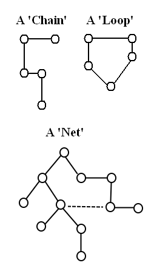
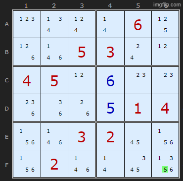
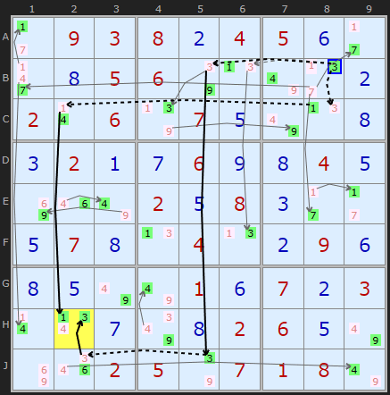
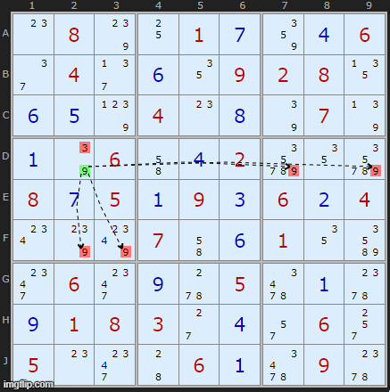
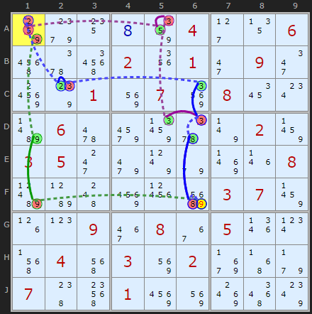
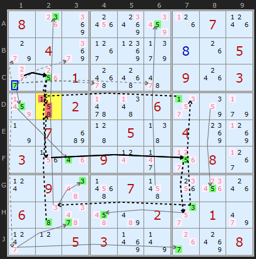
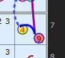
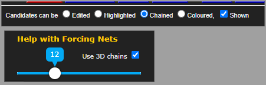

# 28 · Forcing Nets

> **Level:** Diabolical → Extreme (the sledgehammer) · **Family:** Forcing / contradiction · **Prerequisites:** [Foundations §3–4](../00-foundations/README.md), [3D Medusa](../15-3d-medusa/README.md) · **See also:** [Digit Forcing Chains](../41-digit-forcing-chains/README.md), [Nishio](../42-nishio-forcing-chains/README.md), [Bowman's Bingo](../48-bowmans-bingo/README.md)
> Diagrams: [sudokuwiki.org/Forcing_Nets](https://www.sudokuwiki.org/Forcing_Nets) by Andrew Stuart. Text: original to this guide.

## In one sentence

Assume one candidate is **ON** (or **OFF**), then follow **every** consequence across the whole board, letting branches merge and trigger new ones. If you reach a **contradiction**, the assumption was wrong.

## Chain vs net

| | Forcing **Chain** | Forcing **Net** |
|---|---|---|
| Shape | one line (or a few separate lines) | a branching web |
| A cell becomes ON when... | a single link forces it | **several branches** together switch off all its other candidates |
| Power | strong | **very** strong. In sudokuwiki's tests it cracked 100% of a 50,000 hard-puzzle benchmark. |
| Human-friendliness | traceable on paper | hard to do by hand |



## The propagation rules

Starting from one assumption, apply these over and over:

1. **ON ⇒ OFF everywhere it can see.** A digit placed in a cell switches off that digit in its row, column and box, and switches off every other candidate in the cell.
2. **OFF ⇒ ON only when one option is left.** If a cell has one candidate left, or a unit has one place left for a digit, that candidate turns ON.
3. Repeat until nothing more happens, or something breaks.

**Contradictions to look for:**
- every candidate in a cell is OFF (an empty cell)
- two candidates in one cell are ON
- every copy of a digit in a unit is OFF
- two copies of a digit in one unit are ON

When you find one, the starting assumption was false. If you assumed ON, **eliminate** the candidate. If you assumed OFF, **place** it.

> 🤔 **Isn't this just guessing?** It's close, and that's the honest objection. The difference is that you only follow **forced** consequences, never a second guess, and you stop at the first contradiction. Every Forcing Net can be rewritten as a set of [AIC](../32-alternating-inference-chains/README.md) fragments. Still, it's the least "pattern-like" technique in this guide, so keep it as a **last resort**.

---

## Watching a net grow



A deliberately trivial example. Assume **5 is ON in F6**:
- **Depth 1:** every 5 it sees goes OFF.
- **Depth 2:** bivalue cells that lost their 5 turn their other candidate ON (green).
- **Depth 3:** those new ONs switch off more candidates...
- ...until **column 6 has no 2 left** (yellow). That's a contradiction, so F6 ≠ 5.

(Of course, a glance would have shown that 5 belongs in A6. The point is to watch the mechanics.)

## A real example



Assume **9 is OFF in B7**. Two branches grow from that:

```
Branch 1: -9[B7] +9[C7] -4[C7] +4[C2] -1[C2] +1[H2]
Branch 2: -9[B7] +9[B5] -9[J5] +3[J5] -3[J2] +3[H2]
```

Both end by switching on a candidate in **H2**, one a 1 and one a 3. A cell can't hold two digits, so the assumption was wrong, and **B7 = 9**.

This is the same position as the first [3D Medusa](../15-3d-medusa/README.md) example. Medusa is in effect a restricted forcing net that only uses bivalue and bi-location links.

▶ [Load position](https://www.sudokuwiki.org/sudoku.htm?bd=S9B2b0903080b04050f2b2j0h05067q0n7u2f0b020r067r070e7u0n0h0c020a0g060i0h040e8i1m7u020e080c2b2b0e070h0n040n0b090f0h0e7u7u010f070b030r0v0g7y0h02060e7u8i1q02057q0701087u)

## Nets can pass through groups



If **D2 = 9**, every other 9 in box 4 goes OFF. That might leave only **one** 9 in some row, so it turns ON, and the net keeps growing through what's effectively a grouped link.

## Nets on monster puzzles



This is a 3-branch net from one of sudokuwiki's weekly "unsolvable" puzzles.

▶ [Load position](https://www.sudokuwiki.org/sudoku.htm?bd=S9B849k140h86042d13065m5y5q021y012i092m987s018y0792081a0wbf0662a28f5y7v028b03052k9m7x9e8r1n08bhb94c9625ci03078b1h0p093e0836051r0x5f045e038y02ab4z9f07485k01968y8s5a80)



On [Unsolvable #592](https://www.sudokuwiki.org/sudoku.htm?bd=800000070040000005001000903002006000070050400300900080090070000600002010005300008), assuming 7 in **C1** empties **D2**, and assuming 2 in C1 also empties D2. That leaves **C1 = 5**.

## Reading the solver display



The starting candidate (here, 9 in **G9** assumed OFF) is drawn as the start of the net, but the conclusion is that it's actually **ON**. So the colours at the root can look contradictory. Read the root as "this is what was assumed" and the text as "this is what's true".



sudokuwiki's solver has a **Chains** mode with a depth slider. Click a candidate (once for ON, twice for OFF) and watch the net grow.

---

## Tips for humans

- Start from **bivalue cells** or **strong links**. Their OFF assumption immediately forces something ON.
- Keep two colours (ON / OFF) on a copy of the grid, or use the solver's simulator.
- Stop at a **shallow depth** (4–6 steps). Deep nets are unverifiable by hand.

## How it connects

- **Simpler relatives:** [Digit](../41-digit-forcing-chains/README.md), [Cell](../43-cell-forcing-chains/README.md) and [Unit](../44-unit-forcing-chains/README.md) Forcing Chains, and [Nishio](../42-nishio-forcing-chains/README.md).
- **When even this fails:** [Bowman's Bingo](../48-bowmans-bingo/README.md) and [Pattern Overlay](../47-pattern-overlay/README.md).
