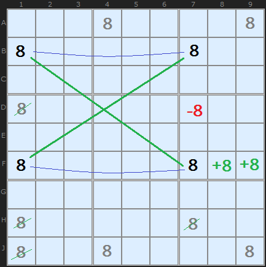
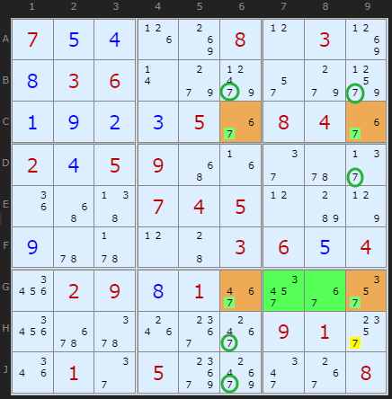
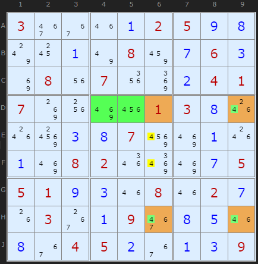

# 29 · Finned X-Wing (and Sashimi)

> **Level:** Extreme (but easy to learn!) · **Family:** Fish · **Prerequisites:** [X-Wing](../04-x-wing/README.md) · **Next:** [Finned Swordfish](../30-finned-swordfish/README.md)
> Diagrams: [sudokuwiki.org/Finned_X_Wing](https://www.sudokuwiki.org/Finned_X_Wing) by Andrew Stuart. Text: original to this guide.

## In one sentence

An X-Wing that's **almost** there: one base line has a few extra candidates (the **fin**) sitting in **one box** next to a corner. Either the X-Wing is real or the fin is true, so you can eliminate from cells that would be hit **in both cases**. Those are the cover-line cells **inside the fin's box**.

## The intuition: two possible worlds

```
            col 1        col 7
row B   ── [X] ──────── [X] ──         ← clean base line
row F   ── [X] ──────── [X] [+X +X]    ← fin: extra Xs next to the corner, same box
                         ↓
         eliminate only where the cover line (col 7) passes through the fin's box
```

Exactly one of these is true:

| World | What happens |
|---|---|
| **Fin is false** (no X in the fin cells) | It's a real X-Wing, so the cover lines are cleared |
| **Fin is true** (X is somewhere in the fin) | X sits inside the fin's box, so the rest of that box is cleared |

The only cells that lose X **in both worlds** are where a **cover line** passes through the **fin's box**. Those are your eliminations.



*A would-be X-Wing on 8 (green X). Row F has extra 8s at **F8, F9** (the fin, +8). Of all the X-Wing's eliminations, only the −8 that shares a box with the fin survives.*

## How to spot it

1. Look for an X-Wing that "almost works" because one base line has **1–2 extra candidates**.
2. Check that all the extras sit in **one box**, and that this box also contains one of the X-Wing's corners on that line.
3. Eliminate X from cells that are **in a cover line AND in the fin's box** (and aren't part of the pattern).

> 💡 **Mental shortcut:** "The fin shrinks the elimination zone down to its own box."

---

## Worked examples

### Example 1



- Rows **C** and **G**, columns **6** and **9** make the would-be X-Wing on 7 (orange corners).
- Row G also has 7s at **G7, G8** (green). That's the fin, and it's in box 9.
- If the X-Wing were clean, every circled 7 in columns 6 and 9 would go.
- With the fin, only **H9** goes, because it's in column 9 *and* box 9.

▶ [Load position](https://www.sudokuwiki.org/sudoku.htm?bd=S9B070e0d1h8k080l038l0h03060r9g9p2q9g9x0a0i0b0c0536080436020d05094y1f2e5u2f1i4y470704050lb87p0i5u5v0l4403060e042602090h013e32362u266q5y1o3c3g09012w1q012e05agak2m3808) · [From the start](https://www.sudokuwiki.org/sudoku.htm?bd=700008030036000000000050840205900000000745000000003604029010000000000910010500008) (turn off Grouped X-Cycles)

---

## Sashimi: when the finned corner is missing

Here's the surprise: the corner **in the fin's box** doesn't even need to hold X. If it doesn't, the X-Wing is called **sashimi** (the fish has been "filleted").



The would-be corner **D6** is a given, so it never held a 4. The fin is in the same box. The logic still works:

- **Either** row D's 4 is at **D9**, which forces a chain (6 in H9, then 4 in H6), and H6 knocks out **E6/F6**.
- **Or** row D's 4 is in the fin **D4/D5**, which shares box 5 with **E6/F6** and knocks them out.

So **E6 and F6 lose their 4** either way.

▶ [Load position](https://www.sudokuwiki.org/sudoku.htm?bd=S9B033e361m0a02050i0h7w180a7u088a0g060c8i081u071y8m0b0401078k1w8q2201030h1o1o980c0h07968q0a1o0a8q08021q8u8q0g0505010i0c1m081m020g1g03380a093e0h0e1m0h3604050b360a0c09) (turn off Grouped X-Cycles)

---

## Common mistakes

- ❌ **Fins in two boxes.** All the fin cells must share **one** box.
- ❌ **Eliminating along the whole cover line.** Only cells in the **fin's box** qualify.
- ❌ **A fin on both base lines.** You only get one finned line.

## How it connects

- A finned X-Wing is a short [Grouped X-Cycle](../27-grouped-x-cycles/README.md), with the fin acting as a group node.
- Bigger finned fish: [Finned Swordfish](../30-finned-swordfish/README.md).

## Practice

[A Klaus Brenner puzzle with two Finned X-Wings and only hidden singles otherwise](https://www.sudokuwiki.org/sudoku.htm?bd=900040000704080050080000100007600820620400000000000019000102000890700000000050003)
