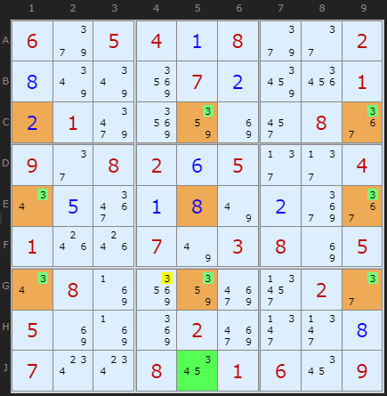
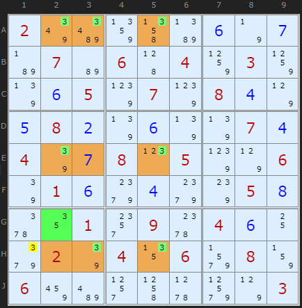
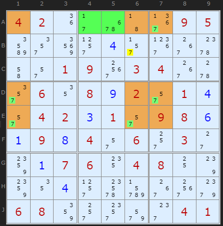
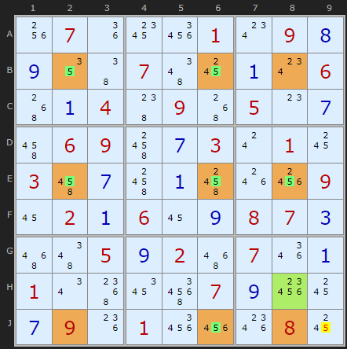

# 30 · Finned Swordfish (and Sashimi)

> **Level:** Extreme · **Family:** Fish · **Prerequisites:** [Swordfish](../09-swordfish/README.md), [Finned X-Wing](../29-finned-x-wing/README.md)
> Diagrams: [sudokuwiki.org/Finned_Swordfish](https://www.sudokuwiki.org/Finned_Swordfish) by Andrew Stuart. Text: original to this guide.

## In one sentence

The [finned X-Wing](../29-finned-x-wing/README.md) idea applied to a [Swordfish](../09-swordfish/README.md). If a would-be Swordfish has extra candidates in **one box** (the fin), you can still eliminate from cover-line cells **inside that box**.

## Recap of the logic

```
Either the fin is false → a true Swordfish → clear the cover lines
Or     the fin is true  → X is in the fin's box → clear the rest of that box
Both   → eliminate from (cover lines) ∩ (fin's box)
```

Sashimi works here too: the corner of the fish **inside the fin's box** can be missing its candidate entirely.

---

## Worked examples

### Example 1: a finned 2-2-3



The base is three **columns** with 3s appearing 2, 2 and 3 times, which would make a 2-2-3 Swordfish. But column 5 has an extra 3 at **J5**, which spoils it. That's the fin, in box 8. Only the cover-row cell inside box 8 survives as an elimination: **G4 loses its 3**.

▶ [Load position](https://www.sudokuwiki.org/sudoku.htm?bd=S9B069i05040a089i2e020h7y7y92070b8e26010b019q92868i2y083a092e08020f052f2f040u0e3i0a0h7u0bae3a011o1o077u03088i050u088j9286ai33022e058i8j8m02ai2n2n0h070w0w081a01061a09) · [From the start](https://www.sudokuwiki.org/sudoku.htm?bd=605408002000070001010000080908205004000000000100703805080000020500020000700801609)

### Example 2: sashimi



This is a 2-2-3 formation eliminating along rows. The fin is the 3 at **G2**, and the corner **H2** has no 3 at all, which makes it sashimi. Row H and box 7 intersect at **H1**, so H1 loses its 3.

▶ [Load position](https://www.sudokuwiki.org/sudoku.htm?bd=S9B027ybi874nbb0f7n0gb707b60645048503857r0f057t077t080d7p0e080b7r0f7r7r070d047q0g080p057t7p067q010f9k0d9k7s050h5y12012w0960040f109i027q0413069v0883068abe2t4l5x9x7p03)

### Example 3: a sparse sashimi



The missing corner (**A6**, brown) isn't a given. Its 7 was simply eliminated earlier. The fin is **A4, A5** (green). In row orientation this is just a 1-2-2 fish, and it still works. (Turn Grouped X-Cycles off.)

▶ [Load position](https://www.sudokuwiki.org/sudoku.htm?bd=S9B04021i2b6q433b0905bq2u922t0d2r3d38604i2q01093o0304385w2u0612080i022q010d2q04020c012q09080f0a090h042q062s032c880a0706140408107s88120d2t6gdf383o9k0608862s2w9u2g0401)

### Example 4: double sashimi



This fish on 5 is based on **BEJ / 268**, and it's missing **two** corners: **J2** and **J8**. It still works. When there are two sashimi corners, check *both* boxes for fins and eliminations.

▶ [Load position](https://www.sudokuwiki.org/sudoku.htm?bd=S9B1w0g030d0810011u0i1g091f1413070d5e5e4q4q4b060i0z0g0c025e010g101u030i50040i56025u3f4z051f0c035m5609235h44074z07540i4m1y04484l4j565c56013q5e0o096a0a46055y020i060d5u)

---

## Fish sampler puzzle

[This Klaus Brenner puzzle](https://www.sudokuwiki.org/sudoku.htm?bd=003080100090007000000600002010003004002000500300900070700004000000100090005020600) contains, in order: an X-Wing on 6, a Finned X-Wing on 6, a Swordfish on 9, a Finned Swordfish on 6 (corner H9 never had a 6), and a Sashimi Finned Swordfish on 6 (corner G8 never had a 6). It's a good workout for the whole fish family.

## Common mistakes

- ❌ **Fin cells spread over two boxes.** The fin must be inside one box.
- ❌ **Eliminating along whole cover lines.** Only the part inside the fin's box counts.
