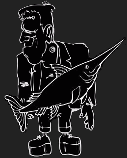
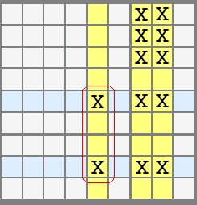
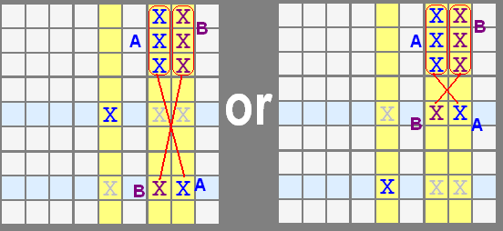
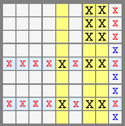
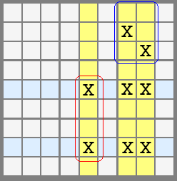
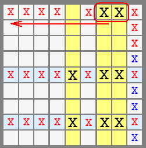
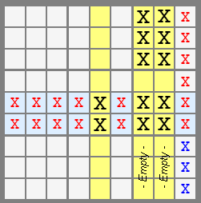
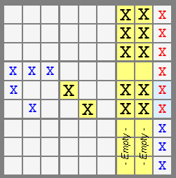

# 31 · Franken Swordfish

> **Level:** Extreme (rare) · **Family:** Fish (with boxes) · **Prerequisites:** [Swordfish](../09-swordfish/README.md), [Grouped X-Cycles](../27-grouped-x-cycles/README.md)
> Diagrams: [sudokuwiki.org/Franken_Sword_Fish](https://www.sudokuwiki.org/Franken_Sword_Fish) by Andrew Stuart (pattern from Sudopedia). Text: original to this guide.

## In one sentence

A Swordfish where a **box** stands in for one of the lines. A conjugate pair in one column, plus two other columns whose candidates all **meet in a single box**, forces an X-Wing-like either/or, and that clears both the pair's rows and the box.

## Background: mixing boxes into fish

A normal fish uses only rows and columns. As you saw on the [X-Wing page](../04-x-wing/README.md#what-about-boxes), a 2-line fish that uses a box is just a pointing pair. With **three** lines, though, putting a box into the mix *can* produce something new. That's the **Franken** fish. (There's no such thing as a Franken X-Wing.)

## The shape

| Part | What it is |
|---|---|
| **Defining set** | 3 columns (here 5, 7, 8) |
| **Conjugate pair** | one of those columns (col 5) has X **exactly twice**, in rows E and H |
| **Franken box** | the other two columns (7, 8) have all their Xs in **one box** (box 3), except possibly in rows E/H |
| **Yellow cells** | must **not** contain X. This is what makes the pattern work. |
| **Secondary set** | the two rows of the conjugate pair (E, H), in light blue |

## Why it works

The conjugate pair in column 5 forces one of two worlds:

- **E5 = X:** then row E is used up, and the empty yellow cells push columns 7 and 8 into a fixed arrangement (group **A**).
- **H5 = X:** the mirror image (group **B**).

In both worlds, rows E and H each get exactly one X from the pattern, and box 3 gets exactly one X from the pattern.

So you can clear X from the **rest of rows E and H** and from the **rest of box 3** (red crosses). The blue cells show where the X's must end up.

## Variations

| Diagram | Note |
|---|---|
|  | The Franken box doesn't need many Xs. Think of each column's Xs in the box as a [grouped node](../27-grouped-x-cycles/README.md) pointing down the column. |
|  | If the box's remaining Xs line up on a **row**, that row gets extra eliminations too. |
|  | The conjugate pair can sit higher, in the same band, as long as the right cells (yellow) are empty. |
|  | A pair that's conjugate only **within a box** still forms the pattern, but eliminations shrink to boxes 3 and 6. (The solver doesn't search for this weaker form.) |

## Honest assessment

Franken Swordfish turn up in only a handful of very hard puzzles per thousand, and they're hard to see by eye. Learn [Grouped X-Cycles](../27-grouped-x-cycles/README.md) first. Every Franken fish is a grouped loop, and loops are easier to find.
