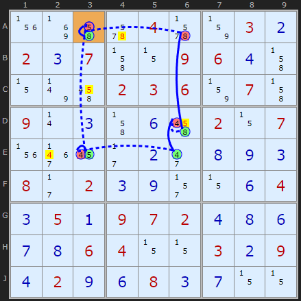
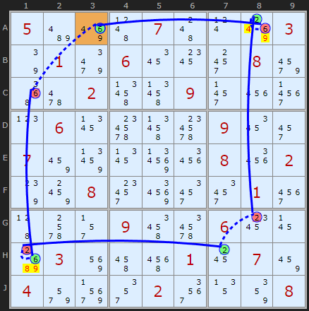
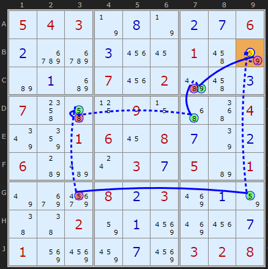
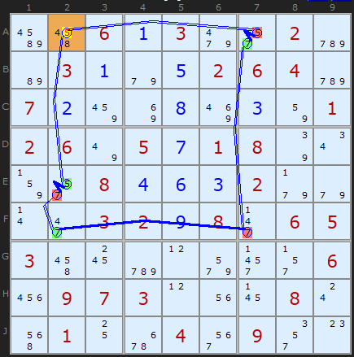

# 32 · Alternating Inference Chains (AIC)

> **Level:** Extreme · **Family:** Chains (the master technique) · **Prerequisites:** [Foundations §4](../00-foundations/README.md), [X-Cycles](../14-x-cycles/README.md), [XY-Chains](../25-xy-chains/README.md) · **Next:** [AIC with Groups](../33-aic-with-groups/README.md), [AIC with ALSs](../34-aic-with-als/README.md)
> Diagrams: [sudokuwiki.org/Alternating_Inference_Chains](https://www.sudokuwiki.org/Alternating_Inference_Chains) by Andrew Stuart (concept from Myth Jellies, 2006). Text: original to this guide.

## In one sentence

A chain of candidates where links **alternate strong / weak**, and where each link can be **within a cell** (bivalue) or **across a unit** (bi-location). Whatever is true at one end forces something at the other, which gives the same three loop rules as X-Cycles, but now across **every digit**.

## Why AICs matter: the grand unification

Almost every chain-shaped technique is a special case:

| Technique | As an AIC |
|---|---|
| [X-Wing](../04-x-wing/README.md), [Swordfish](../09-swordfish/README.md) (2-2-2) | single-digit loop |
| [X-Cycles](../14-x-cycles/README.md), [Simple Colouring](../06-simple-colouring/README.md) | single digit, bi-location links only |
| [XY-Chains](../25-xy-chains/README.md), [Y-Wing](../07-y-wing/README.md), [Remote Pairs](../49-remote-pairs/README.md) | bivalue (in-cell) strong links only |
| [W-Wing](../13-w-wing/README.md) | 2 bivalue + 1 bi-location strong link |
| [3D Medusa](../15-3d-medusa/README.md) | a whole network of AICs |

Learn AICs well and every one of these becomes "just a chain".

## The two link types, now in 2D

| | Strong (`=`) | Weak (`-`) |
|---|---|---|
| **Across a unit** | X appears **exactly twice** in the unit | any two Xs in the same unit |
| **Inside a cell** | the cell has **exactly two** candidates | any two candidates in the same cell |
| **Meaning** | NOT A ⇒ B | A ⇒ NOT B |

Remember that a strong link can always **play** a weak role, but never the other way round.

## Reading AIC notation

```
-5[A3] +8[A3] -8[A6] +8[D6] -4[D6] +4[E6] -4[E3] +5[E3] -5[A3]
  │      │      │
  │      │      └ 8 is OFF in A6 (weak link from +8[A3] across row A)
  │      └ 8 is ON in A3 (strong link inside bivalue cell A3)
  └ start: 5 is OFF in A3
```

The plain-English version: *"If A3 isn't 5, it's 8, so A6 isn't 8, so D6 is 8, so D6 isn't 4..."*

---

## The three Nice Loop rules (again)

| Rule | Loop shape | Conclusion |
|---|---|---|
| **1** | perfectly alternating loop | eliminate on every **weak link**: other copies of the digit in a unit, **or** other candidates in a cell |
| **2** | two **strong** links meet | the meeting candidate is **true** |
| **3** | two **weak** links meet | the meeting candidate is **false** |

### Rule 1: continuous loop



```
-5[A3] +8[A3] -8[A6] +8[D6] -4[D6] +4[E6] -4[E3] +5[E3] -5[A3]
```

Walk it through: A3 is 8, A6 isn't 8, D6 is 8, D6 isn't 4, E6 is 4, E3 isn't 4, E3 is 5, A3 isn't 5. You're back at the start with no contradiction, so the loop is consistent in either direction.

Each **weak** link gives an elimination:

| Weak link | Elimination |
|---|---|
| 8 in A3 – 8 in A6 (row A) | 8 off **A4** |
| 8 / 4 inside **D6** | other candidates in D6 (the **5**) |
| 4 in E6 – 4 in E3 (row E) | 4 off **E2** |
| 5 in E3 – 5 in A3 (column 3) | 5 off **C3** |

▶ [Load position](https://www.sudokuwiki.org/sudoku.htm?bd=S9B1v8j4i6a046b83030b020c074j0z09060d4j0z7v4q02030683074j090r0c4j0f4q020z071v3f162b0b2i0h0i0c082b020c0i2r0z0f040c050a0907020d0h0f0g0h06040z0z030b090d020i0f080c0g0z0z) (4th chain in the solver's "explore" list)

#### In-cell eliminations



```
+6[A3] -6[C1] +6[H1] -2[H1] +2[H7] -2[G8] +2[A8] -6[A8] +6[A3]
```

The loop switches between 6 and 2 inside **H1** and inside **A8**. Within each of those cells, one of the two digits is true, so **H1 loses 8/9** and **A8 loses 4/9**.

▶ [Load position](https://www.sudokuwiki.org/sudoku.htm?bd=S9B05be8q4d074c0t8s037q019q061a1c3008a25262024v4v092z223v0p061b6o4v6o091a2y078a8f1b9b260826027s8c08349a3232013u456c2r094u6m061c17c4038y4q5m0118078a049uar2u023q138608)

### Rule 2: two strong links meet ⇒ place it



```
-9[B9] +9[G9] -5[G9] +5[G3] -5[D3] +8[D3] -8[D7] +8[C7] -9[C7] +9[B9]
```

Assume B9 isn't 9, and the chain comes back round to say B9 **is** 9. So **B9 = 9**.

▶ [Load position](https://www.sudokuwiki.org/sudoku.htm?bd=S9B0504037n0h7n0b0g060bdudu0c2216014q82b60ac2072202be4q0c074o4i11090z4y52047y86010616080g7q0b06b8be0s030g05b6017uaaay080b038q0a82464602820a968q220g018y968a0g96030208)

### Rule 3: two weak links meet ⇒ remove it (the workhorse)



```
+5[A2] -5[A7] +7[A7] -7[F7] +7[F2] -7[E2] +5[E2] -5[A2]
```

If A2 is 5, then A7 isn't 5, so A7 is 7, so F7 isn't 7, so F2 is 7 (strong link in column 2), so E2 isn't 7, so E2 is 5. But **E2 sees A2**, so A2 can't be 5. That's a contradiction, so **A2 ≠ 5**.

▶ [Load position](https://www.sudokuwiki.org/sudoku.htm?bd=S9Bbu4q060a039m2q02cyb6030a9e0e020604cy070b8a8i0h8q0c820102067u050g01087q0u832q080d0f0c029f9e0r2i03020i082j0605034q18cy0l9u2z2r06220907030l1u17080s5e01106q043m092u0o)

---

## The practical form: open AICs

In practice you rarely close the loop. You just need a chain that **starts and ends with a strong link**:

```
A ═ … ─ … ═ B         (ends are both strong-link "outputs")
⇒ at least one of A, B is true
```

Then:
- **A and B are the same digit:** any cell that sees both A and B loses that digit.
- **A and B are in the same cell:** every other candidate in that cell goes.
- **A and B are different digits in cells that see each other:** each cell loses the other's digit (if A's cell has B's digit, it goes, and vice versa).

## How to hunt for AICs

1. Pick a **target**: a candidate you'd like to eliminate.
2. Look for two candidates that the target sees, which you suspect are "one or the other".
3. Try to connect them with alternating links, using bivalue cells and two-candidate units as your **strong** stepping stones.
4. Keep chains short (6–10 nodes). Long chains are easy to get wrong by hand.

## Common mistakes

- ❌ **Two weak links in a row** in the middle of a chain. The inference stops there.
- ❌ **Treating a 3-candidate cell as a strong link.** It's only strong if the cell is bivalue.
- ❌ **Forgetting in-cell weak links.** "A3 is 8, so A3 isn't 5" counts as a link too.

## How it connects

AICs become even stronger with other kinds of link:

- **Groups** (box–line intersections): [AIC with Groups](../33-aic-with-groups/README.md)
- **Almost Locked Sets:** [AIC with ALSs](../34-aic-with-als/README.md)
- **Unique Rectangles:** [AIC with URs](../35-aic-with-unique-rectangles/README.md)
- **X-Wings and other patterns:** [Exotic links](../36-aic-exotic-links/README.md)

## Practice puzzles (by Klaus Brenner)

[1](https://www.sudokuwiki.org/sudoku.htm?bd=000001000040280910001003068003000107080000000600047300008000002095030000000004000) ·
[2](https://www.sudokuwiki.org/sudoku.htm?bd=000020000002008300007090004004201007105000000080030000039800500000905040070010000) ·
[3](https://www.sudokuwiki.org/sudoku.htm?bd=903004000000000004080010000100000860000500300600090005008900000000070043054002006) ·
[4](https://www.sudokuwiki.org/sudoku.htm?bd=405000300302107000000800140000006008170000400600000015007009000009000000000030500)
