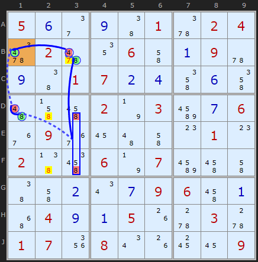
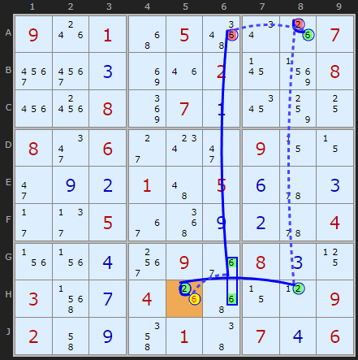
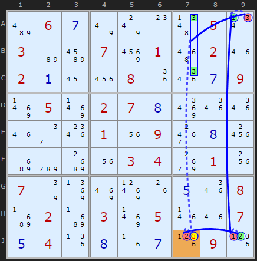

# 33 · AIC with Groups

> **Level:** Extreme · **Family:** Chains · **Prerequisites:** [AIC](../32-alternating-inference-chains/README.md), [Grouped X-Cycles](../27-grouped-x-cycles/README.md)
> Diagrams: [sudokuwiki.org/AIC_with_Groups](https://www.sudokuwiki.org/AIC_with_Groups) by Andrew Stuart. Text: original to this guide.

## In one sentence

An [AIC](../32-alternating-inference-chains/README.md) where some nodes are **groups**, meaning "digit X is somewhere in these 2–3 cells of one box-line intersection", so the chain can jump across gaps that single cells can't bridge.

## How a group behaves in a chain

A group is a **directional** node. It only works along the line its cells share, and within its box.

```
   Box 4                     column 3
  ┌───────┐                     │
  │ X . [X]│  ← D3 ┐            │
  │ . . .  │       ├ group DF3 ─┼─→ strong link to B3 (if the column has
  │ . . [X]│  ← F3 ┘            │    no other X outside DF3 and B3)
  └───────┘
```

- **Into the group (strong):** if every other X in the box (or line) is OFF, the group is ON.
- **Out of the group (weak):** if the group is ON, every X in its shared line and box outside the group is OFF.

---

## Rule 1: continuous loop



```
+4[B1] -4[D1] +8[D1] -8[D3|F3] +8[B3] -4[B3] +4[B1]
```

If D1 is 8, then every other 8 in box 4 goes, including the group **D3|F3**. That leaves **B3** as the only 8 in column 3. The group lets the chain travel "up column 3" even though neither D3 nor F3 is a single strong-link partner.

Eliminations on the weak links: 8 off **D2** and **F2** (box 4, outside the group), and **7 off B3** (from the in-cell 8/4 link).

▶ [Load position](https://www.sudokuwiki.org/sudoku.htm?bd=S9B050f2e0i46015y020466026212064i0a095u0i4601070b0d4m0f4m4a4j4q027n03bu0g06360936164a4i0o010o02474u067n07bu4q4i464i0b0u0g09064q0a4y040i0a051g5w035w01071y080u1g181609) (turn off Forcing Nets)

## Rule 2: two strong links meet



```
-2[H5] +2[H8] -2[A8] +6[A8] -6[A6] +6[G6|H6] -6[H5] +2[H5]
```

If A6 isn't 6, then the 6 in column 6 has to be in the group **G6|H6**. That group lies in box 8, so the 6 in **H5** goes, which makes H5 = 2. Assuming H5 isn't 2 has led to H5 being 2, so **H5 = 2**.

▶ [Load position](https://www.sudokuwiki.org/sudoku.htm?bd=S9B091o014y055a0u1g073u3u0c8i1m02178z082224088m070a1a8410082m062c0w2i090z0z2i0i0b014a050f5u0c2b2f0536520i0b5u041v1v0d3o0936080c11035f0g041g4y0z0l09024i0i4m0146070d06)

## Rule 3: two weak links meet



```
+3[J7] -2[J7] +2[J9] -1[J9] +1[A9] -3[A9] +3[A7|C7] -3[J7]
```

The 3s in box 3 are reduced to **A7|C7**, both in column 7. That group points straight down column 7 at J7. If J7 were 3, the chain would end up denying it, so **J7 ≠ 3**.

▶ [Load position](https://www.sudokuwiki.org/sudoku.htm?bd=S9Bbe060g7u7w0o4f050v03b6bu07960156021m020a1622081i1q0g098r058r02070h8u1q1q1m2e1s011u093g0h24c2cyc41u0304ac011w077q8n8q8t1g0e1q08c302c3038r051n1m070e041j0h1f0g1l091l)

---

## Spotting tips

- Every time you see the phrase "X is in one of these two cells of a box, and they line up", think: **group node**.
- Groups are most useful when a chain needs to get **out of a box** that has 3+ copies of the digit.
