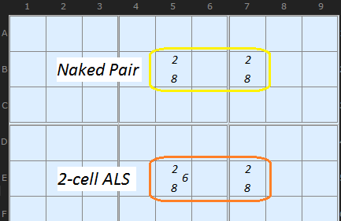
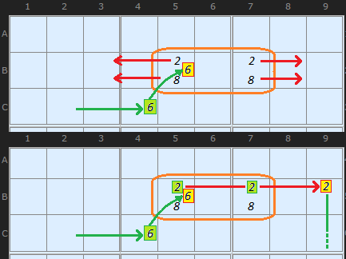
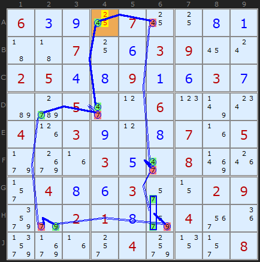
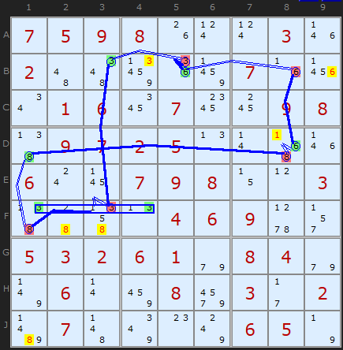
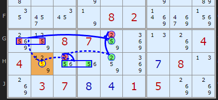
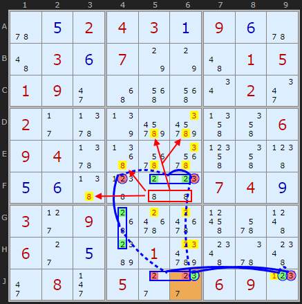

# 34 · AIC with Almost Locked Sets

> **Level:** Extreme · **Family:** Chains · **Prerequisites:** [AIC](../32-alternating-inference-chains/README.md), [Naked Candidates](../01-naked-candidates/README.md) · **See also:** [Almost Locked Sets](../37-almost-locked-sets/README.md)
> Diagrams: [sudokuwiki.org/AIC_with_ALSs](https://www.sudokuwiki.org/AIC_with_ALSs) by Andrew Stuart. Text: original to this guide.

## In one sentence

An **Almost Locked Set** (N cells, N+1 candidates) turns into a real naked set the moment one of its digits is switched OFF. So a chain can **enter** an ALS by switching one digit off, and **exit** by switching off the other digits wherever the newly locked set reaches.

## What's an ALS?

| | Cells | Candidates | Example |
|---|---|---|---|
| Locked set (naked pair) | 2 | 2 | `{2,8}` `{2,8}` |
| **Almost** locked set | 2 | **3** | `{2,8}` `{2,6,8}` |

The simplest ALS of all is a single **bivalue cell** (1 cell, 2 candidates). So you've been using ALSs in [XY-Chains](../25-xy-chains/README.md) all along.



## How an ALS becomes a chain link



1. The chain arrives with **6 ON in C4**, which switches off the 6 in B5 (same box).
2. The ALS **{B4,B5}** loses its stray 6 and becomes a **naked pair {2,8}**.
3. A naked pair clears its row, so the 2 and 8 in **B9** go OFF, and the chain continues from there.

In notation, ALS nodes use curly braces: `+7{H6|G6}` means "the ALS on H6/G6 is now locked, and 7 is one of its locked digits".

> 💡 Every exit gives you **two chances**: the chain can continue on *either* of the locked digits.

---

## Worked examples

### Rule 2: placing a digit



```
-4[A4] +4[D4] -7[D4] +7[D2] -7[H2] +9[H2] -9[H6] +7{H6|G6} -7[F6] +4[F6] -4[A6] +4[A4]
```

The key step is **9 ON in H2**, which removes the 9 from **H6**. The ALS **{G6,H6}** collapses to a {5,7} naked pair in column 6, which switches off the 7 in **F6**. The loop closes on A4 with two strong links, so **A4 = 4**.

▶ [Load position](https://www.sudokuwiki.org/sudoku.htm?bd=S9B06030918071810080143430710060309160s020504080901060307b6cy052i0l060p7u0o041h03090l08071f059f381f03052i088r1o2r040806032q0z02099y9e0201089u043m1i9zab1f2s049w132r08)

### Rule 1: off-chain eliminations



```
-3[B5] +6[B5] -6[B8] +6[D8] -8[D8] +8[D1] -8[F1] +3{F1|F4} -3[F3] +3[B3] -3[B5]
```

The ALS is **{F1,F4}** = {1,3,8}. Switching off the 8 in F1 locks it into a {1,3} pair. Because the loop is continuous, every weak link gives eliminations: 6 off **B9**, 1 off **D8**, 8 off **F2, F3, J1**, and 3 off **B4**.

▶ [Load position](https://www.sudokuwiki.org/sudoku.htm?bd=759800030200000700016070098097250000600798003000046900532610840060080302070000650)

### Exiting back onto the start



```
+5[H2] -5[G1|G2] +5[G5] -2[G5] +2[H5] -2[H3] +5{H3|H4} -5[H2]
```

The chain leaves the ALS **{H3,H4}** on digit 5, which lands right back on **H2**. That's a contradiction, so **H2 ≠ 5**. (This one mixes a group and an ALS. Example from HoDoKu.)

▶ [Load position](https://www.sudokuwiki.org/sudoku.htm?bd=S9Bckbm0a22030g8s8s8k8m7u1q020a0h8u050707181s22828i08011k0164090c0f050s2k444k06107n0g047p03bp122y1a7n08028rai8z90850807848m0n8k0404851w1u848m0g080n8k03070h0d01058k8k)

### Bonus: the other locked digit eliminates too



When the loop is continuous, the ALS that gets locked is **fully** locked. If the chain only uses its 2s, you still know the **8** is in those cells too. So 8s that see the whole pair go as well (red box and arrows). (It's the 7th chain in the solver's explore list.)

▶ [Load position](https://www.sudokuwiki.org/sudoku.htm?bd=S9B5u0e0204030a090f5u4a030f077o7o4a010501092i4y5e5e0u022m022b5z7rdmdq4n4m0609045z53767a4p4m490e0f4749444807040i032d095070704t6a4d062c0ebc01dc4g5y4g2i082j052c2g06090p)

---

## Common mistakes

- ❌ **Entering on a digit the ALS doesn't contain.** You enter by switching **off** one of its candidates.
- ❌ **Exiting on the same digit you entered on.** That digit is gone. Exit on one of the **remaining** digits.
- ❌ **ALS cells that don't all see each other.** All the cells of an ALS must share one unit.
