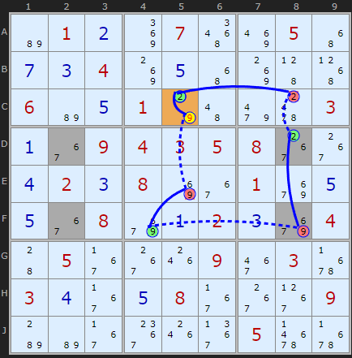
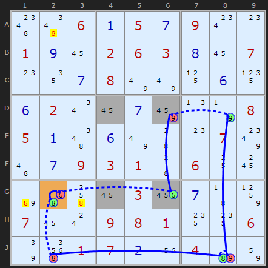
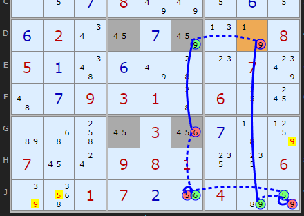

# 35 · AIC with Unique Rectangles

> **Level:** Extreme · **Family:** Chains + uniqueness · **Prerequisites:** [AIC](../32-alternating-inference-chains/README.md), [Unique Rectangles](../17-unique-rectangles/README.md)
> Diagrams: [sudokuwiki.org/Using_Unique_Rectangles_as_Links_in_Chains](https://www.sudokuwiki.org/Using_Unique_Rectangles_as_Links_in_Chains) by Andrew Stuart (implementation prompted by David Hollenberg). Text: original to this guide.

## In one sentence

A potential Unique Rectangle whose roof has **two extra candidates** acts as a **strong link** between those extras. At least one of them must be true, otherwise you'd have the deadly pattern. So a chain can switch one off and **conclude** the other is on.

## The idea

A Type 1 UR says that at least one "extra" candidate in the rectangle must survive. If the rectangle has **exactly two** extra candidates (say 2 in D8 and 9 in F8), then:

```
NOT 9 in F8  ⇒  2 in D8          (otherwise the 6/7 rectangle is deadly)
```

That's exactly a **strong link**, the same kind you get from a bivalue cell or a two-candidate unit. So a UR can sit in the middle of any chain.

In notation: `-9(UR[DF28]) +2[D8]`

> ⚠️ Like all uniqueness logic, this assumes the puzzle has exactly one solution.

---

## Worked examples

### Example 1: a Rule 2 loop



```
-2[C5] +9[C5] -9[E5] +9[F4] -9(UR[DF28]) +2[D8] -2[C8] +2[C5]
```

The shaded cells **D2, D8, F2, F8** all contain 6/7, and between them they have just two extras: a 2 and a 9. When the chain removes 9 from **F8**, the UR forces **2 into D8**, and the chain carries on. It comes back to C5 with two strong links, so **C5 = 2**.

▶ [Load position](https://www.sudokuwiki.org/sudoku.htm?bd=S9Bb6010b8m075a8q054y0g0c048k0e4y8k455106b60e017o4a9m64030a36090403050838380d020c088i3601aa0e0e3608aa0a020caa04440537381o093e036r030d370e0837383909b8b6373c1o3b056z6r) · [From the start](https://www.sudokuwiki.org/sudoku.htm?bd=010070050004000000600100003009435800020800100008002004050009030300080009000000500)

### Example 2: two loops, same UR

| Option 3 | Option 4 |
|---|---|
|  |  |

Here the UR's two extras are the **9 in D6** and the **6 in G6**. Removing either one forces the other. Both loops (chains 3 and 4 in the solver's explore list) close using this link, and each gives different off-chain eliminations. Simpler AICs also exist at this step, so this one is mainly a demonstration.

▶ [Load position](https://www.sudokuwiki.org/sudoku.htm?bd=S9B4g4e060a050g090w0o010i160206030h16070o120g087u7u110f150f020u160g8a0n7n08050a4e0f7u440o07804a0g09030144061018b64y4k1603220g438507160s0908011414067q5i01070b1u04b682)

---

## When to think of this

When a chain gets stuck next to a rectangle of identical pairs that has **two stray candidates**, those strays are your bridge.
