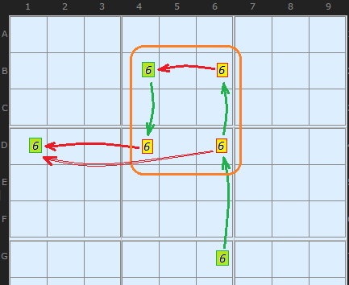
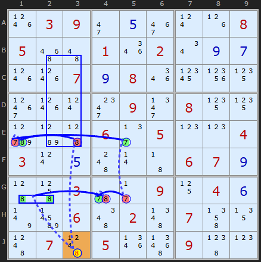
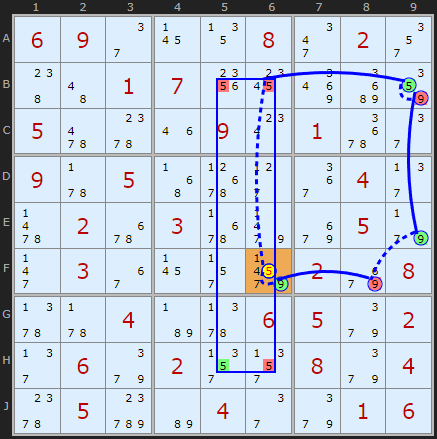

# 36 · AIC with Exotic Links (the "X-Wing link")

> **Level:** Extreme · **Family:** Chains · **Prerequisites:** [AIC](../32-alternating-inference-chains/README.md), [X-Wing](../04-x-wing/README.md) · **See also:** [Forcing Nets](../28-forcing-nets/README.md)
> Diagrams: [sudokuwiki.org/AICs_with_Exotic_Links](https://www.sudokuwiki.org/AICs_with_Exotic_Links) by Andrew Stuart (inspired by a puzzle from Lane Walker). Text: original to this guide.

## In one sentence

A **four-cell, two-box** arrangement of one digit can act as a single link. Switching on an input X turns off two of the four Xs, which (through a strong link) forces off a third, so an output X somewhere else is forced **ON**. Normal AICs can't follow this, because it needs **two** OFFs to make one ON.

## The pattern



The chain arrives at **G6 = 6 (ON)**:

1. Column 6: the 6s in **B6** and **D6** are both switched OFF.
2. Row B has only two 6s (**B4**, **B6**), so B6 OFF forces **B4 ON**.
3. B4 ON switches off **D4** (column 4).
4. Now box 4's 6s in row D are gone, so **D1** (the exit) is forced **ON**.

A plain AIC would stop at step 3, because it can't "remember" that D6 is also off. This pattern packages the little branch into one link.

**Requirements:**
- four Xs spread over **two boxes**, in a different box from the input
- two of them form a **strong link** (B4–B6)
- two of them see the **exit** cell

The solver writes it as `XW[...]`, because the shape looks like an X-Wing even though the logic is different.

---

## Worked examples

### Example 1



```
+8[J3] -8(XW[-E3/-B3+B2-E2]) +8[E1] -7[E1] +7[E5] -7[G5] +7[G4] -8[G4] +8[G1|G2] -8[J3]
```

The input **J3 = 8** feeds the four-cell pattern in **BE23**. Row E has only a few 8s, so that forces **E1 = 8**. The chain then loops back and denies J3, so **J3 ≠ 8**.

▶ [Load position](https://www.sudokuwiki.org/sudoku.htm?bd=S9B1p03092i0e3e0t1h0805564a011q020u0i0g1p1p070i081q1d21153h1p0t2o092n081515d1b945062f050p0p04030t0e4c0r4306070i454l035u2b0911040f7vbv064e024f074n134d074d051r5b09490p)

### Example 2



```
+5[F6] -5(XW[-B6/-H6+H5-B5]) +5[B9] -9[B9] +9[E9] -9[F8] +9[F6] -5[F6]
```

**F6 = 5** feeds the pattern **BH56**. Row H's two 5s are the strong link, and row B's third 5 at **B9** is the exit. The loop comes back and says **F6 ≠ 5**.

▶ [Load position](https://www.sudokuwiki.org/sudoku.htm?bd=S9B06092e1713082m022u484a0107201c8uc6860562601m090w016u2e095v054z6t2d3a042f63026q036r9naa059f2j0336172ra302aa085z5v04b75z06059i022f069i022v2v089i046005d4b6042e9i0106)

---

## Perspective

This is the smallest possible **net**: a chain that briefly splits and rejoins. [Forcing Nets](../28-forcing-nets/README.md) generalise the idea without limits. Learn this pattern if you like seeing how chains can branch. Otherwise, it's fine to skip.
