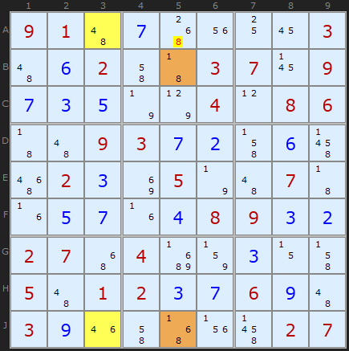
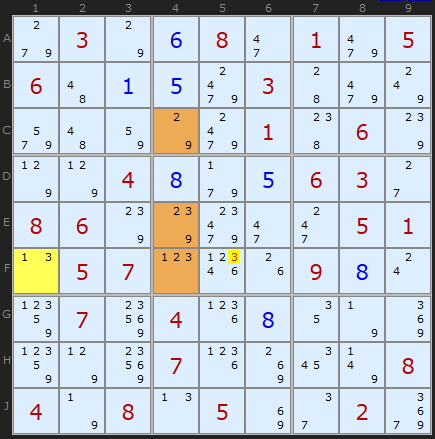
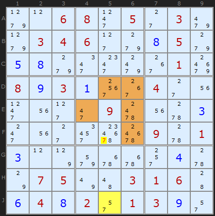
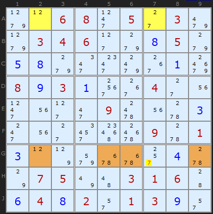
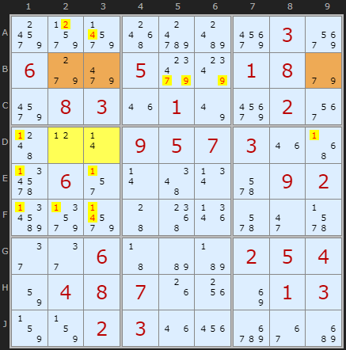
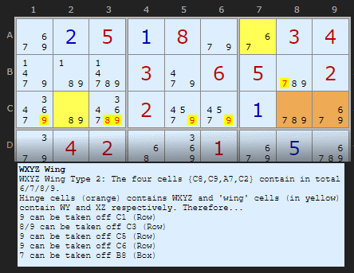
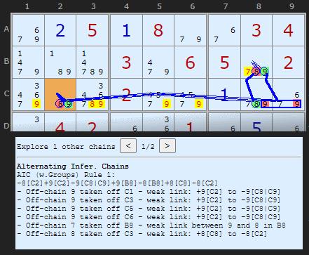
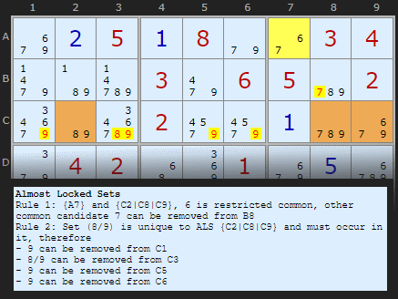

# 37 · Almost Locked Sets (ALS-XZ)

> **Level:** Extreme · **Family:** Almost Locked Sets · **Prerequisites:** [Naked Candidates](../01-naked-candidates/README.md), [XYZ-Wing](../10-xyz-wing/README.md) · **See also:** [WXYZ-Wing](../24-wxyz-wing/README.md), [AIC with ALSs](../34-aic-with-als/README.md), [Death Blossom](../39-death-blossom/README.md)
> Diagrams: [sudokuwiki.org/Almost_Locked_Sets](https://www.sudokuwiki.org/Almost_Locked_Sets) by Andrew Stuart. Text: original to this guide.

## In one sentence

Two **Almost Locked Sets** (N cells holding N+1 candidates) joined by a **restricted common digit X** (one that can only be true in one of the two sets) force the sets to share out their other digits. Any **other** common digit **Z** must then appear in one set or the other, so a cell that sees **every Z** in both sets loses Z.

## Vocabulary

| Term | Meaning |
|---|---|
| **Locked set** | N cells, N candidates, so every digit is placed (a naked pair, triple, ...) |
| **Almost locked set (ALS)** | N cells, **N+1** candidates. Remove any one digit and it becomes locked. |
| **Restricted common (X)** | a digit in **both** ALSs where every copy in one ALS **sees** every copy in the other. It can't be true in both. |
| **Z** | any *other* digit in both ALSs |

A bivalue cell is the smallest ALS (1 cell, 2 digits).

## Why it works

X can be true in **at most one** ALS. Take the other ALS, the one without X: it has lost a digit, so it's now **locked**, and every one of its remaining digits (including Z) is placed inside it.

```
Case A: X is not in ALS-1  →  ALS-1 locks  →  Z is in ALS-1
Case B: X is not in ALS-2  →  ALS-2 locks  →  Z is in ALS-2
(at least one case is true, because X can't be in both)
⇒ Z is in ALS-1 or ALS-2  ⇒  remove Z from any cell seeing all Zs in both
```

---

## Worked examples

### Example 1: two 2-cell ALSs



- Yellow ALS **{A3, J3}** = {4,6,8}
- Brown ALS **{B5, J5}** = {1,6,8}
- **X = 6.** The 6s in J3 and J5 share row J, so 6 can't be in both sets.
- **Z = 8.** **A5** sees every 8 in both sets, so it loses its 8.

To check: if A5 were 8, then A3 = 4, so J3 = 6, so J5 ≠ 6. B5 = 1, and J5 has lost both 6 and 8, so J5 = 1 too. That puts two 1s in column 5, which is impossible. ✅

▶ [Load position](https://www.sudokuwiki.org/sudoku.htm?bd=910700003062003709735004086009372060023050070057048932270400300501237690390000027) (untick AICs and Forcing Chains)

### Example 2: a bivalue cell plus a 3-cell ALS



- ALS 1 is the bivalue cell **F1** {1,3}.
- ALS 2 is three brown cells including **E4, F4**.
- **X = 1.** All the 1s see each other.
- 3 is common to both but **not** restricted, because E4's 3 can't see F1. So **Z = 3**.
- **F5** sees F1 (row F) and E4/F4 (box 5), so it loses its 3.

▶ [Load position](https://www.sudokuwiki.org/sudoku.htm?bd=030680105601503000000001060004805630860000051057000980070408000000700008408050020)

### Example 3: a 5-cell ALS



ALS 1 is **J5** (bivalue). ALS 2 is the huge **{D5, D6, E4, E6, F6}** (5 cells, 6 digits). X = **5** (only D5 has it, and it lines up with J5). Z = **7**, which comes off **F5**.

▶ [Load position](https://www.sudokuwiki.org/sudoku.htm?bd=006805030034600850580000010893100400000090003000000901300000040075003160648201390)

### Example 4: when Z doesn't reach every copy



The ALSs are **{A2, A7}** and **{G2, G5, G6, G9}**, with X = **1** (linked through A2–G2). **G7** has both 2 and 7:
- its **7** sees every 7 in both sets, so it goes ✅
- its **2** can't see the 2 in A2, so it **stays** ❌

▶ [Load position](https://www.sudokuwiki.org/sudoku.htm?bd=006805030034600850580000010893100400000090003000000901300000040075003160648201390)

---

## Rule 2: doubly linked ALSs (more eliminations)

If two ALSs share **two** restricted commons (X₁ and X₂), then **both** sets become fully locked. Each X goes to one set or the other, and that takes one digit out of each. Now:

- every **restricted common** is locked into the pair of sets, so remove it from cells that see all its copies;
- every digit **unique to one ALS** is locked inside that ALS, so remove it from cells that see all of that ALS's copies of it.



The ALSs are **{D2, D3}** and **{B2, B3, B9}**, with restricted commons **2 and 4**:
- 4 comes off **A3, F3**, and 2 comes off **A2** (the restricted commons are locked)
- 1 appears only in {D2, D3}, so it's locked there and comes off the rest of box 4 (D1, D9, E1, E3, F1, F2, F3)
- 7 and 9 appear only in {B2, B3, B9}, so they're locked in row B and come off **B5, B6**

▶ [Load position](https://www.sudokuwiki.org/sudoku.htm?bd=S9Ba49xa358d8bgay03aq069g9m059s8001089ea208031m017uay023m4d0l0r090507031m4z6n062r0r4e0v6a0902bz9za344541r6a2i6b2e2e0643b6b7020504820408071g1w8i0103838302031m22du36c2) (turn off AIC and Forcing Chains)

---

## One deduction, three names

The same eliminations can often be described in several ways:

| As a WXYZ-Wing | As an AIC | As ALS-XZ |
|---|---|---|
|  |  |  |

(Example from [HoDoKu's ALS page](https://hodoku.sourceforge.net/en/tech_als.php).)

## How to find ALSs (the hard part)

ALSs are **everywhere**. The difficulty is finding a useful *pair* of them.

1. Start from a **target**: a candidate Z you suspect is false.
2. Look for small ALSs (1–3 cells) that contain Z and that the target sees.
3. Check whether two of them share a digit X whose copies all see each other.
4. Make sure the target sees **all** the Zs.

## How it connects

- [XYZ-Wing](../10-xyz-wing/README.md) and [WXYZ-Wing](../24-wxyz-wing/README.md) are compact ALS-XZ patterns.
- Chains of ALSs: [AIC with ALSs](../34-aic-with-als/README.md). Several ALSs around one cell: [Death Blossom](../39-death-blossom/README.md).
