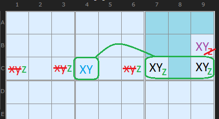
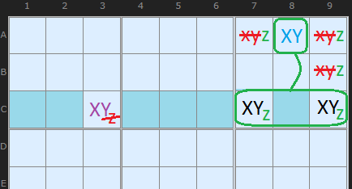

# 38 · Almost Locked Pairs / Triples

> **Level:** Tough–Diabolical (rarely taught, but simple) · **Family:** Bent sets · **Prerequisites:** [Naked Candidates](../01-naked-candidates/README.md), [Intersection Removal](../03-intersection-removal/README.md)
> Diagrams: [sudokuwiki.org/Almost_Locked_Pair](https://www.sudokuwiki.org/Almost_Locked_Pair) by Andrew Stuart (pattern by Gordon Fick, New Sudoku Forum). Text: original to this guide.

## In one sentence

A box–line intersection that must hold **at least one** of {X,Y}, sitting next to a bivalue `{X,Y}` cell that limits it to **at most one**, holds **exactly one**. Together with the bivalue cell, it forms a **virtual naked pair** on {X,Y}.

## Type 1: the bivalue cell is on the line

- In box 3, X and Y can only go in **C7, C9** (a group on row C) or in **B9**.
- Box 3 needs both an X **and** a Y. Outside the group only B9 can take either, and B9 can only take one. So the group holds **at least one** of X/Y.
- **C4** on row C is `{X,Y}`, so it takes one of them, and the group can hold **at most one**.
- So the group **C7|C9** and **C4** act like a **naked pair {X,Y}** in row C.

**Eliminations:**
- X and Y come off the rest of **row C**.
- The box still needs the *other* of X/Y, and the only place left for it is **B9**, so B9's other candidates (Z) go.

## Type 2: the bivalue cell is in the box

- Along row C, X and Y can only go in **C3** or the group **C7|C9**.
- **A8** in box 3 is `{X,Y}`, so the group can hold at most one of them.
- The group and A8 form a **virtual pair** in box 3.

**Eliminations:**
- X and Y come off the rest of **box 3**.
- Row C still needs the other digit, which must be in **C3**, so C3's extra candidates go.

## Why learn it

It's a quick, visual pattern that saves you from building an [ALS chain](../34-aic-with-als/README.md) later. Look for it whenever a bivalue cell sits next to a box–line intersection that holds the same two digits.

The **triple** version works the same way: three digits, a group, and two cells.

**Further reading:** [Gordon Fick's forum thread](http://forum.enjoysudoku.com/almost-locked-pair-and-almost-locked-triple-t39348.html)
