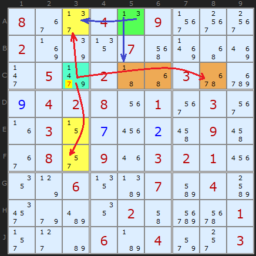
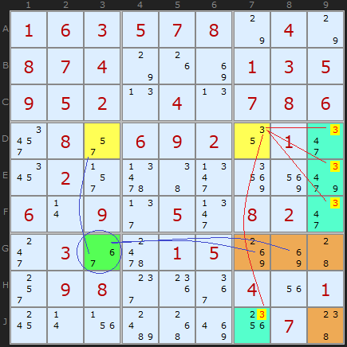
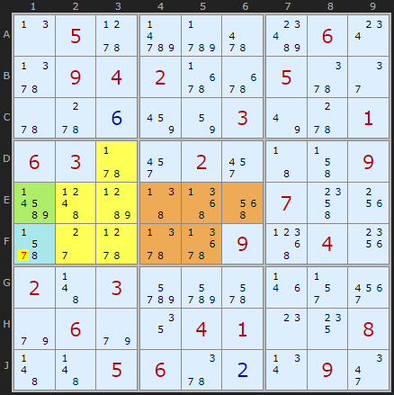

# 39 · Death Blossom

> **Level:** Extreme · **Family:** Almost Locked Sets · **Prerequisites:** [Almost Locked Sets](../37-almost-locked-sets/README.md), [Aligned Pair Exclusion](../26-aligned-pair-exclusion/README.md)
> Diagrams: [sudokuwiki.org/Death_Blossom](https://www.sudokuwiki.org/Death_Blossom) by Andrew Stuart (pattern by Mike Barker). Text: original to this guide.

## In one sentence

A **stem** cell with candidates {a, b, ...} has one **petal** ALS per candidate. If the stem is a, then petal A loses a and locks, and the same for every other candidate. If **every petal shares a digit Z** (which the stem doesn't have), Z must land in one of the petals, so cells that see every Z in every petal lose Z.

## The shape

```
             ┌──────── Petal for "a"  (ALS containing a and Z)
 Stem {a,b} ─┤
             └──────── Petal for "b"  (ALS containing b and Z)

 For each stem digit d:  the stem sees EVERY d in that digit's petal
 Z: present in every petal, NOT in the stem
```

**Why it works:** the stem takes *some* value d. That kills every d in petal *d* (the stem sees them all), so that petal becomes **locked**, and its Z is placed inside it. Whatever the stem is, **some** petal holds Z.

> 🌸 It's ALS-XZ with a "hub". Instead of two ALSs connected by a restricted common, several ALSs are each connected to the stem.

## How to spot it

1. Pick a stem with **2–3 candidates**. Bivalue cells are easiest.
2. For each stem candidate d, find an ALS that contains d, where **every** d in the ALS is seen by the stem.
3. Find a digit Z that's in **every** petal and **not** in the stem.
4. Eliminate Z from any cell (outside the pattern) that sees every Z in every petal.

---

## Worked examples

### Example 1



- **Stem A5** (green) = {1,3}
- **Petal for 3:** the ALS {A3, E3, F3} (yellow). A5 sees its 3 (in A3).
- **Petal for 1:** the ALS {C5, C6, C8} (brown). A5 sees its 1 (in C5).
- **Z = 7**, which is in both petals and not in the stem.
- **C3** sees every 7 in both petals, so it loses its 7.

**Working backwards to check:** if C3 were 7, the yellow ALS would shrink to F3 = 5, E3 = 1 and A3 = 3. The brown ALS would become a 6/8 pair with C5 = 1. Then the stem A5 sees a 3 *and* a 1 and has nothing left. ✅

▶ [From the start](https://www.sudokuwiki.org/sudoku.htm?bd=800409000200070000050200300042801030030000090080903210006007040000020001000604003) (uncheck AICs)

### Example 2: four eliminations



The stem is **G3** {6,7}. One petal is the 2-cell ALS {3,5,7} (yellow), and the other is a 4-cell ALS {2,3,6,8,9}. **Z = 3**, and it comes off **D9, E9, F9, J7**.

You can also see it as two chains from the stem:
- G3 = 7 → D3 = 5 → D7 = 3
- G3 = 6 → G8 = 9 → G7 = 2 → G9 = 8 → J9 = 3

Either way a 3 lands where those four cells can see it.

▶ [Load position](https://www.sudokuwiki.org/sudoku.htm?bd=S9B0106030507087o047o0807047o1g8i0103050905020n040n07080632082q06090212012m1a022r67462n928y9q060r092f052n08022m2k0336d801058k8ib82s09082g1k3a041u01180r1vbg508q2007bc) (uncheck AICs and the Digit/Cell/Unit Forcing Chains)

### Example 3: two enormous petals



The stem is **E1**. Each petal is a **5-cell** ALS: {D3, E2, E3, F2, F3} and {E4, E5, E6, F4, F5}. Between them they remove **7 from F1**. (A Klaus Brenner showpiece.)

▶ [Load position](https://www.sudokuwiki.org/sudoku.htm?bd=S9B0n055xd7cz62bk060w5z0904026r6q055y2e5u5w0f8a82037u5w0106035v2y022y434j09bv4db947535e074o1w6b2c5x5z6v09550420024b03dede6a1n2r3u9e069e1204010o14084b4b05065y0b0v092m)

---

## Common mistakes

- ❌ **The stem not seeing every copy of its digit in the petal.** If one copy is out of sight, that petal might not lock.
- ❌ **Z in the stem.** Z must be absent from the stem, otherwise the stem itself could be Z.
