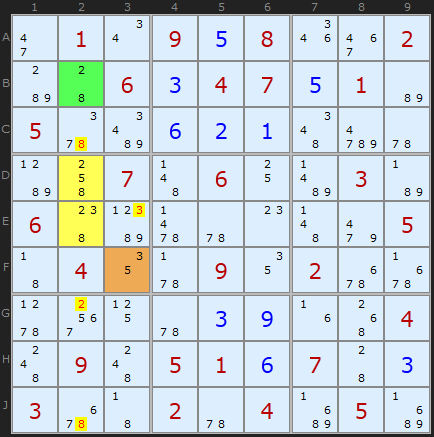
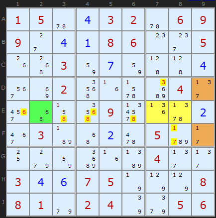

# 40 · Sue de Coq

> **Level:** Extreme · **Family:** Locked sets across an intersection · **Prerequisites:** [Naked Candidates](../01-naked-candidates/README.md), [Intersection Removal](../03-intersection-removal/README.md), [Almost Locked Sets](../37-almost-locked-sets/README.md)
> Diagrams: [sudokuwiki.org/Sue_de_Coq](https://www.sudokuwiki.org/Sue_de_Coq) by Andrew Stuart (named after the forum user who found it). Text: original to this guide.

## In one sentence

Take **2–3 cells in a box–line intersection** that hold **N + 2 (or more) digits**. Find a helper cell **on the line** and another **in the box** whose digits come only from that set, and that don't overlap each other. All the cells together form a big **locked set**: the line-helper's digits are cleared from the line, and the box-helper's digits are cleared from the box.

## The intuition

The intersection cells **C** have too many candidates to be a naked set on their own. But:

- the **line helper D** uses up some of those digits along the line;
- the **box helper E** uses up *different* ones within the box.

Count the cells and digits: C + D + E have exactly as many cells as digits, so the whole group is locked. Each digit goes to the part that "owns" it:

```
            ┌─── line (row/column) ───────────────────┐
            │  [D: helper on line]  ...  [C][C]  ...  │   ← clear D's digits + C's line-digits from rest of line
            └──────────────────────────────┬──────────┘
                                   box ────┤ [E: helper in box]   ← clear E's digits + C's box-digits from rest of box
```

## The rule

1. **C** = 2 or 3 cells in one box *and* one line, with candidate set **V**, where |V| ≥ |C| + 2.
2. **D** = a cell (or ALS) on the **line**, outside the box, using only digits from V.
3. **E** = a cell (or ALS) in the **box**, outside the line, using only digits from V.
4. D's and E's digits must not overlap.
5. Eliminate D's digits (plus any C-digit not in E) from the rest of the **line**. Eliminate E's digits (plus any C-digit not in D) from the rest of the **box**.

---

## Worked examples

### Example 1: the basic 2 + 1 + 1



- **C** = **D2, E2** (box 4, column 2) = {2,3,5,8}. That's 2 cells and 4 digits.
- **D** = **B2** {2,8} on column 2.
- **E** = **F3** {3,5} in box 4.

C can't be {2,8}, because that would empty B2, and it can't be {3,5}, because that would empty F3. So C takes one digit from each pair, and the four cells together lock {2,3,5,8}.

**Eliminations:** 8 off **C2** and **J2**, 2 off **G2** (column 2), and 3 off **E3** (box 4).

▶ [Load position](https://www.sudokuwiki.org/sudoku.htm?bd=S9B2i010u0905081q3e02b844060304070501b6055ybi0602014ed65ub94k074b0610bf03b70648bd635u0o4bd6054304125v0912026q6r5x784l5u03094z50044c094c050106074403036q43025u04c305c3)

### Example 2: bigger helpers



- **C** = **E7, E8** = {1,3,6,7,8}. That's 2 cells and 5 digits (N+3).
- **Line helper:** **E2** {6,8} on row E.
- **Box helper:** the ALS **{D9, F9}** {1,3,7} in box 6.

That's 5 cells and 5 digits, a locked set. So 6 and 8 come off the rest of **row E**, and 1, 3 and 7 come off the rest of **box 6**.

▶ [Load position](https://www.sudokuwiki.org/sudoku.htm?bd=S9B01055u0403025u0609092c040108060o2g051g50038207824545043m8i025i1f6bc6042f3u4y4j1209331j5z023e03b74y026205cz2b109g82c61fbb042f2f03040607057n7p7p0808019e02047q9i0506)

---

## Spotting tip

Look at intersections with **2–3 unsolved cells that are crowded with candidates**. Then scan along the line, and inside the box, for bivalue cells made only of those digits.
