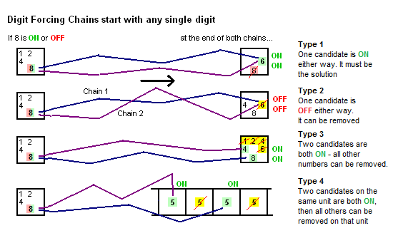
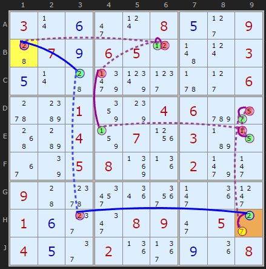
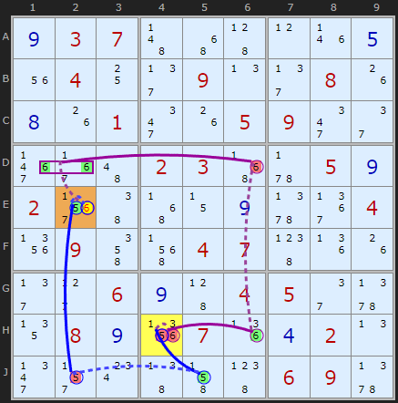
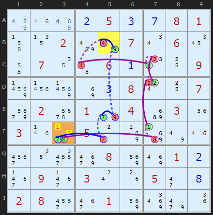
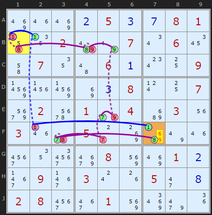
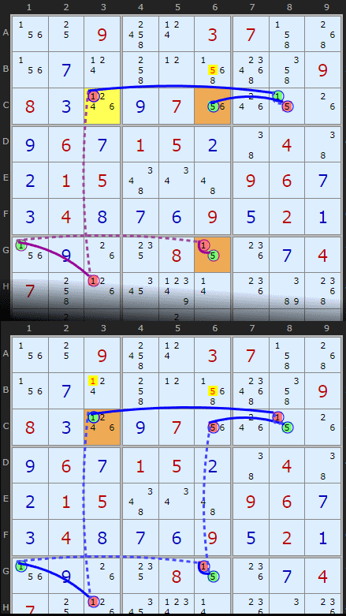

# 41 · Digit Forcing Chains

> **Level:** Extreme · **Family:** Forcing chains · **Prerequisites:** [AIC](../32-alternating-inference-chains/README.md) · **Siblings:** [Nishio](../42-nishio-forcing-chains/README.md), [Cell](../43-cell-forcing-chains/README.md) and [Unit](../44-unit-forcing-chains/README.md) Forcing Chains · **Big brother:** [Forcing Nets](../28-forcing-nets/README.md)
> Diagrams: [sudokuwiki.org/Digit_Forcing_Chains](https://www.sudokuwiki.org/Digit_Forcing_Chains) by Andrew Stuart. Text: original to this guide.

## In one sentence

Pick a single candidate and follow **two chains**: one assuming it's **ON**, one assuming it's **OFF**. Any conclusion that **both chains agree on** must be true, because one of the two assumptions is.

## The intuition: "heads I win, tails I win"

```
           ┌── if ON  ──→ … ──→ conclusion
candidate ─┤
           └── if OFF ──→ … ──→ the same conclusion
⇒ the conclusion holds no matter what
```

This differs from a [Nishio](../42-nishio-forcing-chains/README.md) chain, which only tries **ON** and hunts for a contradiction. A Digit Forcing Chain tries **both** states and looks for agreement.

## The four types



| Type | Both chains end with... | Conclusion | Frequency |
|---|---|---|---|
| **1** | the **same candidate ON** | place it | rare, but powerful |
| **2** | the **same candidate OFF** | eliminate it | **most common** |
| **3** | two **different** candidates ON in one **cell** | that cell holds one of them, so its other candidates go | common |
| **4** | the **same digit** ON in two **different cells of a unit** | one of them holds it, so the rest of the unit loses it | rare |

---

## Worked examples

### Type 1: both chains place the same digit



The start is the **2 in B1**.

```
ON  (purple): +2[B1] -2[B6] +1[B6] -1[C4] +1[E4] -1[E9] +5[E9] -5[D9] +7[D9] -7[H9] +2[H9]
OFF (blue):   -2[B1] +2[C3] -2[H3] +2[H9]
```

Both chains end with **H9 = 2**, so H9 is solved.

▶ [Load position](https://www.sudokuwiki.org/sudoku.htm?bd=S9B030r0f2i0t080e2d0944070i06050l4b0t030e0r449r812h5v2d065wbc01867s0406cy2q50b80483071x03b70z367q05088n1j029n2j094460321q3q2j1i2l010f2g2m08092i052c040e2e021j3b0i1i08) (uncheck Forcing Nets for all examples here)

### Type 2: both chains remove the same candidate



The start is the **5 in H4**.

```
OFF: -5[H4] +5[J5] -5[J2] +5[E2] -6[E2]
ON:  +5[H4] -6[H4] +6[H6] -6[D6] +6[D1|D2] -6[E2]
```

Both chains switch off the **6 in E2**, so it goes. (This puzzle has three Type 2s in a row.)

▶ [Load position](https://www.sudokuwiki.org/sudoku.htm?bd=S9B0i03074b4y450l1n0e1u04102f090n2f081g0h1g012m1g05092m2e3f374a02034z5v050i023n464z0z0i5z3b041z094m5f0407491j1g2f2d060i4504052e5z13080i1z071j0d020n2n2r0w474j4906095z)

### Type 3: two candidates in one cell



The start is the **4 in B5**.

```
OFF: -4[B5] +9[B5] -9[E5] +7[E5] -7[F5] +7[F3]
ON:  +4[B5] -4[C4] +4[C7] -2[C7] +2[D7] -1[D7] +1[F7] -8[F7] +8[F3]
```

One chain makes F3 = 7 and the other makes F3 = 8. Either way **F3 ∈ {7, 8}**, so its other candidates go.

▶ [Load position](https://www.sudokuwiki.org/sudoku.htm?bd=S9B8q1m8q0b050c0g08014j1302be7u070u061a4i07124a060a0w10099723978i0c080t1007aq0276019e04c2031u031n6r052c8kc37u1m3u123yai088y8q010b3f093f030s1g052i0h02083u3e018y8u9m1i)



On the next step, starting from **1 in B1**, the two chains say **F7 ∈ {1, 8}**, so 6 and 9 come off F7.

### Type 4: same digit, two cells in a unit



The start is the **1 in C3**.

```
ON:  +1[C3] -1[H3] +1[G1] -1[G6] +5[G6]
OFF: -1[C3] +1[C8] -5[C8] +5[C6]
```

Either **G6** or **C6** is 5, and both are in column 6, so the other 5s in column 6 go. (Check the box as well when the two cells share one.) This type is usually picked up by AICs first.

▶ [Load position](https://www.sudokuwiki.org/sudoku.htm?bd=S9B1v10094s0t03074j501v0g0t4k0l5f5c4m09080c1p0i071u1o0z1g0i060g01050b4604460b01054e0u4a09060g0c040h0g0f090e020a1v0i1g14080z1k0g04074k1h1a810r1kba540d4403067o0g01b605)

---

## Tips

- Start from a candidate in a **bivalue cell** or a **strong link**. Then the OFF chain has an immediate ON to work with.
- Follow both chains in parallel, step by step, and look for overlaps as you go.
