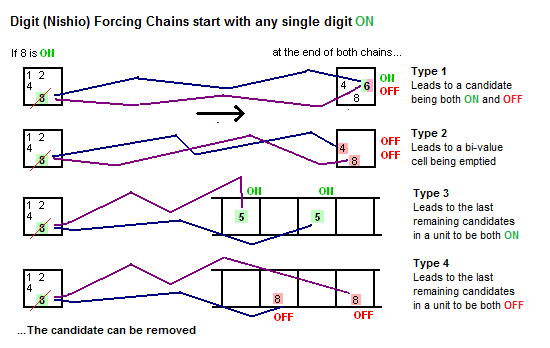
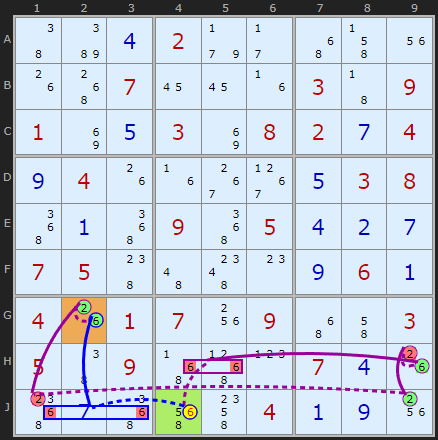

# 42 · Nishio Forcing Chains

> **Level:** Extreme · **Family:** Forcing chains · **Prerequisites:** [Digit Forcing Chains](../41-digit-forcing-chains/README.md)
> Diagrams: [sudokuwiki.org/Nishio_Forcing_Chains](https://www.sudokuwiki.org/Nishio_Forcing_Chains) by Andrew Stuart. Text: original to this guide.

## In one sentence

Assume a candidate is **ON**. If two chains from it lead to **the same candidate being both ON and OFF**, the assumption is impossible, so eliminate it.

## Digit Forcing vs Nishio

| | Digit Forcing Chain | Nishio |
|---|---|---|
| Assumptions tried | ON **and** OFF | **ON only** |
| Looking for | the two branches **agree** | the branches **contradict** |
| Result | place or eliminate the *target* | eliminate the *start* |

> 📜 Historically "Nishio" meant a single-digit trial-and-error hunt. Framed as two chains from one assumption, it becomes a proper pattern you can write down and check.

---

## Worked example

Assume **6 is ON in J4**.

- **Blue chain (short):** J4 = 6 removes the other 6s in row J. Box 7's only remaining 6 is then **G2**, so **G2 = 6**.
- **Purple chain (long):** J4 = 6 removes the 6s in box 8. That forces **H9 = 6**, which forces **J9 = 2**, which removes 2 from **J1**, which makes **G2 = 2**, so **G2 ≠ 6**.

G2 can't be both 6 and not-6, so **J4 ≠ 6**.

▶ [Load position](https://www.sudokuwiki.org/sudoku.htm?bd=S9B46ba0d029f2b4y4j1u1g500716161f034309018i0e038i08020g040i041g1f38390e0308520a520952050d0b0g0705484a4g0o0i060a041g01071w094y4i030546094z510p070d1g540g525e4o040a0i1w) (uncheck Forcing Nets and Digit Forcing Chains)

---

## Tips

- Good starting candidates are ones with **many peers** that have few candidates. Switching them ON causes the biggest knock-on effects.
- A Nishio that **empties a cell** or puts **two of a digit in a unit** is just as valid. Any contradiction counts.
