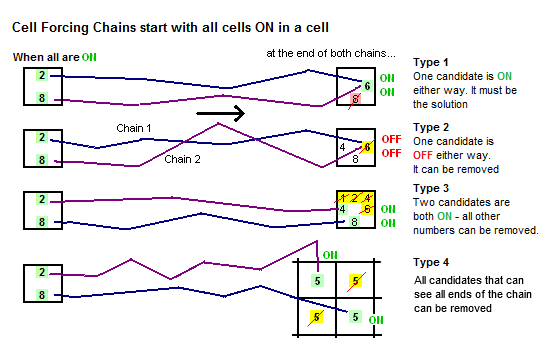
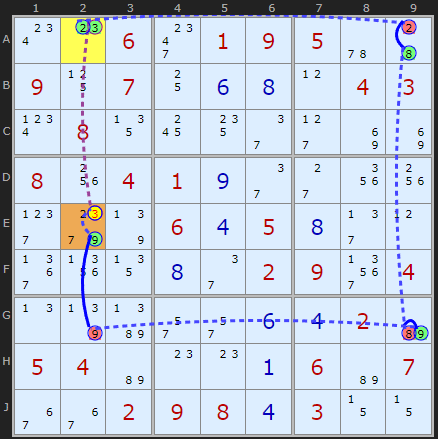
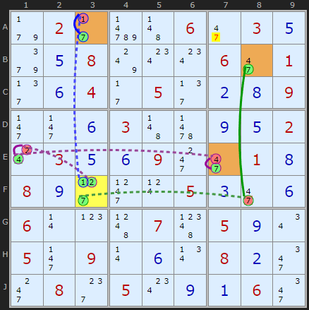
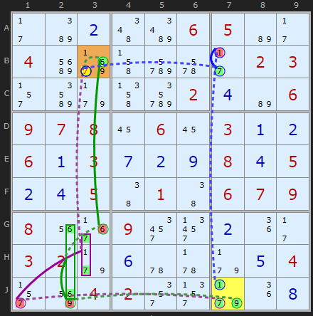
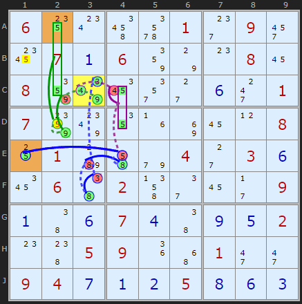
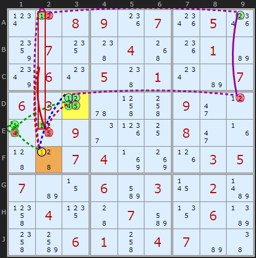

# 43 · Cell Forcing Chains

> **Level:** Extreme · **Family:** Forcing chains · **Prerequisites:** [Digit Forcing Chains](../41-digit-forcing-chains/README.md) · **Next:** [Unit Forcing Chains](../44-unit-forcing-chains/README.md)
> Diagrams: [sudokuwiki.org/Cell_Forcing_Chains](https://www.sudokuwiki.org/Cell_Forcing_Chains) by Andrew Stuart. Text: original to this guide.

## In one sentence

A cell has to be **one of its candidates**. Start a chain from **each** candidate. If **every** chain reaches the same conclusion, that conclusion is true.

## The intuition: case analysis

```
Cell {a, b, c}
   a ──→ … ──→ target is OFF
   b ──→ … ──→ target is OFF
   c ──→ … ──→ target is OFF
⇒ target is OFF (whichever of a, b, c is real)
```

The number of chains equals the number of candidates in the start cell:

| Start cell | Name | Notes |
|---|---|---|
| 2 candidates | **Dual** | usually found earlier as an AIC or a Digit Forcing Chain |
| 3 candidates | **Triple** | the sweet spot |
| 4 candidates | **Quad** | rare (about 6 in 40,000 puzzles) |



The possible conclusions are the same as for [Digit Forcing Chains](../41-digit-forcing-chains/README.md): all chains place the same candidate, all chains remove the same candidate, all chains switch on one of a few candidates in a cell, or (Type 4) all chains switch on copies of one digit, so any cell that sees **all** those copies loses it.

---

## Worked examples

### Dual: from a bivalue cell



The start is **A2** = {3, ...}:
- **A2 = 3** removes the 3 in E2 directly (column 2).
- **The other case** goes A9 = 8 → G9 = 9 → G2 ≠ 9 → (strong link) E2 = 9 → E2 ≠ 3.

Either way **E2 ≠ 3**. (The solver normally finds this as an AIC first. Untick AIC and Digit Forcing Chains to see it.)

▶ [Load position](https://www.sudokuwiki.org/sudoku.htm?bd=S9B0w0o062o0109055u44091107100f0h0l04030x081318142e2d8i8i081w04010i2e2c1y1w2h9k7r060d050h2f0l3b1z130h2e02093r040n7rbb2q2q0f0d02b60504b60o0o0a06b60736360209080d030z0z)

### Triple: three branches, one of them through an ALS



This board shows two separate triple cell forcing chains.

**Start F3:**
- F3 = 1 → A3 = 7 → **A7 ≠ 7**
- F3 = 2 → E1 ≠ 2 → E1 = 4 → E7 = 7 → **A7 ≠ 7**
- F3 = 7 → F8 ≠ 7 → (strong link) B8 = 7 → **A7 ≠ 7**

**Start D1** (red): when D1 = 9, the 9 leaves H1, so H9 = 9, so the 9 leaves E9. That turns the ALS {D8, E9} = {3,5,9} into a **{3,5} naked pair**, which removes the 3 from **D7**. D1's other candidates reach the same conclusion by shorter routes.

▶ [Load position](https://www.sudokuwiki.org/sudoku.htm?bd=S9B9f022bd74b062i030e9i0e087w0w0w062i012f0f042b052f0b0h092j2j0f034b630i0e020s030e0f092k2i010h080i2d2l0t050c2i0f060r0p4d074h050i0u052j090r0f0v080b2m2k082g050w0i0a062m)

### Triple: groups and ALSs



The start is **J7**, and the target is the 7 in **B3**:

```
+1[J7] -1[B7] +7[B7] -7[B3]
+7[J7] -7[J1] +7[G3|H3] -7[B3]            (group pointing up column 3)
+9[J7] -9[J2] +6{J2|G2} -6[G3] +6[B3] -7[B3]   (ALS {5,6,9} locks to {5,6})
```

All three branches end with **B3 ≠ 7**. You're unlikely to find this one on paper, but it shows how far forcing chains can reach.

▶ [Load position](https://www.sudokuwiki.org/sudoku.htm?bd=S9B2bba0b4ebi0605b62b04ciab4jde6a2b02032rbq9f4ndi020db606090708160616030a0b060a030g0b0i080d050b0d05460146060709081u370932330b1i2b03029f0f5u5v9f0e042r8y04022u2v9f1i0h)

### Type 4: chain ends that all see one cell



Each candidate of **C3** (3, 4, 9) leads to a **5 being ON**, but in different places (E1, A2/C2, ...). Any 5 that can see **every** chain end goes, so **B1** and **D2** lose 5.

```
+3[C3] -3[F3] +8[F3] -8[E3] +8[E4] -5[E4] +5[E1]
+4[C3] -4[C4] +5{C4|D4} -5[E4] +5[E1]
+9[C3] -9[C2] +9[D2] -5[D2] +5[A2|C2]
```

▶ [Load position](https://www.sudokuwiki.org/sudoku.htm?bd=S9B06140w4u6e012g092y1c070a06867o0o081608867y1a2u2c0f2k01078880121f8i160l081001b84i9e042c030f1a0646024n2e162b090a460f070d460i0e020o4805091i4y012i2i09040g0a0b050h0f0c)

### Quad



**D3** = {1,2,4,5}, and all four branches remove the 1 from **F2**:

```
+1[D3] -1[F2]
+2[D3] -2[D9] +2[A9] -2[A2] +1[A2] -1[F2]
+4[D3] -4[E1] +1[E1] -1[F2]
+5[D3] -5[E2] +1{E2|A2} -1[F2]
```

▶ [Load position](https://www.sudokuwiki.org/sudoku.htm?bd=S9B0x0l08091k071s051s8807144804501k01b680060w0548010wb6070603195u4l4k092i0l0r11092e1l10082i1f454507048j8k1h030507b60z06bm031702bf4p04154407bm1306bb4obo06014k0407b646)

---

## Tips

- Choose a start cell whose candidates each knock out lots of peers, for example a cell in a crowded row and box.
- Work out the **target first**: a candidate that "feels" wrong. Then try to reach it from every candidate of a nearby cell.
