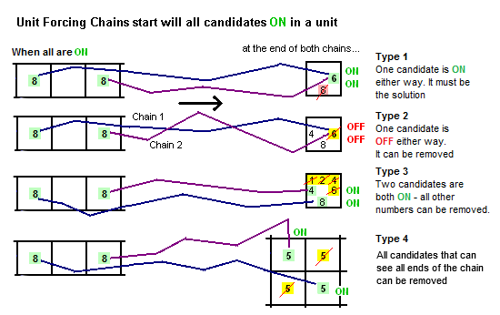
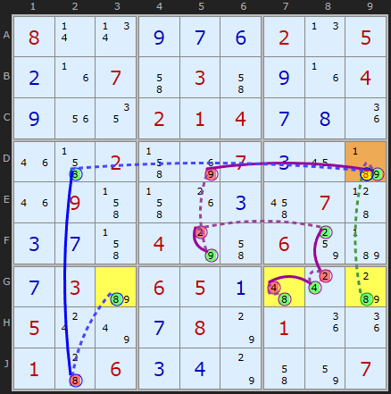
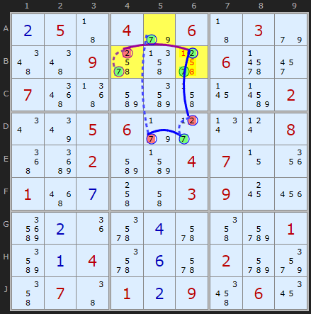
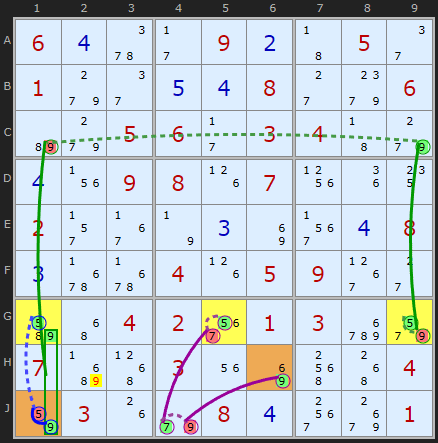
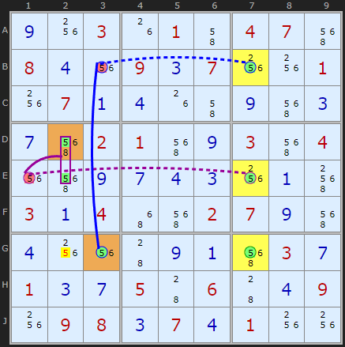

# 44 · Unit Forcing Chains

> **Level:** Extreme · **Family:** Forcing chains · **Prerequisites:** [Cell Forcing Chains](../43-cell-forcing-chains/README.md)
> Diagrams: [sudokuwiki.org/Unit_Forcing_Chains](https://www.sudokuwiki.org/Unit_Forcing_Chains) by Andrew Stuart. Text: original to this guide.

## In one sentence

The [Cell Forcing Chain](../43-cell-forcing-chains/README.md) idea turned sideways. A unit must contain digit X in **one of its candidate cells**, so start a chain from **each** place X could go. Any conclusion that **all** the chains share is true.

## Cell vs unit

| | Cell Forcing | Unit Forcing |
|---|---|---|
| "One of these is true" | the candidates **of a cell** | the positions **of a digit in a unit** |
| Chains | one per candidate | one per position |



---

## Worked examples

### Type 2: every chain removes the same candidate



The 8s in one unit sit in **G3, G7, G9**. Each of them ends up removing the 8 in **D9**:

```
+8[G9] -8[D9]                                                   (same column)
+8[G3] -8[J2] +8[D2] -8[D9]
+8[G7] -4[G7] +4[G8] -2[G8] +2[F8] -2[F5] +9[F5] -9[D5] +9[D9] -8[D9]
```

So **D9 ≠ 8**.

▶ [Load position](https://www.sudokuwiki.org/sudoku.htm?bd=S9B080r0v0i0g0f020n050b1f074i034i0i1f040i1u120201040g0h1i1m4j024j8i070c16b71m094j4j1g0c4q07450c0g4j047o4i0684b70g03b606050a4a0sb8050s7u0g087o011i1i0144060c0d7o4i8207) (uncheck Forcing Nets for all examples)

### Type 3: every chain lands on one cell



Try each place for **7 in box 2**:
- **7 in A5** → D5 ≠ 7 → D6 = 7 → D6 ≠ 2 → **B6 = 2**
- **7 in B4** → B4 ≠ 2 → **B6 = 2**
- **7 in B6** → B6 is 7, trivially.

So **B6 ∈ {2, 7}**, and its other candidates go.

▶ [Load position](https://www.sudokuwiki.org/sudoku.htm?bd=S9B0b0543049e0643039e4e4e096c4n6d066j2y075a53bmbq4j17bv020u7y05069f2d0v0t0852c602bmbn04070z1y01560g4k4i03091822cm0b1i6e0d6a4mde01bq0a046e0f6a02de9y4m0746010b094u061a)

### Type 4: the chain ends share a peer



Row G has three 5s: **G1, G5, G9**. Each chain ends with a 9 being forced, either in **H6** or in **J1**. Any 9 that sees **both** of those cells (here **H2**) goes.

```
+5[G5] -7[G5] +7[J4] -9[J4] +9[H6]
```

▶ [Load position](https://www.sudokuwiki.org/sudoku.htm?bd=S9B060d5y2b090b43052e019g2e0e0d082c9k06b69g05062b0304439g0d1v09081h071x1i14022r377n0c8i3n0d080c6r6r041h0509392cbm4y04023m0103du9u07c351031u8i5g500482031g9e080d3oac01)



Column 7's three 5s give these three chains:

```
+5[B7] -5[B3] +5[G3]
+5[E7] -5[E1] +5[D2|E2]
+5[G7]                         (a "chain" of length zero!)
```

**G2** sees G3, G7 and the D2|E2 group, so it loses its 5.

▶ [Load position](https://www.sudokuwiki.org/sudoku.htm?bd=S9B0i1w031g014i04075e080d1u090c071w1w011w070a0d1g4i0i5e0c0g5e02015e0i035e041u5e0i0g0d0c1w0a5g030a044y5e02070i5e0d1w1u440i0a5e030g010c0g054406440d091w09080c070d011w1w)

---

## Practice (by Klaus Brenner: two UFCs each, otherwise only hidden singles)

[1](https://www.sudokuwiki.org/sudoku.htm?bd=080500071030000600005004000000000400000380100800006000000002560500643700300008009) ·
[2](https://www.sudokuwiki.org/sudoku.htm?bd=706010004000708000000000260500391000002006005000050719020000000008000300003020000)
