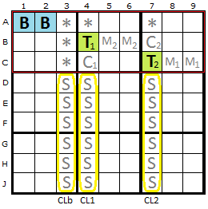
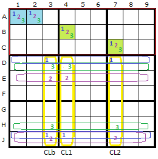
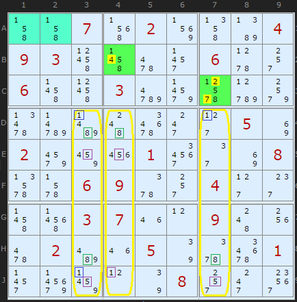

# 45 · Exocet (JExocet)

> **Level:** Extreme+ (the hardest puzzles) · **Family:** Pattern-based · **Prerequisites:** [Swordfish](../09-swordfish/README.md), [Intersection Removal](../03-intersection-removal/README.md) · **Next:** [Double Exocet](../46-double-exocet/README.md)
> Diagrams: [sudokuwiki.org/Exocet](https://www.sudokuwiki.org/Exocet) by Andrew Stuart (pattern found by Allan Barker; rules from David P. Bird's *JExocet Compendium*). Text: original to this guide.

## In one sentence

Two **base** cells in one box-line intersection hold 3–4 candidates between them. Two **target** cells in the other two boxes of the same band (or stack) must then hold **the same two digits** the base cells end up with. So anything in a target that isn't a base digit can go, along with several other consequences.

## When you'll need this

Exocet only appears in **ultra-hard** puzzles, where almost every cell has 3–5 candidates and there are hardly any bivalue cells or strong links to chain from. It first showed up in Allan Barker's puzzle *Fata Morgana*. If you're solving newspaper puzzles, you'll never meet one.

▶ [Fata Morgana](https://www.sudokuwiki.org/sudoku.htm?bd=000000003001005600090040070000009050700050008050402000080020090003500100600000000)

## The anatomy

| Part | Label | Requirement |
|---|---|---|
| **Base** | B | two cells in one box, on the same line, holding 3–4 digits **in total** |
| **Targets** | T | two cells in the **other two boxes** of the band. Neither sees the bases or the other target, and each must contain **all** the base digits (extras allowed). |
| **Cross-lines** | yellow | the three columns (in a horizontal band) through the two targets and through the third, empty cell of the base's mini-line |
| **S-cells** | | the cells of the cross-lines **outside** the band |
| **Companions** | C | each target's neighbour on its line within its box. It must contain **no base digit**, not even as a given. |
| **Mirrors** | M1, M2 | the cells next to the *opposite* target |
| **Escape cells** | * | where a base digit that turns out false can go instead |

### The S-cell test (what makes it a real Exocet)

For each base digit, look at where it appears in the S-cells. It must be possible to **cover** every copy with at most **two** lines, which are normally rows perpendicular to the cross-lines. (A line can also run along a cross-line if both copies sit in one column.) If every base digit passes this test, the pattern is confirmed.

## Why it works, roughly

Each base digit can appear only a limited number of times in the S-cells, and the cross-lines have to take every digit **three times** (once per band). That forces the two digits that are true in the base to also appear in the targets, one in each target. It's a fish-like counting argument, close in spirit to a [Swordfish](../09-swordfish/README.md).

## What a confirmed Exocet tells you

1. The two targets hold **two different** base digits, the same two that are true in the base.
2. Each mirror pair holds the digit of its opposite target, plus one non-base or false-base digit.
3. Each true base digit appears **exactly twice** in the S-cells.

## Elimination rules (as the solver implements them)

| Rule | Plain English |
|---|---|
| **1** | Remove any **non-base** candidate from the targets. |
| **3** | If a base digit's S-cell copies can be covered by **just one** line, it can't be true in the base, so remove it from the base cells and the targets. |
| **4** | If one target is forced to a particular base digit, remove that digit from the other target. |
| **5** | If a base digit's S-cells are covered by a **cross-line**, that digit can't be in the target on that cross-line. |
| **8** | Mirror-based eliminations (subtle; see the compendium). |

### Example: Rule 1

The targets carry candidates that aren't in the base set: the 4 in **B4**, and the 2 and 7 in **C7**. Rule 1 removes all of them. (Untick X-Cycles to see this step.)

▶ [From the start](https://www.sudokuwiki.org/sudoku.htm?bd=007020004930000600600300000000000050200010008006900400003700900020050001000008000)

---

## Practice

[An Exocet puzzle by Klaus Brenner that's otherwise straightforward](https://www.sudokuwiki.org/sudoku.htm?bd=900000006050300010020400003000100280000860070030004000000020800400500060090000005)

## Further reading

The definitive reference is **David P. Bird's JExocet Compendium** (14 parts) on the [EnjoySudoku forum](http://forum.enjoysudoku.com/jexocet-compendium-t32370.html). [Phil's Folly](http://www.philsfolly.net.au/) also has many examples, and [Systematic Sudoku](https://sysudoku.com/2015/06/16/fata-morgana-exocet/) walks through Fata Morgana.
