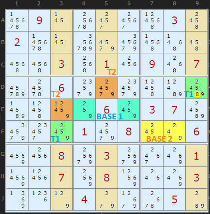
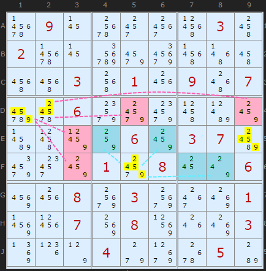
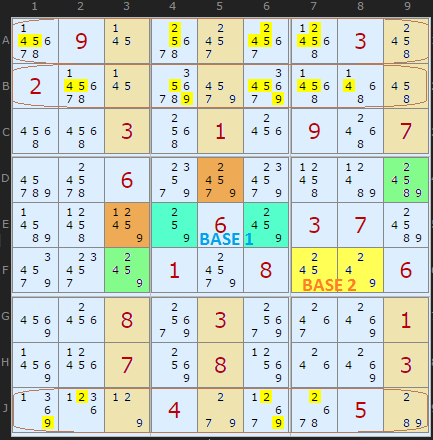

# 46 · Double Exocet

> **Level:** Extreme+ · **Family:** Pattern-based · **Prerequisites:** [Exocet](../45-exocet/README.md)
> Diagrams: [sudokuwiki.org/Double_Exocet](https://www.sudokuwiki.org/Double_Exocet) by Andrew Stuart (rules from David P. Bird). Text: original to this guide.

## In one sentence

When **two** Exocets share the **same base digits**, their combined bases and targets pin those digits down so tightly that they act like a giant fish. That clears the digits from many cells at once.

## The setup

This is weekly "unsolvable" #165. Exocet 1 is in blue/green and Exocet 2 in yellow/orange. **Both** have base set **{2,4,5,9}**, and they share the same S-cells. On their own, the two Exocets only give one elimination: 8 from target **D9**.

▶ [Load position](https://www.sudokuwiki.org/sudoku.htm?bd=090000030200000000003010907006000000000060370000108006008030001007080003000400050)

## Rule 1: see all four targets (or all four bases) ⇒ eliminate

Treat the **four target cells** as one group (pink) and the **four base cells** as another (blue). Between them, they must hold the base digits. So a base digit in any cell that **sees all four targets** or **all four bases** can be removed:
- **D1, D2** see all four targets, so they lose {2,4,5,9}
- **F5, E9** see all four bases, so they lose {2,4,5,9}

## Rule 2: cover lines fill up

Both Exocets need their base digits to land in the S-cells along the same cover lines (here **rows A, B and J**). Those rows have no room left for {2,4,5,9} anywhere else, so remove them from the non-S cells of rows A, B and J. It works much like a [Swordfish](../09-swordfish/README.md) on four digits at once.

In this puzzle, that single step opens everything up, and the rest is singles to the end.

---

## Note

sudokuwiki's solver handles only Double Exocets whose base sets are **identical**. Partially overlapping pairs exist too and are covered in the compendium.
