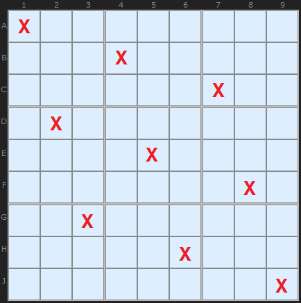
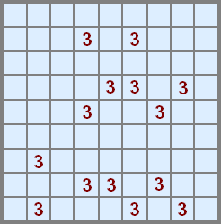
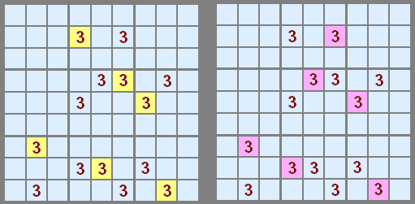
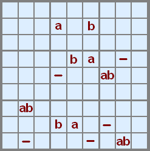
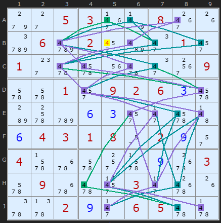
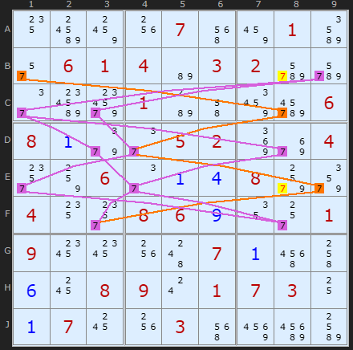
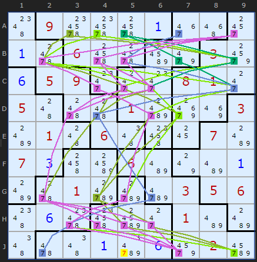

# 47 · Pattern Overlay Method (POM)

> **Level:** Extreme (late-game) · **Family:** Templates · **Prerequisites:** [Foundations](../00-foundations/README.md) · **See also:** [Swordfish](../09-swordfish/README.md) and the whole fish family, which are partial templates
> Diagrams: [sudokuwiki.org/Pattern_Overlay](https://www.sudokuwiki.org/Pattern_Overlay) by Andrew Stuart (method by Myth Jellies). Text: original to this guide.

## In one sentence

For one digit, list **every way** to place all nine copies (one per row, column and box) that fits the current candidates. Cells used by **every** pattern must hold the digit, and candidates used by **no** pattern can be removed.

## The intuition: templates

Each digit's final positions form a **template**: 9 cells with exactly one in each row, column and box.



On an empty grid there are **46,656** templates per digit:

```
row A: 9 choices × row B: 6 × row C: 3   (top band)
row D: 6 × row E: 4 × row F: 2            (middle band)
row G: 3 × row H: 2 × row J: 1            (bottom band)
= 9·6·3·6·4·2·3·2·1 = 46,656
```

That's far too many early on. Late in a puzzle, though, a digit might have only a **handful** of templates left, and listing them is easy.

## Walking through it



Here are only the 3s. The top box has two places for a 3, so start there. Each choice forces a chain of placements:



Only **two** templates (call them *a* and *b*) fit. Now label each cell with the templates that use it:



| Label | Meaning |
|---|---|
| **ab** | every template uses it, so **place 3 here** |
| **a** or **b** | some templates use it, so it's still possible |
| **—** | no template uses it, so **remove the 3** |

## The two solver rules

| Rule | Scope | How it works |
|---|---|---|
| **1** | one digit | a candidate that appears in **no** template for its digit is removed |
| **2** | all digits together | if every template of digit X needs a cell, then other digits' templates can't use that cell. Prune them, and then apply Rule 1. |

Rule 2 is powerful but hard to do by hand. The solver handles it well.

---

## Worked examples

### Rule 1



Digit 4 has only **three** templates left (the coloured paths). None of them passes through **B5**, so B5 loses its 4.

▶ [Load position](https://www.sudokuwiki.org/sudoku.htm?bd=S9B9g2c05033f7v083g1gd206d6022ybe2m012y012g626i3m622m3o096a6a012y0902060c6ib86ccy0f0c2y2j6i4b0f040301082q020i2q046b6q6a2s6b0i6s036a096q6231032j701g5y5z020i2j06056263)

### Rule 2



Digit 7 starts with templates through **B1** and **B9**. After the solver prunes templates that clash with other digits' forced cells, two paths remain, and **B8** and **E8** lose 7.

▶ [Load position](https://www.sudokuwiki.org/sudoku.htm?bd=S9B14bw8c1w075e8a01bq2q060104b60302dede2ec0a801b84i8edm06080a9i2e05028maa042w84062e0a0d089w9y04142w08060i122s01091c1c1w4c070a5m4k0f1808090s010703100a07181w035e96cqbo)

### In a Jigsaw



Templates work for any variant. Each region simply replaces a box. Here **J5** can't be 7, because no 7-template uses it.

---

## When to use it

- **Late game**, when a digit has only a few candidates left.
- On digits where fish and chains don't help. POM is in effect a "complete fish", covering every possible fish for that digit at once.
