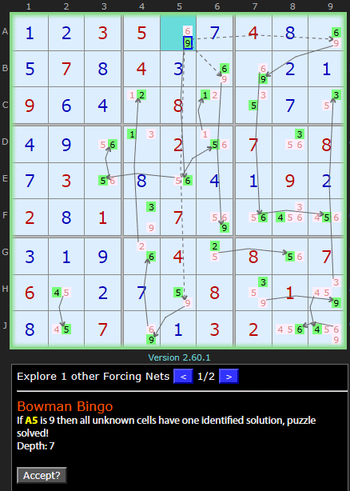

# 48 · Bowman's Bingo

> **Level:** Last resort · **Family:** Forcing / whole-board · **Prerequisites:** [Forcing Nets](../28-forcing-nets/README.md)
> Diagrams: [sudokuwiki.org/Bowmans_Bingo](https://www.sudokuwiki.org/Bowmans_Bingo) by Andrew Stuart (improved method credited to the dxSudoku channel). Text: original to this guide.

## In one sentence

Switch on one candidate and follow every forced consequence. If the net reaches **every cell**, leaving exactly one candidate ON in each **without any contradiction**, you've found the solution.

## The intuition

A [Forcing Net](../28-forcing-nets/README.md) normally hunts for a **contradiction** so it can eliminate the starting candidate. Bowman's Bingo hopes for the opposite: a **clean sweep**. If one assumption forces a value into every cell and nothing clashes, the solution is consistent with that assumption. Since the puzzle has only one solution, that's the solution.

```
+X[cell] → … every cell gets exactly one ON, no conflicts  →  BINGO: whole board solved
```

> 🧭 Older versions of this technique were basically guessing. The current version is fully deterministic: the solver shows every link, and the result can be checked.

## Example



Starting from **9 ON in A5**, the forced consequences spread across the whole board. Every pink candidate is removed and every cell is left with one value. In sudokuwiki's solver, press **"Accept?"** to apply it, then **Take Step** to see the finished grid.

This puzzle doesn't really *need* Bowman's (a W-Wing works at this step). It was picked because the board isn't too crowded to follow. Untick almost every strategy before "last resort" to see it.

▶ [Load position](https://www.sudokuwiki.org/sudoku.htm?bd=S9B0a0b03058i0g040h8i0e070h040c8i8i0b0a090f0d0l080l120g120d0i1u0n021v071y080g031u0h1u0d0a090b020h017q078y1u26220c0a0i1g0410081u0706160b0g820886018e0h16078i0a03022296)

## Should you use it?

Only as a **last resort**. On a cluttered board, tracing a whole-board net by hand is practically impossible. It's useful mainly as a solver feature, or when only a few cells are left.

**Further reading:** [dxSudoku #103: Improved Bowman's Bingo](https://www.youtube.com/watch?v=3-P16P4cclE)
