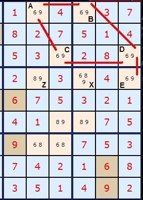
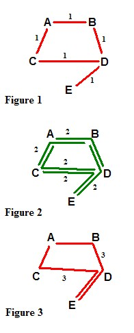
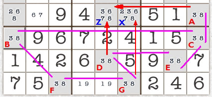
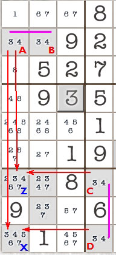

# 49 · Remote Pairs

> **Level:** Tough (classic, now folded into chains) · **Family:** Bivalue chains · **Prerequisites:** [Naked Candidates](../01-naked-candidates/README.md) · **See also:** [W-Wing](../13-w-wing/README.md) (the 4-cell case), [XY-Chains](../25-xy-chains/README.md)
> Diagrams: [sudokuwiki.org/Remote_Pairs](https://www.sudokuwiki.org/Remote_Pairs) by Andrew Stuart. Text: original to this guide.

## In one sentence

A chain of cells that all hold the **same pair {x,y}**, each one seeing the next, **alternates** x, y, x, y... Two cells an **odd** number of steps apart must be **opposite**, so a cell that sees both of them loses x **and** y.

## The intuition: a line of alternating switches

```
 A{6,9} ── B{6,9} ── C{6,9} ── D{6,9} ── E{6,9}
   6        9        6        9        6      (one possibility)
   9        6        9        6        9      (the other)
```

- Cells an **odd** distance apart (A–B, A–D, B–E, ...) are always **opposite**. Together they hold both 6 and 9, like a naked pair at a distance.
- Cells an **even** distance apart (A–C, A–E, B–D, ...) are always the **same**, which tells you nothing useful.

So **only odd-distance pairs eliminate**. Any cell that sees both ends of an odd-distance pair loses both digits.

---

## Worked examples

### The classic five-cell network



Five `{6,9}` cells, **A–E**, are linked by locked pairs (red lines): AB, AC, BD, CD and DE. The goal is to remove the 9 from **Z** and keep its 8.

- **A to E** is distance 3 (A–C–D–E), which is odd, so A and E are opposite. Z sees both, so **Z loses 6 and 9**.
- **B to E** is distance 2 (B–D–E), which is even, so B and E are the same. **X** sees both, but nothing can be removed from it.



*Figure 1: direct links (distance 1). Figure 2: distance-2 paths (always "same"). Figure 3: distance-3 paths (always "opposite").*

### Seven cells



There are seven `{3,8}` cells, **A–G**. **A–D** is odd by every path (for example ACED, or ACBFGD), so **Z** loses 3 and 8. **A–G** is even, so **X** keeps its candidates.

### ⚠️ The chain must be continuous



There are four `{3,4}` cells, but **AB** and **CD** are two **separate** chains with no link between them. You can't conclude anything about Z or X from pairing A with D. Always check that the chain is unbroken.

---

## How it connects

- The 4-cell version is the "double" [W-Wing](../13-w-wing/README.md).
- Every remote pair is an [XY-Chain](../25-xy-chains/README.md), and also a [Simple Colouring](../06-simple-colouring/README.md) network on either digit.
- Further reading: [Mihail Iusut's paper on Remote Pairs and XY-Chains](https://www.sudokuwiki.org/sudoku/Remote_Pairs_and_XY_Chains.pdf).
